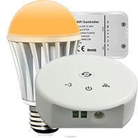
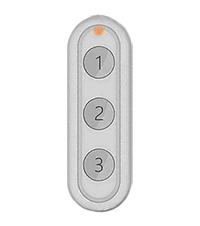

# Änderungsprotokoll

[siehe hier](https://bcaro.github.io/wifilightV2-doc/fr_FR/changelog)

# Installation

Das Plugin erfordert die Installation von Abhängigkeiten. Wenn die Abhängigkeiten nicht installiert sind, funktionieren viele Geräte nicht richtig. Wenn die Installation jedoch fehlschlägt, funktioniert nur das Finden der IP-Adresse von Tuya und Ewelink-Geräten nicht. 

# Präsentation

Warnung :
Die dauerhafte Funktion des Plugins kann nicht garantiert werden: Inkompatibilität oder teilweise Kompatibilität des Produkts, schlecht verwaltetes Protokoll, schlechte Verbindungsqualität zum Beispiel. Verwenden Sie das Plugin nicht, um empfindliche Geräte zu steuern, die irgendeine Art von Störung verursachen können. Das Plugin wird zu Testzwecken bereitgestellt und nicht für eine Installation, die unter allen Umständen einen optimalen Betrieb erfordert.

Mit diesem Plugin können Sie viele LED-Streifen, LED-Lampen, Steckdosen, Thermostate, Temperatursensoren, Türsensoren usw. verwalten. über Wifi direkt oder über eine mit dem Produkt verkaufte Wifi-Box gesteuert werden. Das Prinzip des Plugins besteht darin, niemals die Cloud und damit eine Internetverbindung zwischen dem Plugin und dem Gerät über einen Remote-Server zu nutzen, alle Aktionen sind daher lokal im Heimnetzwerk.

Eine Ausnahme: Govee-Produkte.

 

# Kompatibilitäten und Einschränkungen

## Kompatible Produkte
 
Es gibt viele Produkte, die mit dem Plugin kompatibel sind, jedoch von sehr unterschiedlichen Marken oder markenlos.
 
Kompatible Produkte:
- Mi.Light/EasyBulb/LimitlessLED-Lampen an den Controllern unten angeschlossen: keine Statusrückmeldung!
- Mi.Light/EasyBulb/LimitlessLED Strip-LED an den Controllern unten angeschlossen: keine Statusrückmeldung!
- Mi.Light/EasyBulb/LimitlessLED V3.0 bis V5.0 LED-Controller (der Miboxer ist nicht kompatibel): keine Statusrückmeldung!
- Mi.Light/EasyBulb/LimitlessLED V6.0/iBox1/iBox2 LED-Controller: keine Statusrückmeldung!
- MiLight-Hub DIY LED-Controller: mit Statusrückmeldung !!
- Weiße und farbige Xiaomi Yeelight WiFi-Lampen mit Status-Feedback!
- Xiaomi Yeelight Farb-Wifi-Strip-LED mit Status-Feedback!
- Xiaomi Yeelight WiFi-Deckenleuchte mit Status-Feedback!
- Xiaomi Yeelight V2 WiFi Nachttischlampe mit Status-Feedback!
- Xiaomi Mijia WiFi-Schreibtischlampe mit Status-Feedback!
- Sonoff Basic R3 im DIY-Modus mit Status-Feedback !!
- Nanoleaf Aurora mit Status-Feedback!
- myStrom Produkte mit Statusrückmeldung !!
- Govee-Produkte mit Status-Feedback!

Produkte, die möglicherweise kompatibel und nicht garantiert sind:
- LW12/Lagute: RGB-Strip-LED-Controller: Statusrückmeldung!
- Wifi 320/370 RGB/RGBW-Strip-LED-Controller: teilweise Rückkehr!
- Magic UFO: RGBW-Strip-LED-Controller, verwaltet Weiß!
- MagicHome: RGBW/RGBWW-Strip-LED-Controller und RGBW-Lampen/-Spots, die mit der MagicHome-App kompatibel sind!
- H801: RGBW-Strip-LED-Controller, keine Statusrückmeldung !!
- Arilux AL-C01/02.03.04.06.10: RGB/RGBW/RGBWW Strip-LED-Controller, Statusrückmeldung!
- Kasa LB100/110/120/130: Leuchtmittel mit Statusrückmeldung!
- Extel Meli Lampe mit Statusrückmeldung!
- Xiaomi Philips: Schreibtischlampe, Lampeb und Deckenleuchte mit Statusrückmeldung !!!
- Lampen, Steckdosen, Schalter, Jalousieschalter, Luftbefeuchter, Thermostat kompatibel mit Tuya Smartlife App mit Statusrückmeldung !!!
- Kasa HS100 HS110 Steckdosen mit Statusrückmeldung !!
- Magic Home-kompatible Pixel-Strip-LED-Controller mit Statusrückmeldung!
- Per Ewelink-App gesteuerte Peripherie einschließlich Sonoffs im LAN-Modus mit Statusrückmeldung !!!
- Wifi-Gateways (einschließlich Lidl) mit dem Tuya-Protokoll für Zigbee-Geräte !!!
- Meross-Peripheriegeräte !!!
- Wiz-Produkte !!
- Tapo !!

Bei letzteren Controllern oder Wifi-Geräten kommt das Austauschprotokoll nicht direkt vom Hersteller, der es daher jederzeit ändern kann. Es gibt mehrere Versionen auf dem Markt, die nicht alle mit dem Plugin kompatibel sind. Einige bestimmte Produkte sind möglicherweise nicht kompatibel.

Warnung :
- ! : einfache Integration für eine Person, die die Dokumentation liest, bevor sie handelt
- !! : erfordert zusätzlich zu ! die Einhaltung eines bestimmten Verfahrens, das für eine Person geeignet ist, die versteht, dass ein Verfahren gewissenhaft befolgt werden muss
- !!! : zusätzlich zu !! erfordert grundlegende EDV-Kenntnisse und ist es gewohnt, zweckgebunden im Internet zu recherchieren

Es ist ratsam, sich im Forum zu erkundigen, um die Kompatibilität eines Produkts zu erfahren, das nicht weit verbreitet ist.

Ändern Sie niemals die Firmware der Produkte, die sie mit dem Plugin inkompatibel machen können.

Gehen Sie zum Jeedom-Forum [hier](https://community.jeedom.com/t/plugin-wifilightv2-discussion-generale/2439)

## Einschränkungen

Mi.Light/EasyBulb/LimitlessLED:
- Alle Features werden vom Plugin berücksichtigt (bei ibox1 und 2 und bei der DIY Milight-Hub Bridge)
- Die MiBoxer Bridge ist nicht kompatibel
- Led Milight Controller (Typ YL etc.) ohne Bridge.

LW12/Lagute:
- Die Programmierung von benutzerdefinierten Modi ist nicht möglich, Sie müssen die mit dem Controller gelieferte Anwendung (Magic Home) verwenden. Andererseits können die benutzerdefinierten Modi mit dem Plugin ausgelöst werden.
- Es gibt mehrere Versionen von LW12, die möglicherweise nicht mit dem Plugin kompatibel sind.

Magic UFO, MagicHome und Arilux AL-C01/02.03.04.06.10:
- Die Programmierung von benutzerdefinierten Modi, Radiomodus und Timern wird nicht verwaltet. Sie müssen die mit dem Controller gelieferte Anwendung (Magic Home) verwenden. Andererseits können die benutzerdefinierten Modi mit dem Plugin ausgelöst werden.
- Es gibt verschiedene Modelle, die möglicherweise nicht mit dem Plugin kompatibel sind.
- Einige mit Magic Home kompatible Geräte sind nicht kompatibel, da sie nur mit der Cloud funktionieren

Xiaomi Yeelight:
- HSV-Aufträge werden nicht verwaltet. Flow und Szene werden erstellt, indem Befehle mit dem JSON-Code erstellt werden, der dem gewünschten Effekt entspricht (siehe die YeeLight API-Dokumentation).
- Xiaomi Nachttischlampe der ersten Version ist nicht kompatibel.
- Die Xiaomi Mijia Schreibtischlampe ist teilweise kompatibel (keine vollständige Statusrückmeldung).

Wifi 320/370:
- Die Statusrückmeldung des Szenenmodus wird nicht verwaltet, nur EIN/AUS wird verwaltet.
- Es gibt verschiedene Modelle, die möglicherweise nicht mit dem Plugin kompatibel sind.

H810:
- Bühnenspiele werden nicht unterstützt.
- Es gibt verschiedene Modelle, die möglicherweise nicht mit dem Plugin kompatibel sind.

Kasa:
- Die Timer werden nicht verwaltet.
- Die Informationen zum Stromverbrauch werden für Lampen nicht verwaltet.

Extel Meli:
- Der Tonanteil der Lampe wird nicht berücksichtigt

Xiaomi Philips:
- Alle Funktionen werden berücksichtigt

Magic Home kompatible Pixel-Strip-LED-Controller:
- Benutzerdefinierte Szenen werden nicht unterstützt.

Tuya Smartlife kompatible Peripheriegeräte:
- alle Befehle validierter Peripheriegeräte (siehe Forum) der Firmware 1.0 und Firmware 2.0 sind kompatibel (insbesondere die Neo CoolCam-Buchsen).
- nicht kompatibel mit Cloud-Geräten, insbesondere Öffnungssensoren

Sonoff-DIY:
- Basic R3 mit Firmware 3.3.0 Peripherie mit einem Kontakt.

Ewelink und Sonoff-LAN:
- Peripheriegeräte mit Firmware 3.0.1 (Liste unten im eWelink-Absatz)
- nicht zigbee kompatibel
- nicht kompatibel mit Cloud-Geräten, insbesondere Öffnungssensoren und Lampen oder Streifen-LEDs.

Meross:
- Rollladensteuerung: Teilbetrieb
- Garagentorsteuerung: Teilbetrieb

Nanoleaf Aurora:
- Rhythmus nicht implantiert

Tuya Wifi-Gateway und Zigbee-Geräte:
- Die Konfiguration erfolgt manuell oder halbautomatisch, mit Ausnahme einer begrenzten Anzahl von Peripheriegeräten.

Zauberer:
- nur die Lampe wurde getestet und wartet auf Benutzerfeedback für andere Geräte

myStrom:
- Nur die bestellte Steckdose wurde getestet und wartet auf Benutzerfeedback für andere Geräte

Govee:
- Die Verbindung mit den Produkten erfolgt über die Cloud und erfordert Internet.
- nur die Ein/Aus-Regler für Farbintensität und Farbtemperatur funktionieren
- diese Befehle funktionieren nicht auf allen Govee-Modulen

# Konfiguration des Wifi-Moduls

## Peripheriegeräte installieren

Laden Sie die Handy-App des Herstellers herunter und befolgen Sie die Anweisungen, um das Gerät mit dem Handy zu steuern. Für jedes wifilightV2-Gerät wird auf der Konfigurationsseite detaillierte Hilfe bereitgestellt.

Solange das Gerät nicht mit der mobilen App gesteuert wird, kann das Plugin nicht funktionieren.

Konsultieren Sie die Hilfe und Foren des Geräteherstellers.

## Router konfigurieren
Um die Vergabe der IP-Adresse des Wifi-Moduls oder die Lampe oder Fassung statisch zu ändern, müssen Sie das DHCP Ihres Routers (in der Regel von Ihrem Access-Provider bereitgestellt) konfigurieren. Merken Sie sich diese Adresse. Im Allgemeinen hat es die Form:
192.168.1.xxx
wobei xxx der Adresse des Wifi-Moduls entspricht (2 bis 254)

Konsultieren Sie die Foren Ihrer Box, um zu erfahren, wie Sie Ihr DHCP konfigurieren.

Stellen Sie nach dieser Änderung sicher, dass die mobile Anwendung das Gerät weiterhin steuert.

Sie können dann zur Konfiguration des wifilightV2-Plugins gehen.

## Plugin-Konfiguration

wifilightV2 erstellt keine Geräte automatisch, außer:

- Tuya Smartlife
- Ewelink
- Govee

Hilfe :
- Verwenden Sie das Fragezeichen-Symbol, um Hilfe zu jedem Konfigurationselement zu erhalten.

Einstellungen :
- Um ein Gerät zu konfigurieren, wählen Sie das Menü Plugins/Kommunizierende Objekte/wifilightV2
- Klicken Sie dann oben links auf die Schaltfläche Wifi-Modul hinzufügen
- Geben Sie den Namen des Wifi-Moduls ein
- Geben Sie das übergeordnete Objekt ein
- Wählen Sie die Kategorie Licht (standardmäßig)
- Aktivieren und sichtbar machen (Standard)
- Geben Sie die IP-Adresse der Wifi-Steckdose oder des Lampenmoduls ein (siehe FAQ für weitere Erklärungen)
- Für die Milight-hub Box muss eine Kennung und ein Port konfiguriert werden
- Sie können mit dem Jeexplorer-Plugin Bilder in den /data/myImages des Plugins laden. Diese Bilder können die mit Geräten verknüpften Bilder auf der Anzeigeseite aller wifilightV2-Geräte ersetzen. Nützlich für benutzerdefinierte Geräte, die keinem Bild zugeordnet sind.
- Bei einigen Geräten werden Sie aufgefordert, den verwendeten Kanal einzugeben, erstellen Sie ein wifilightV2-Gerät pro Kanal
- Bei einigen Geräten werden Sie aufgefordert, einen Token oder (und) eine Kennung einzugeben, konsultieren Sie die Hilfe auf der Gerätekonfigurationsseite
- Für Tuya-Peripheriegeräte ist es möglich, die Abfrage des Status jede Minute zu erzwingen, was für Steckdosen mit Verbrauch nützlich ist.
- Bei einigen Controllern ist es notwendig, die Anzahl der LEDs der Pixelstreifen-LEDs anzugeben
- Bei einigen Controllern ist es notwendig, die Reihenfolge der Farben anzugeben, wenn die Standardfarben nicht übereinstimmen
- Geben Sie die Marke oder den Gerätetyp ein
- Geben Sie den genauen Untertyp des Controllers, die Lampe, der Fassung oder der LED-Leiste ein, dies ist wichtig, um die Befehle zum Ansteuern des Geräts zu erstellen
- Geben Sie die Anzahl der gesendeten Befehle ein: Ermöglicht Ihnen, den Befehl für ein entferntes Gerät bei schlechter Übertragung zu wiederholen. (1 standardmäßig). Manche Lampen oder Fassungen schaffen diese Wiederholung nicht, da das Plugin durch Rückmeldung den Zustand der Übertragung sicherstellt. Bestimmte relative Befehle (Inkremente) werden nicht wiederholt.
- Geben Sie die Sendeverzögerung bei Wiederholung ein (0 ms standardmäßig, 100 ms max.)
- Geben Sie das Intensitätsinkrement in % ein, wenn Sie die Lichtintensitäts-Inkrement- oder -Dekrement-Tasten drücken
- Konfigurieren Sie die Anzahl der erstellten Befehle, die Erstellung aller Befehle (Energiefarbeneffekte) kann die Benutzeroberfläche belasten
- Geben Sie die Gruppennummer für die Synchronisation ein, siehe unten

## Befehle hinzufügen
Beim Speichern des Moduls werden die Aufträge automatisch angelegt.

Konfigurieren Sie den Parameter "Erstellung von Aufträgen", um alle oder einen Teil der Aufträge zu erstellen.

Der Name der Befehle kann geändert werden. Automatisch erstellte und gelöschte Aufträge werden beim Speichern neu erstellt.

Wenn alle Aufträge angelegt sind, können sie die Oberfläche belasten, es ist möglich, sie nicht anzuzeigen, indem Sie die Auftragserstellung konfigurieren.

## Gerätemodifikation

- eine Änderung des Typs oder Untertyps löscht alle Befehle
- nach Änderung zweimal speichern

# Statusrückmeldung

## Kompatibilität

Die Statusrückmeldung erfolgt sofort für die folgenden Geräte:
- Yeelight
- kompatibel mit Ewelink
- kompatibel mit der Tuya Smart Live App
- Sonoff im LAN-Modus
- Tuya/Zigbee-kompatibel
- Sonoff im DIY-Modus (erfordert aktuelle Firmware, sonst minütliche Abfrage)

Wenn beispielsweise ein Schalter umgelegt wird, erkennt Jeedom dies sofort.

Für Peripheriegeräte:
 - LW12/Lagute
 - Magisches UFO/Zuhause
 - Arilux
 - Wifi 3x0 (teilweise)
 - Kasa
 - Xiaomi Philips
 - Extel Meli
 - Nanoleaf Aurora
 - Meross
 - Mi.Light mit der Milight-Hub-Brücke verbunden
 - Zauberer
 - myStrom
 - Govee
 - Tapo

Das Plugin fragt das Gerät regelmäßig ab, um seinen Status zu erfahren. Die Verzögerung, bis Jeedom den Status erkennt, kann 1 Minute überschreiten.

Für andere Peripheriegeräte gibt es keine Statusrückmeldung.

Der Befehl stateGet ermöglicht es Geräten, die ihren Zustand zurückgeben, die Aktualisierung des Zustands durch Abfragen des Geräts zu erzwingen.

## Nach Szenario aktualisieren

Die Befehle xxxxGet und Etat können in einem Jeedom-Szenario verwendet werden.

## Verbindungsinformationen

Der Befehl ConnectedGet ruft den Verbindungsstatus jedes Geräts ab. Es wird jede Minute aktualisiert.
- -1: Peripheriegerät mit OK-Statusrückmeldung
- -2: Verbindung zum Gerät kann nicht vorbereitet werden
- -3: Gerät nicht verbunden
- -4: keine Antwort vom Gerät
- -5: schlechte Antwort vom Gerät
- -6: Peripheriegerät ohne Statusrückmeldung

Auf der Geräteseite zeigt ein Emoticon an, ob die Verbindung OK oder KO ist. Das indifferente Emoticon wird in Fällen verwendet, in denen das Plugin den Zustand der Verbindung nicht kennen kann, dh die Geräte, die ihren Zustand nicht zurückgeben. Beachten Sie, dass bei Geräten mit Gateway (Tuya Zigbee, Meross) der Verbindungsstatus der des Gateways ist und auf alle mit dem Gateway verbundenen Geräte angewendet wird.

# Synchronisation

## Prinzip

Es ist möglich, mehrere Geräte verschiedener Marken zu synchronisieren:

Alle Geräte mit derselben Gruppennummer werden synchronisiert

Gruppe 0 ist nicht synchronisiert (Standardgruppe)

Wenn ein Befehl von einem Gerät in der Gruppe verwendet wird, wird derselbe Befehl auf alle Geräte in derselben Gruppe angewendet

Existiert der Befehl für das synchronisierte Gerät nicht, wird er einfach ignoriert.

Beachten Sie, dass die Peripheriegeräte aufgrund von Latenzverzögerungen beim Senden von Bestellungen, die nacheinander erfolgen, nicht exakt gleichzeitig bestellt werden.

## Aufbau

Sie müssen lediglich bei der Konfiguration des Gerätes eine Zahl ungleich Null in das Gruppenfeld eingeben. Alle Geräte mit den gleichen Nummern werden synchronisiert.

# Kelvin der Lampen

Es gibt 2 Cursor für die Temperatur in Kelvin. Kelvin ausgedrückt in % von 0 (heiß) bis 100 (kalt) und KelvinVal ausgedrückt in Kelvin von min bis max.
Die Defaultwerte entsprechen größtenteils den Herstellerangaben. Für einige Lampen, die keine Min und Max-Werte angeben, verwendet das Plugin standardmäßig 2700 bis 6500.
Bei einigen Lampen können die Min und Max-Werte falsch sein und die Extremwerte von der Lampe nicht verstanden werden. Diese Werte müssen so angepasst werden, dass sie innerhalb der von der Lampe akzeptierten Grenzen liegen.
Sie können den Entwickler benachrichtigen, die Standardkonfiguration zu ändern, um diese Anpassungen zu vermeiden.

# Farbliste

Für Farbbirnen müssen Sie das Gerät im erweiterten + Farben + Disco-Modus erstellt haben. Jeder Farbe wird dann eine Auswahlliste zugeordnet. Wenn die Farbbefehle gelöscht werden, wird die automatisch erstellte Auswahlliste nicht geändert, aber die Dropdown-Liste kann nicht mehr auf diese Farbe zugreifen. Um nicht in der Oberfläche belästigt zu werden, ist es notwendig, die Anzeige der Farbsteuerelemente zu unterdrücken.

# Liste der Disco und Custom-Modi

Einige Lampen haben Disco und Custom-Modi. Jeder Option dieser Modi ist eine Auswahlliste zugeordnet. Beim Löschen der Disco oder Custom-Orders wird die automatisch erstellte Auswahlliste nicht verändert. Bei benutzerdefinierten Bestellungen können Sie neue Bestellungen hinzufügen, müssen diese neue Bestellung jedoch manuell in der Liste ändern. Sie müssen das Gerät im erweiterten + Farben + Disco-Modus erstellt haben. Wenn die einzelnen Modi Disco und Custom gelöscht werden, kann die Dropdown-Liste nicht mehr auf diesen Modus zugreifen. Um in der Oberfläche nicht gestört zu werden, ist es notwendig, die Anzeige der Disco- und Custom-Befehle zu unterdrücken.

Der Befehl action/list für den Zoll hat beispielsweise den internen Namen: CMD_LIST_CUSTOM. Sein Parameter entspricht dem Aufbau dieser Liste:

    Scene01|Extinction;Scene02|Ignition

Die Liste zeigt Power off und Power on an und die ausgeführten Befehle sind die mit dem internen Namen Scene01 oder Scene02. Wenn Sie einen neuen benutzerdefinierten Befehl hinzufügen, beispielsweise Scene03 mit dem Namen Flash, müssen Sie den Parameter wie folgt ändern:

    Scene01|Extinction;Scene02|Ignition;Scene03|Flash

Wenn der Befehl Scene01 anschließend gelöscht wird, müssen Sie den Parameter CMD_LIST_CUSTOM manuell ändern:

    Scene02|Ignition;Scene03|Flash
   
# Mi.Light

Sie müssen im Plugin ein Gerät pro Kanal erstellen.

## Ibox 1/2 und Mi.Light Box

###Verkaufsende

Mi.Light überträgt die ibox1 und 2 nicht mehr, die sie durch den Miboxer ersetzt haben, der eine reine Cloud ist und nicht mit dem Plugin kompatibel ist.

### Aufbau

Seit Version 1.0.58 von iBox 1 und 2 kann es notwendig sein, ihre Konfiguration zu ändern, damit sie mit Jeedom kommunizieren können.

Verbinden Sie sich in http (mit einem Webbrowser) mit der IP-Adresse Ihrer iBox. Die Standard-Anmeldeinformationen sind admin/admin. Gehen Sie auf die Registerkarte "Andere Einstellungen" und wählen Sie in "Netzwerkparametereinstellung/Protokoll" UDP und speichern Sie.

Sie müssen das Port-Feld leer lassen (nicht einmal ein Leerzeichen).

## MiLight-Hub

### Ein alternativer Hub

Mehrere Projekte führten zu Hubs, die mit Mi.Light-Lampen und Fernbedienungen kompatibel sind, um die Einschränkungen der Hubs der Hersteller zu umgehen und die heute mit dem Verschwinden von iBox1 und 2 noch interessanter werden. Das Plugin ist kompatibel mit dem Projekt von [Sidoh](https://github.com/sidoh/esp8266_milight_hub) und bietet 2 Modi zum Antrieb die Lampe. Der erste Modus ist der historische Modus von iBox1 und 2, mit dem Sie Ihre Peripheriegeräte wie gewohnt verwenden können. Es müssen 2 Konfigurationsparameter hinzugefügt werden. Der 2. Modus ist komplett neu und hat die Vorteile einer sehr hohen Reaktionsfähigkeit und einer partiellen Statusrückmeldung im Minutentakt.

### Montage der Milight-Nabe

Der Hub ist also DIY, er muss also mit den Angaben von [Sidoh](https://github.com/sidoh/esp8266_milight_hub) montiert und programmiert werden. Ein Tutorial ist [im Forum] verfügbar (https://community.jeedom.com/t/tuto-realiser-un-hub-milight-en-remplacement-des-ibox1-et-ibox2/47836?u=bernardfr.caron).

### Historischer Mi.Light-Modus

In diesem Modus müssen Sie lediglich den Port-Parameter mit dem UDP-Modus-Port des Milight-Hubs eingeben. Siehe [Sidoh](https://github.com/sidoh/esp8266_milight_hub) oder [im Forum](https://community.jeedom.com/t/tuto-realiser-un-hub-milight-en-remplacement-des-ibox1-et-ibox2/47836?u=bernardfr.caron) für weitere Details.

### ESP-Modus

In diesem Modus erfolgt die Auswahl der Peripheriegeräte nach dem Typ der Fernbedienung und nicht nach dem Lampentyp wie im historischen Modus. Nachdem Sie die üblichen Parameter eingegeben haben, müssen Sie die Kennung der Gruppe der Fernbedienungen eingeben, siehe [Sidoh](https://github.com/sidoh/esp8266_milight_hub) oder [im Forum](https://community.jeedom.com/t/tuto-realiser-un-hub-milight-en-remplacement-des-ibox1-et-ibox2/47836?u=bernardfr.caron) für weitere Details. Dieser Modus bietet jede Minute aktualisierte partielle Statusrückmeldungen.

Um eine Lampe mit dem Milight-Hub zu koppeln, schalten Sie die Lampe ein und klicken Sie auf Sync ON. Verwenden Sie Sync OFF zum Entkoppeln. Um eine Fernbedienung zu koppeln, wählen Sie ON des zu synchronisierenden Kanals, sobald die Stromversorgung eingeschaltet wird, und klicken Sie auf Sync ON.

Um die Eigenschaften des Hubs zu erfahren, klicken Sie auf getKey, das Ergebnis wird in getKeyget durch Klicken auf Test erhalten.

# Xiaomi Yeelight

## Aufbau
Die lokale Netzwerksteuerung muss unbedingt über die Xiaomi Yeelight App aktiviert werden.

## Auswahl der Version

Das Plugin ermöglicht die Wahl zwischen 2 Versionen:

- V1: Die Verbindung zwischen dem Plugin und dem Gerät ist nicht permanent, die Reaktionszeit ist etwas länger und die Statusrückmeldung erfolgt nicht sofort.
- V2: Die Verbindung ist permanent, sodass das Plugin schneller reagiert und die Statusrückmeldung sofort erfolgt. Auf der anderen Seite führt dies zu einer größeren Empfindlichkeit gegenüber schlechten Wifi-Verbindungen, was zu Verbindungsabbrüchen mit der Unmöglichkeit des Zugriffs auf das Gerät für einige Minuten führt.

## Szenenmodus
Szenenmodi können konfiguriert werden. Im Plugin sind mehrere Szenenmodi vorprogrammiert, es ist jedoch möglich, weitere Szenenmodi hinzuzufügen.

Es genügt, bestimmte Bedingungen zu beachten:
- Fügen Sie einen Standardbefehl für den WifilightV2-Aktionstyp hinzu
- Geben Sie ihm einen Namen (zum Beispiel Scene Flashing)
- Geben Sie in den Parametern den Yeelight-Szenenbefehl ein, zum Beispiel:
    "id":1,"method":"set_scene","params":["cf",0,0,"500,1,255,100,1000,1,16776960,70"]

SetzenSienicht die Start- und Endklammern sowie die Newline-Zeichen, das Plugin fügt sie automatisch hinzu
Lassen Sie sich von den vorkonfigurierten Bedienelementen inspirieren, um diese zusätzlichen Szenenmodi zu erstellen.
Informationen zur Yeelight-Syntax finden Sie [hier](https://www.yeelight.com/download/Yeelight_Inter-Operation_Spec.pdf)

## Zustand
In V2 sucht das Plugin beim Aktivieren des Plugins und sobald der Daemon gestartet wird sowie jede Minute nach den mit Jeedom versorgten und mit Jeedom verbundenen Lampen.

Sobald die Lampe gefunden wird, wird der Zustand die Lampe sofort an das Plugin zurückgegeben.

Beachten Sie, dass es bis zu 1 Minute dauern kann, bis das Plugin eine Lampe findet und bis zu 4 Minuten, um festzustellen, dass ein Gerät nicht angeschlossen ist.

In V1 kann die Statusrückgabe bis zu einer Minute dauern.

# Tapo & Kasa TP-Link

Kompatible Geräte sind:

Tapo:
- Birnen L510 L530 L900 L920
- P100 P110 Steckdosen

Kasa:
- Glühlampen KL50 KL60 KL110 KL120 KL130 LB100 LB110 LB120 LB130
- HS100 HS110 KP105 KP110 Steckdosen

## Aufstellen

## TP-Link Cloud-Setup

Dieser Teil des Plugins erfordert, dass die Abhängigkeiten gestartet werden.

Geben Sie in der Konfiguration des Plugins die E-Mail-Adresse und das Passwort für die Verbindung zur Kasa- oder Tapo-App ein und speichern Sie. Wählen Sie dann: Tapo-Kasa Wechseln Sie zu Inklusion. Geräte werden automatisch erstellt. Die Anmeldeinformationen sind für Tapo und Kasa gleich.

Wenn die lokale IP-Adresse vom Plugin nicht gefunden wird, gleichen Sie die MAC-Adresse mit der IP-Adresse ab, die in den Geräteeinstellungen der Tuya-Anwendung und Ihres Routers angegeben ist, und ändern Sie die IP-Adresse. Das Verfahren zum Ermitteln der IP-Adresse verwendet einen Linux-Systembefehl, kann dieser nicht geladen werden oder ist das System nicht kompatibel, kann die IP-Adresse nicht automatisch ermittelt werden.

Für die Geräte in der Liste unten wird der Subtyp gefunden, in anderen Fällen wird der Tapo P100 vom Plugin ausgewählt, Sie können den Subtyp ändern, ohne die Geräte-ID zu verlieren.

Wenn die IP-Adresse nicht gefunden wurde, weil das Peripheriegerät nicht verbunden ist, geben Sie ihm die Adresse: 0.0.0.0 , verbinden Sie es und starten Sie den Aufnahmevorgang erneut.

Wenn bereits ein Gerät mit derselben Geräte-ID vorhanden ist, erfolgt die Aufnahme nicht.

Danach ist die Gerätesteuerung lokal.

Hinweis: HS100 HS110 KP105 KP110 Sockets müssen möglicherweise das V2-Protokoll verwenden, nehmen Sie die Änderung manuell vor.

# Xiaomi Philips

Es ist wichtig, einen Token wiederherzustellen, der es dem Plugin ermöglicht, mit Xiaomi Philips-Geräten zu kommunizieren.

Das Verfahren ist komplex und erfordert mehrere Manipulationen. Suchen Sie im Web mit dem Stichwort: Xiaomi-Token oder im Forum [hier](https://community.jeedom.com/t/xiaomi-philips-et-wifilightv2/48064).

Es wird keine Hilfe beim Wiederherstellen des Tokens gegeben.

# Meross

Kompatible Peripheriegeräte sind:
- Steckdosen MSS210HK MSS210 MSS425EHK MSS425FHK MSS620
- Schalter MSS71
- Rollladensteuerung MRS100 (nicht funktionsfähige Statusrückmeldung und Positionierung)
- genommen mit MSS310 Verbrauch: der Verbrauch steigt nur jede Minute
- Meross MSH300-Hub
- MTS100/100H: Thermostatköpfe mit der Nabe verbunden
- MSG100 (Garage): funktioniert korrekt in V2
- MSL100, MSL120, MSL320
- die am Hub angeschlossenen Temperatursensoren könnten kompatibel sein (nicht getestet)

Sie müssen für jeden gesteuerten Ausgang ein Gerät im Plugin erstellen und diesem einen Kanal von 1 bis n entsprechend den n Ausgängen zuweisen. Kanal 0 wird verwendet, um alle Ausgänge gleichzeitig zu betreiben.
Achtung: Einige alte Sockets haben ein anderes Verhalten, verwenden Sie Version V1 im Subtyp.

## geben Sie "Meross" für Firmware <2.2.2 ein
Erstellen Sie mit dieser Option keine neuen Peripheriegeräte, verwenden Sie vorzugsweise Meross V2. Dieser Typ ist vorhanden, um die Kompatibilität mit den vor der Einführung von V2 konfigurierten Peripheriegeräten sicherzustellen. Es wird keine Hilfestellung gegeben, um die erforderlichen Parameter für diesen Typ zu finden.

## geben Sie "Meross V2" für alle Firmware ein, einschließlich 2.2.2
Um einen Schlüssel zu erhalten, müssen Sie Login und Passwort des Meross-Kontos eingeben, speichern und auf getKey klicken. Sie wird von den Meross-Servern abgerufen und im Feld Schlüssel gespeichert. Sie können diesen Schlüssel auf alle Ihre Meross-Geräte kopieren und Login und Passwort löschen, müssen dann aber nicht mehr auf getKey klicken.

Warnung: Die wiederholte Verwendung von getgey kann den Zugriff auf Meross-Server blockieren, was mehrere Stunden dauern kann. Erstellen Sie eine Kopie des Schlüssels auf allen Ihren Meross-Geräten, dies hängt vom Benutzerkonto und nicht vom Gerät ab.

## Hub Meross
Bei Geräten, die an den Meross-Hub angeschlossen sind, müssen Sie für jedes mit dem Hub verbundene Gerät ein Gerät im Plugin erstellen. Es ist auch erforderlich, eine lokale Kennung wiederherzustellen. Verwenden Sie ein Tool, mit dem Sie den http-Header aus der Meross-App abrufen können, wenn Sie mit dem Ventil kommunizieren. Die gesuchten Informationen sehen wie folgt aus:

    "id": "01008D5B"

## Präzise Prüfung eines Ereignisses.

Erstellen Sie ein Szenario, das nur einmal ausgelöst wird, wenn Jeedom gestartet wird: Setzen Sie eine Schleife auf 1.000.000 Setzen Sie eine weitere Schleife in 1.000.000 Diese 2 verschachtelten Schleifen mit einer Pause verhindern das Verlassen des Szenarios für Hunderte von Jahren. Setzen Sie in die innere Schleife eine Pause von 10 Sekunden und einen Aufruf von device stateGet, um die Geräteinformationen zu aktualisieren. Die Pause kann je nach Leistung und Komplexität der Installation um bis zu 1s verkürzt werden.

- Ermöglicht das Abrufen der Öffnungsinformationen des Garagenmoduls
- Ermöglicht eine genauere Verbrauchsberechnung: dann die Leistung zurückgewinnen, durch 360 dividieren (für eine Abtastperiode von 10s) und zu einer Variablen addieren, die als Verbrauch bezeichnet wird. Der 360 liefert den Verbrauch in kWh.

# Sonoff im DIY-Modus

## Kompatibilität

Kompatible Peripheriegeräte sind:
- Sonoff D1 Smart Dimmer
- Sonoff BASICR3 und RFR3
- Sonoff MINI

## Aufbau

Für Firmware ab 3.3.0 und darunter 3.5.0 d.h. DIY-Modus 1.0, Sonoff bietet [hier](https://github.com/itead/Sonoff_Devices_DIY_Tools/tree/master/tool) alle Elemente, um die Module im DIY-Modus zu konfigurieren.

Ein Mobiltelefon und ein Windows-PC mit Wifi-Karte sind erforderlich.
Die zum Auffinden des Sonoffs auszuführende Software gibt in der linken Spalte die zur Konfiguration des Geräts erforderliche Kennung an.

Das Sonoff-Gerät muss die Firmware 3.3.0 oder höher haben, die obige Windows-App ermöglicht Ihnen das Aktualisieren der Firmware.

Für Firmware ab 3.5.0 ist die Vorgehensweise einfacher und wird [hier im Forum] ausführlich beschrieben (https://community.jeedom.com/t/sonoff-diy-et-wifilightv2-en-firmware-3-5-0/48060).

# SonOff Ewelink und Cloud

Dieses Verfahren automatisiert die Erstellung der meisten Ewelink- und Sonoff-Geräte. Der Zugriff auf Geräte bleibt jedoch lokal. Das Gerät muss in Firmware 3.0.1 oder höher sein, die Ewelink APP kann die Firmware aktualisieren.

## Plugin-Setup

Geben Sie in der Konfiguration des Plugins den Login (nur E-Mail-Adresse) und das Passwort für die Verbindung zur Ewelink-App ein und speichern Sie. Wählen Sie dann: Ewelink Wechseln Sie zu Inklusion. Geräte werden automatisch erstellt.

Wenn die lokale IP-Adresse vom Plugin nicht gefunden wird, gleichen Sie die MAC-Adresse mit der IP-Adresse ab, die in den Geräteeinstellungen der Tuya-Anwendung und Ihres Routers angegeben ist, und ändern Sie die IP-Adresse. Das Verfahren zum Ermitteln der IP-Adresse verwendet einen Linux-Systembefehl, kann dieser nicht geladen werden oder ist das System nicht kompatibel, kann die IP-Adresse nicht automatisch ermittelt werden.

Dieser Teil des Plugins erfordert, dass die Abhängigkeiten gestartet werden.

Für die meisten Sonoff-Geräte wird der Subtyp gefunden, in anderen Fällen wird Sonoff Basic vom Plugin ausgewählt, Sie können den Subtyp ändern, ohne den ApiKey und die Geräte-ID zu verlieren.

Wenn bereits ein Gerät mit derselben Geräte-ID vorhanden ist, erfolgt die Aufnahme nicht.

### Bemerkungen :
- Einige Geräte werden nicht erstellt (Ewelink Cloud liefert die Daten nicht)
- Reine Cloud-Geräte werden eingebunden, aber das Plugin kann nicht darauf zugreifen
- Wenn die IP-Adresse nicht gefunden wurde, weil das Peripheriegerät nicht verbunden ist, geben Sie ihm die Adresse: 0.0.0.0 , verbinden Sie es und starten Sie den Aufnahmevorgang neu.

## ApiKey deviceID

Um diese 2 Informationen manuell abzurufen, können Sie [hier](https://blog.ipsumdomus.com/sonoff-switch-complete-hack-without-firmware-upgrade-1b2d6632c01) oder [im Jeedom-Forum](https://community.jeedom.com/t/plugin-wifilightv2-sonoff-ewelink-lan/2632) oder suchen Sie im Web und im Jeedom-Forum nach den Schlüsselwörtern: Ewelink oder Sonoff Apikey. Verwenden Sie keine Leerzeichen oder Anführungszeichen.

## Anmeldung

Wenn sich ein Gerät mit dem Wifi verbindet, wird das Plugin sofort benachrichtigt. Auf der anderen Seite kann das Plugin, wenn ein Gerät getrennt wird, es nur erkennen, wenn ein Befehl vom Plugin an es gesendet wird.

## Kompatibilität

Viele Marken sind kompatibel, einschließlich Sonoff. Die getesteten Produkte sind wie folgt:
- Schalter, Steckdosen, Schalter: einfach aller Marken
- Schalter, Steckdosen, Schalter: Vielfaches aller Marken
- Schalter, Steckdosen, Schalter: einfach mit Variator aller Marken
- Sonoff D1 Smart Dimmer
- Sonoff TH10/1H16 Temperatursensor. Neue Konfig für Firmware > = 3.4 mit ON/OFF OK
- Sonoff Basic, RF, POW, Mini
- Sonoff Dual R2
- Sonoff Dual R3 (Verbrauchsrückgewinnung und Motorkonfiguration sollen getestet werden, die Motorkonfiguration ist noch nicht vollständig implementiert)
- Sonoff 4CH/4CH PRO
- Sonoff-Touch
- Sonoff S20/S26
- Sonoff T1/TX
- Sonoff SLAMPHER
- Sonoff T4EUC1
- Sonoff Ifan R2/R3/R4 zu Testzwecken 
- Sonoff RF Bridge 433 nur für die Sensoren (Tür, Präsenzmelder, Fernbedienung)

Der sonoff DW2 ist nicht kompatibel, da er eine reine Cloud ist und nicht in den Access Point eingeht, um apiKey und DeviceID zu finden. Gleiches dürfte für alle ewelink kompatiblen Türsensoren gelten.

Der Zigbee Hub ist nicht kompatibel (und rein Cloud).

Keine Lampe oder LED-Streifen sind kompatibel.

Die Kompatibilität dieser Geräte ist jedoch nicht gewährleistet, da das Protokoll von den Herstellern modifiziert werden kann. Ändern Sie die Firmware des Geräts nicht, ohne überprüft zu haben, ob es mit dem Plugin kompatibel ist.

Bei Mehrkanalgeräten (wie dem Sonoff 4CH) müssen Sie so viele wifilightV2-Geräte erstellen, wie Kanäle vorhanden sind, eine Kopie des ersten ist einfach, dann müssen Sie die Kanalnummer ändern.

Bei Geräten, die nicht in dieser Liste enthalten sind (z. B. Sonoff Ifan) oder wenn die Konfiguration nicht funktioniert und nach der Integration des Geräts in Jeedom (z. B. mit der Sonoff Basic-Konfiguration) in den Protokollen suchen:

Empfangen nach Dekodierung: {.................}

und geben Sie im [Forum](https://community.jeedom.com/t/plugin-wifilightv2-sonoff-ewelink-lan/2632) den Inhalt der geschweiften Klammern an, um die Einbindung des Moduls in das Plugin zu ermöglichen.

# Tuya Smartlife und Cloud Tuya

Dieses Verfahren automatisiert die Erstellung der meisten Tuya- und Tuya/Zigbee-Geräte. Der Zugriff auf Peripheriegeräte bleibt jedoch lokal.

## Konfiguration der Tuya-Plattform

Folgen Sie zunächst diesem [Tutorial](https://linkdhome.com/articles/local-tuya-device-control-in-homekit) und rufen Sie den Reiter "Overview" auf, um Folgendes abzurufen: Access ID et Access Secret. Füllen Sie in der Plugin-Konfiguration diese 2 Parameter im Tuya-Teil aus und speichern Sie, dann wählen Sie: Tuya Gehe zur Aufnahme. Die Geräte werden automatisch angelegt.

Wenn die lokale IP-Adresse vom Plugin nicht gefunden wird, stellen Sie die Verbindung zwischen der Mac-Adresse und der IP-Adresse her, die in den Geräteeinstellungen der Tuya-Anwendung und Ihres Routers angegeben ist, und ändern Sie die IP-Adresse. Das Verfahren zum Ermitteln der IP-Adresse verwendet einen Befehl vom Linux-System, wenn es nicht geladen werden kann oder das System nicht kompatibel ist, kann die IP-Adresse nicht automatisch gefunden werden.

Dieser Teil des Plugins erfordert das Starten von Abhängigkeiten.

Wenn bereits ein Gerät mit derselben devId vorhanden ist, wird die Aufnahme nicht durchgeführt.

### Bemerkungen :
- einige Geräte werden nicht erstellt (Tuya Cloud liefert keine Daten)
- reine Cloud-Geräte werden integriert, aber das Plugin kann nicht darauf zugreifen
- es werden die Farben nach den 3 bekannten Formaten erstellt sowie die dazugehörigen Sättigungs- und Intensitätsregler
- Peripheriegeräte mit codierten Informationen (Betätigungsteil von Alarmen im Allgemeinen) werden nicht verwaltet
- Geräte mit nicht standardmäßigen Informationen (im Allgemeinen mit einem Codeblock in einem Szenario lösbar) werden nicht verwaltet
- das Plugin dekodiert keine komplexen Befehle und fügt dann in den Parametern den Json aus der Tuya-Cloud ein
- Das Löschen einer vom Plugin erstellten Bestellung über die Tuya-Cloud kann nicht mehr neu erstellt werden
- Wenn die IP-Adresse nicht gefunden wurde, weil das Gerät nicht verbunden ist, geben Sie ihm die Adresse: 0.0.0.0, verbinden Sie es und starten Sie den Aufnahmevorgang erneut.

### Tipps:
- Wenn der automatische Vorgang nicht funktioniert, wechseln Sie in den [Geräte-Lernmodus](./tuya#tocAnchor-1-12-7) und verwenden Sie nur die entsprechenden Schaltflächen der Tuya Smartlife App. Wenn andere Schaltflächen verwendet werden, erstellt das Plugin Duplikate der über die Tuya-Cloud erstellten Bestellungen.
- Generell können Aufträge manuell oder im Lernmodus erstellt werden
- Min. und Max. eines numerischen Werts werden aus der Cloud hochgeladen. Ändern Sie nach Bedarf die Parameter #slider# und #value# sowie Jeedom min und max. 

### Teilnahme an der Verbesserung dieses Teils:
Sie können dazu beitragen, die automatische Erstellung zu verbessern, indem Sie so viele Informationen wie möglich bereitstellen: den Json aus der Tuya-Cloud, die vorgenommenen Änderungen, die Protokolle oder alle relevanten Bemerkungen.

So erhalten Sie den Json aus der Tuya-Cloud:
- in Tuya IOT Platform: Cloud > Development >  Projekt auswähle > Devices > Geräte-ID des Geräts kopieren
- Cloud > Api Explorer> (im neuen Fenster) Smart Home Management System > Device Control > Get Device Specification Attribute (das 2. in der Liste ohne s zum Attribut)
- fügen Sie device ID > Submit Request > Copy  (Link im rechten Fenster)

[Siehe die spezifische Dokumentation](./tuya#tocAnchor-1-1)

## Manuelle oder halbmanuelle Erstellung von Tuya- und Tuya/Zigbee-Geräten

Dieses Verfahren erfordert, dass Sie den Localkey manuell aus der Tuya-Cloud kopieren.

 [Siehe spezifische Dokumentation für Tuya/Zigbee-Gateways](./tuya#tocAnchor-1-1)
 
 [Siehe spezifische Dokumentation für Tuya Wifi-Produkte](./tuya#tocAnchor-1-10)

Warnung :

Lidl Tuya/Zigbee Produkte dürfen noch nie mit der Lidl App gekoppelt worden sein. Sie müssen nur mit der Tuya Smartlife-Anwendung gekoppelt werden, sonst können sie vom Plugin nicht mehr verwendet werden.

# Nanoleaf

## Taste

Drücken Sie den Nanoleaf-Power-Button für 5-7 s und drücken Sie den getKey-Befehl des Plugins. Überprüfen Sie, ob der Apikey im "Token"-Feld der Plugin-Konfiguration platziert wurde.

## Benutzerdefinierte Effekte

Erstellen Sie einen Effekt mit der NanoLeaf-App und geben Sie ihm einen Namen. Erstellen Sie eine Aktion/einen Standardbefehl in der Liste der Gerätebefehle im Plugin. Geben Sie den Namen in Parameter ein. Geben Sie dann eine eindeutige Kennung und einen Namen ein, diese können mit dem Namen des Befehls identisch sein.

# Govee

Kompatible Wifi-Geräte sind:
- Lampen:
    H6002 H6003 H6008 H6049 H6050 H6051 H6052 H6054 H6059 H605B H6061 H6062 H6071 H6072 H6073 H6075 H6076 H6083 H6085 H6086 H6087 H6089 H6104 H6109 H610A H611A H611B H611C H611Z H6110 H614A H614B H614C H614D H614E H6117 H6121 H6135 H6137 H6141 H6142 H6143 H6144 H6148 H615A H615B H615C H615D H6154 H6159 H6160 H6163 H6172 H6182 H6188 H618A H618C H618E H6195 H6198 H6199 H619A H619B H619C H619D H619E H619Z H61A0 H7005 H7021 H7022 H7028 H7050 H7060 MSSFH20 MSS4 MSS425K
-   vergriffen :
H5001 H5080 H5081 H7014

Dual Socket wird nicht unterstützt, könnte aber sein, wenn ein Benutzer einen hat und helfen möchte, das Plugin zu verbessern.

##Installation
Die Installation, Erstellung und Konfiguration von Geräten erfolgt vollautomatisch:
- Holen Sie sich den API-Schlüssel von der von Govee bereitgestellten Anwendung
- Geben Sie in der Plugin-Konfiguration diesen API-Schlüssel in das Feld Govee ein und speichern Sie.
- Klicken Sie auf Govee-Aufnahme: Die Geräte werden automatisch erstellt.

## Bemerkungen
Achten Sie auf folgende Punkte:
- Wenn ein Gerät mit derselben MAC-Adresse bereits im Plugin vorhanden ist, wird es nicht neu erstellt oder geändert
- Wenn ein Gerät aus dem Govee-Konto gelöscht wird, wird es nicht aus dem Plugin gelöscht, es muss manuell durchgeführt werden
- Wenn ein Gerätemodell nicht bekannt ist, wird der Lampentyp verwendet
- Wenn die Internetverbindung oder die Govee-Server nicht funktionieren, kann das Plugin nicht auf das Gerät zugreifen
- das Plugin kann nur die Farbe, Intensität, Farbtemperatur und ON/OFF am Gerät ändern.
- Bei einigen Modellen funktioniert die Intensitätsvariation nicht, ebenso wie die Farbtemperatur oder die Farbe.

# Hilfe ?

Gehen Sie zum Jeedom-Forum [hier](https://community.jeedom.com/t/plugin-wifilightv2-discussion-generale/2439)