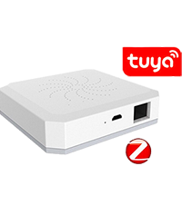

# Presentation

This plugin can manage many LED strips or LED bulbs or electrical plugs controlled by wifi or radio frequency 2.4 GHz via a box wifi sold with the product.

    

 

# Compatibility and limitations

## Compatible products

There are many products compatible with the plugin but very different brands or brands.

Compatible products:
-   Mi.Light / EasyBulb / LimitlessLED bulbs connected to the controllers below: no feedback!
-   Strip-led Mi.Light / EasyBulb / LimitlessLED connected to the controllers below: no feedback!
-   Led controller Mi.Light / EasyBulb / LimitlessLED V3.0 to V5.0 (the miboxer is not compatible): no feedback!
-   Mi.Light / EasyBulb / LimitlessLED LED controller V6.0 / iBox1 / iBox2: No feedback!
-   White and color Xiaomi Yeelight WiFi bulbs with status feedback!
-   Strip-led WiFi Xiaomi Yeelight color with status feedback!
-   Xiaomi Yeelight WiFi ceiling light with status feedback!
-   WiFi desktop lamp Xiaomi Mijia with status feedback!
-   Sonoff Basic R3 in DIY mode with status feedback !!
-   Nanoleaf Aurora with status feedback!

Products that may be compatible and not guaranteed:
-   LW12 / Lagute: RGB strip-led controller: status feedback!
-   Wifi 320/370 RGB / RGBW strip-led controller: partial status feedback!
-   Magic UFO: RGBW strip-led controller, manages white!
-   MagicHome: RGBW / RGBWW strip-led controller and RGBW bulbs / spots compatible with the MagicHome app!
-   H801: RGBW strip-led controller, no status feedback !!
-   Arilux AL-C01 / 02/03/04/06/10: RGB / RGBW / RGBWW strip-led controller, status feedback!
-   TP-Link LB100 / 110/120/130: bulbs with status feedback!
-   Extel Meli lamp with status feedback!
-   Xiaomi Philips: Desk lamp, bulb and ceiling lamp with status feedback !!!
-   Bulbs, sockets, switch, shutter switches, humidifier, thermostat compatible with Tuya Smart live or Jinvoo smart or eFamilyCloud apps with status feedback !!!
-   TP-link HS100 HS110 electrical outlets with status feedback !!
-   Magic home compatible pixel strip controllers with status feedback!
-   Peripherals controlled by the Ewelink app including Sonoffs in LAN mode with status feedback !!!

For these controllers, bulbs or sockets, the exchange protocol does not come directly from the manufacturer, who can therefore modify it at any time. Several versions exist on the market which are not all compatible with the plugin.

Warning :
- ! : easy integration for a person who reads the documentation before acting
- !! : in addition to!, requires to follow a particular procedure, suitable for a person who understands that a procedure is made to be scrupulously followed
- !!! : in addition to !! requires basic computer knowledge and be used to researching the internet for a specific purpose

Incompatible and non-incompatible products:
-   The Mi.light MiBoxer bridge (except ON / OFF of the box)
-   Led Milight controllers (type YL etc.) without bridge.
-   Bulbs, sockets or LED strip controllers that contain a bluetoooth receiver instead of a 2.4 Ghz or WiFi radio receiver.
-   The LED strip or bulb controllers and the bulbs or sockets that use a point-to-point WiFi connection with the mobile application.
-   The Xiaomi bedside lamp is not compatible (by construction).

## Compatibility test

On request, a test plugin for non-validated products can be provided.

It is advisable to inquire on the forum to find out the compatibility of a product that is not widely distributed.

Go to the Jeedom forum [here] (https://community.jeedom.com/t/plugin-wifilightv2-discussion-generale/2439)

# limitations

Mi.Light / EasyBulb / LimitlessLED:
-   All the functionalities are taken into account by the plugin.
-   MiBoxer bridge is not compatible

LW12 / Lagute:
-   Programming of custom modes is not possible, you must use the application supplied with the controller (Magic Home). On the other hand, custom modes can be triggered with the plugin.
-   There are several versions of LW12 which may not be compatible with the plugin.

Magic UFO, MagicHome and Arilux AL-C01 / 02/03/04/06/10:
-   Programming of custom modes, radio mode and timers is not supported. You must use the application supplied with the controller (Magic Home). On the other hand, custom modes can be triggered with the plugin.
-   There are different models which may not be compatible with the plugin.

Xiaomi Yeelight:
-   HSV commands are not managed. Flow and scene are created by creating commands with the JSON code corresponding to the desired effect (see the YeeLight API documentation).
-   The Xiaomi bedside lamp is not compatible.
-   The Xiaomi Mijia desk lamp is partially compatible (no full status feedback).

Wifi 320/370:
-   Scene mode status feedback is not managed, only ON / OFF is managed.
-   There are different models which may not be compatible with the plugin.

H810:
-   stage games are not managed.
-   There are different models which may not be compatible with the plugin.

TP-Link:
-   The timers are not managed.
-   The power consumption information is not managed for the bulbs.

Extel Meli:
-   The sound part of the lamp is not taken into account

Xiaomi Philips:
-   All features are taken into account

Magic Home compatible pixel strip controllers:
-   custom scenes are not managed.

Compatible devices Tuya Smart / Jinvoo / eFamilyCloud:
-   all commands from validated devices (see forum) of firmware 1.0 and firmware 2.0 are compatible (in particular the Neo CoolCam sockets).

Sonoff DIY:
-   Basic R3 with firmware 3.3.0 peripherals with a single contact.

Ewelink and Sonoff LAN:
-   devices with firmware 3.0.1 (list given below in the eWelink paragraph)

Nanoleaf AUrora:
-   Rhythm not implemented

# WiFi module configuration

## Install peripherals

Download the manufacturer&#39;s mobile application and follow the instructions to control the device with your mobile. For each wifilightV2 device, detailed help is provided on the configuration page.

As long as the device is not controlled with the mobile application, the plugin will not be able to work.

Consult the device manufacturer&#39;s help and forums.

## Configure the router
You must configure the DHCP of your router (generally provided by your access provider) to modify the allocation of the IP address of the wifi module or the bulb or socket so that it is static. Note this address. In general, it will be of the form: 192.168.1.xxx where xxx corresponds to the address of the wifi module (2 to 254)

Consult the forums of your box to learn how to configure your DHCP.

After this modification, check that the mobile application is still controlling the device.

You can then proceed to the configuration of the wifilightV2 plugin.

## Plugin installation and configuration

wifilightV2 does not create any device automatically, you have to create them in the plugin before configuring them.

Help :
-   Use the question mark icon for help with each configuration item.

Setting :
-   To configure a device, choose the Plugins / Communicating objects / wifilightV2 menu.
-   Then click on the button at the top left Add a WiFi module
-   Enter the name of the wifi module
-   Enter parent object
-   Choose the Light category (default)
-   Activate and make visible (default)
-   Enter the IP address of the WiFi plug or bulb module (see the FAQ for more explanations)
-   For some peripherals it is requested to enter the channel used, create a wifilightV2 device per channel
-   For some devices it is asked to enter a token or (and) an identifier, consult the help on the device configuration page
-   For some devices it is possible to suppress the status feedback if it causes micro-cuts
-   For some controllers it is necessary to indicate the number of leds of the pixel strip leds
-   For some controllers it is necessary to indicate the order of colors if the default colors do not match
-   Enter the brand or type of device
-   Enter the exact subtype of the controller, the bulb, the socket or the strip-led, this is essential to create the commands in order to control the device
-   Enter the number of orders sent: allows you to repeat the order for distant equipment in the event of a bad transmission. (1 by default). Some bulbs or sockets do not manage this repetition because the plugin ensures by return of transmission status. Some relative commands (increments) are not repeated.
-   Enter the sending delay in the event of repetition (0 ms by default, 100 ms max)
-   Enter the% of intensity increase when pressing the light intensity increment or decrement buttons
-   Enter the group number for synchronization, see below

## Adding commands
when saving the module, orders are automatically created.

the name of the commands can be changed. The automatically created and deleted orders are recreated during a backup.

when all the commands are created, they can weigh down the interface, it is possible not to display them by configuring the creation of the commands.

## Changing the device type or subtype

-   delete all orders
-   change device type or subtype
-   save 2 times

# Status feedback and connection status operation

## Compatibility of status feedback

Status feedback is immediate for the following devices:
- Yeelight
- compatible with ewelink
- compatible with the Tuya smart live app
- Sonoff in LAN mode

For example, if a switch is pressed, Jeedom will know it immediately.

For peripherals:
 - LW12 / Lagute
 - Magic UFO / Home
 - Arilux
 - Wifi 3x0 (partially)
 - TP-Link
 - Xiaomi Philips
 - Extel Meli
 - Sonoff in DIY mode
 - Nanoleaf Aurora

The plugin regularly queries the device to know its status. The delay for Jeedom to know the state can exceed 1 minute.

For other devices there is no status feedback;

## Update by scenario

The xxxxGet and State commands can be used in a Jeedom scenario.

## Connection information

The ConnectedGet command allows you to retrieve the connection status of each device. It is updated every minute.
-  -1: device with status return OK
-  -2: unable to prepare the connection to the device
-  -3: device not connected
-  -4: no response from the device
-  -5: wrong response from the device
-  -6: device without status feedback

# How synchronization works

## Principle of synchronization

It is possible to synchronize several devices of different brands:

All devices with the same group number are synchronized

Group 0 is not synchronized (default group)

When using a command from a device in the group, the same command is applied to all devices in the same group

If the command does not exist for the synchronized device, it is simply ignored.

Attention, the peripherals will not be ordered exactly at the same time because of the latency times during the sending of the orders which is done one after the other.

## Synchronization configuration

Just put a number other than zero in the group field when configuring the equipment. All equipment with the same numbers will be synchronized.

# Particular case of Mi.Light boxes

## Configuration of iBox 1 or 2

Since version 1.0.58 of iBox 1 and 2, it may be necessary to modify their configuration so that they can communicate with Jeedom.

Connect in http (with a web browser) to the IP address of your iBox. The default credentials are admin / admin. Go to the &quot;Other Setting&quot; tab and in &quot;Network Parameters setting / Protocol&quot; choose UDP and save.

# Special case of Xiaomi Yeelight

## Bulb configuration
It is essential to activate the local network control via the Xiaomi Yeelight app.

## Xiaomi Yeelight Scene Mode
Scene modes can be configured. Several scene modes are preprogrammed in the plugin but it is possible to add other scene modes.

It is enough to respect certain conditions:
-   Add a wifilightV2 action of type Default
-   Give it a name (for example Scene Flashes)
-   In parameters, put the Yeelight scene command, for example: &quot;id&quot;: 1, &quot;method&quot;: &quot;set_scene&quot;, &quot;params&quot;: [&quot;cf&quot;, 0,0, &quot;500,1,255,100,1000,1,16776960, 70 &quot;]

Do not put the start and end braces as well as the newline characters, the plugin will automatically add them. Take inspiration from the preconfigured commands to create these additional scene modes. For the Yeelight syntax, see [here] (https://www.yeelight.com/download/Yeelight_Inter-Operation_Spec.pdf)

## Status update in Jeedom
When activating the plugin and as soon as the daemon is launched as well as every minute, the plugin searches for light bulbs powered and connected to Jeedom.

As soon as the bulb is found, the state of the bulb is returned to the plugin immediately.

Note that the plugin can take up to 1 minute to find a bulb and 4 minutes to find that a device is disconnected.

# Special case of TP-Link devices

## Bulb configuration

Since mid 2019, new devices are coming out in version 2 protocol. The V2 protocol requires recovering a token allowing the plugin to communicate with TP-Link devices.

To obtain this token, you must capture the frames exchanged between the Kasa app on the phone and the device to be added in the plugin. On Android you have to use Packet Capture.

The plugin then allows you to extract the token. You must copy the retrieved frame in the Parameters field of the getKey command and then execute this command. If the frame is decodable, the token will be displayed in the logs and in the message center (attention: delete the message each time after reading).

The frame to put in &quot;Parameters&quot; must have the following appearance (the ... replace other values):

00 00 00 5f d0 f2 91 fe 90 e4 81 f9 8d af 95 ... 99 bb 81 fa 87 fa 87

The data is separated by spaces and represents hexadecimal numbers which come directly from Packet Capture. In general, the frame begins with 3 zeros then, here, 5f gives the size of the frame in hexadecimal or 95 in decimal.

No help will be given to recover the frame from Packet Capure.

For the moment only the sockets can be used in V2, contact the author if you have bulbs in V2.

# Special case of Xiaomi Philips

## Bulb configuration

It is essential to retrieve a token allowing the plugin to communicate with Xiaomi Philips devices.

The procedure is complex and requires several manipulations. Do a web search with the keyword: Xiaomi token.

No help will be given to retrieve the token.

# Special case of Sonoff in DIY mode

## DIY mode configuration

Sonoff gives all the elements [here] (https://github.com/itead/Sonoff_Devices_DIY_Tools/tree/master/tool) to configure the modules in DIY mode.

A mobile phone and a Windows PC with WiFi card are required. The software to run to find the Sonoff gives in the left column the identifier necessary for the configuration of the device.

The Sonoff device must be in firmware 3.3.0 or more, the Windows app above allows you to update the firmware.

# Special case of devices compatible with the Ewelink application in LAN mode

## Retrieving the APiKey and DeviceID

Follow the directions [here] (https://blog.ipsumdomus.com/sonoff-switch-complete-hack-without-firmware-upgrade-1b2d6632c01) to retrieve these 2 pieces of information. The deviceid is to be put in the plugin identifier. The Apikey is to be put in the token. Do not put space or quotes.

The device must be in firmware 3.0.1 or higher, the Ewelink app is used to update the firmware.

## Connection information

When a device connects to wifi, the plugin will be immediately notified. On the other hand, when a device is disconnected, the plugin will only know if a command is sent to it by the plugin.

## Compatibility

Many brands are compatible including Sonoff.
-  Switches, wall sockets, switch: simple of all brands
-  Switches, wall sockets, switch: multiples of all brands
-  2 types of lamps (test the 2 types)
-  Sonoff TH10 / 1H16 temperature sensor
-  Sonoff basic, RF, POW, Mini
-  Sonoff Dual
-  Sonoff 4CH / 4CH PRO
-  Sonoff Touch
-  Sonoff S20 / S26
-  Sonoff T1 / TX
-  Sonoff SLAMPHER
-  Sonoff T4EUC1
-  Sonoff RF bridge 433 for sensors only (door, presence detector, remote control)

For multi-channel peripherals (like the Sonoff 4CH) you have to create as many wifilightV2 equipment as there are channels, a copy of the first created easy to spot, then you have to change the channel number.

For the devices not present in this list (Sonoff Ifan, dimmer for example) or if the configuration does not work and after integrating the device in Jeedom (with the Sonoff Basic configuration for example) locate in the logs:

Receive after decode: {...............}

and give in the [forum] (https://community.jeedom.com/t/plugin-wifilightv2-sonoff-ewelink-lan/2632) the content of the braces to allow the integration of the module in the plugin.

# Special case of Tuya Smart / Jinvoo / eFamilyCloud apps compatible devices

## Compatibility

Many brands are compatible with the plugin. Consult the forum for more information. The plugin allows to control many actuators. It can retrieve the state of the peripherals as soon as it sends state change information or when it interrogates them every minute. If a wall switch is used, Jeedom will know immediately.

The following equipment is compatible with firmware 1.0. and in firmware 2.0.

-  simple sockets with and without return on consumption, in particular the Neo Coolcam wifi sockets
-  multiple sockets with and without consumption with and without USB
-  roller shutter control
-  wall switches: 1, 2 or 3 inters
-  wall switch with dimmer
-  NEWKBO humidifier 300 ml and only this one
-  thermostat BHT-6000GCLW / BHT 6000 and only these models
-  RGBW globe bulbs and similar models in operation

However, the compatibility of these devices is not guaranteed because the protocol can be modified by the manufacturers.

For multi-channel devices (such as multiple sockets) you must create as many wifilightV2 equipment as there are channels, a copy of the first created easy to spot, then you must change the channel number.

Presence and opening sensors are not compatible because they do not interact locally.

The plugin tests the devices (but they must be added manually) and displays a message in the message center when a device has been configured with the wrong firmware.

## Device configuration

It is essential to retrieve a local key (LocalKey) and an identifier allowing the plugin to communicate with the devices.

The procedure is complex and requires several manipulations. Do a search on the web with the keyword: Tuya localkey, in Github in particular or on the Jeedom forum.

The device must not be connected to an application on a mobile phone, otherwise it will not respond to Jeedom&#39;s orders. It is therefore necessary to close any application possibly connected to the device.

If the device is uninstalled and then reinstalled in the mobile app, then its key will be changed. You will have to find the key with the above procedure.

No help will be given to recover the key or the identifier.

Any configuration change requires restarting the daemon.

## Configuration of catch consumption recovery

According to the brands, consumption is not sent in a unique way by the plug. To recover this configuration, install the plug in Jeedom and keep the status feedback in the configuration, then go to the logs of wifilightV2. The socket is polled every minute. Find the message that looks like:

return decoded: {&quot;devId&quot;: &quot;xxxxxxxxx&quot;, &quot;dps&quot;: {&quot;1&quot;: false, &quot;2&quot;: false, &quot;9&quot;: 0, &quot;10&quot;: 0, &quot;18&quot;: 0, &quot;19&quot; : 0, &quot;20&quot;: 2281, &quot;21&quot;: 1, &quot;22&quot;: 726, &quot;23&quot;: 28971, &quot;24&quot;: 19417, &quot;25&quot;: 1070}}

The index &quot;20&quot; here corresponds to the supply voltage in hundreds of mV, ie: 228.1 V, it should move slightly. The indexes &quot;18&quot; and &quot;19&quot; correspond to the current (mA) and the power in W, here no device is connected and therefore the information is zero. It is a good way to find the tension, by connecting a device, these 2 values must be modified and the tension is right after.

The syntax is then: 20; 18; 19 which must be put in the field &#39;Energy setting&#39;.

For plugs 1 socket, in general it is necessary: 6; 4; 5 (set by default by the plugin).

For plugs with 2 sockets, in general you need: 9; 7; 8 (set by default by the plugin).

For the other sockets, the value 20; 18; 19 is set by default.

## Customization of orders

Given the variety of Tuya compatible devices, it may be necessary to create custom commands.

Create a new action / default command. Give an identical name and Id and put the Tuya command in parameters. Leave dps empty. Tuya commands are in JSON format and contain dps: {xxxxxx}. This is the xxxxxx that you have to put in parameters.

Examples:

To raise certain rolling shutters: xxxxxx is worth &quot;1&quot;: &quot;1&quot; which is to be set in parameters (use the double quotes of key 3).

To set plug n ° 2 of certain plugs to on: xxxxxx is worth &quot;2&quot;: true which is to be set in parameters (use the double quotes of key 3).

To switch off plug n ° 1 and plug n ° 2 of certain plugs: xxxxxx is worth &quot;1&quot;: false, &quot;2&quot;: false which is to be set in parameters (use the double quotes of key 3).

The following paragraph gives elements to interpret the wifilightV2 logs.
-   Note that it is necessary for the device to return its status.
-   In many cases there will be no status return if the commands added by default do not recover the dps. In this case it is possible to recover the status feedback by adding a custom command by specifying the dps as indicated in the following paragraph.
-   It is therefore possible to mix custom commands by specifying the dps (next paragraph) or without specifying the dps.

## Custom device

It is possible to create a fully custom device. Unlike custom commands, a custom device has no predefined commands and everything must be configured for each command. The procedure requires the device to return its status to the logs, otherwise there is no relief.

### Configuration
-   disable all wifilightV2 devices except the one to be tested
-   configure the device correctly (static IP address, LocalKey, Id)
-   check that the demon is running, if not start it
-   configure wifilightV2 logs in debug mode
-   clear logs

### Information retrieval
-   press a button on the device (on, off, up, down, etc.) or wait for the device to return its status or press a button on the Smart Live app (but in the latter it can prevent status feedback )
-   locate in the logs the passage looking like this:

        Receive after decode :{devId:50701244cc50e37e9aff,dps:{"1":"off","101":true}}
        [2019-10-13 09:15:30][DEBUG] :       >>> : devId | 50701244cc50e37e9aff : 50701244cc50e37e9aff
        [2019-10-13 09:15:30][DEBUG] :       >>> : dps | Array : Array
        [2019-10-13 09:15:30][DEBUG] :       >>>>>>>>>>> : 1 | stop : stop
        [2019-10-13 09:15:30][DEBUG] :       >>>>>>>>>>> : 101 | 1 : 1

    Here, the off button was selected on the device and we observe that the dps 1 has changed.

        Receive after decode :{devId:50701244cc50e37e9aff,dps:{"1":"on","101":true}}
        [2019-10-13 09:15:30][DEBUG] :       >>> : devId | 50701244cc50e37e9aff : 50701244cc50e37e9aff
        [2019-10-13 09:15:30][DEBUG] :       >>> : dps | Array : Array
        [2019-10-13 09:15:30][DEBUG] :       >>>>>>>>>>> : 1 | stop : stop
        [2019-10-13 09:15:30][DEBUG] :       >>>>>>>>>>> : 101 | 1 : 1

    Here, the on button has been selected on the device and we observe that the dps 1 has changed.

-   Create a new action / default command in the device commands:
    *    In the interface column put ON as the name of the button
    *    In the column internal name and order number, put as unique Id: ON, as dps: 1 (without the double quotes) and as parameter: &quot;on&quot; (if the one is not surrounded by quotes, they must be to take off).
-   Create a new action / default command in the device commands:
    *    In the interface column put OFF as the name of the button
    *    In the column internal name and order number, put as unique Id: OFF, as dps: 1 (without the double quotes) and as parameter: &quot;off&quot; (if the off is not surrounded by quotes, they must be to take off).
-   Create a new info / other command in the device commands:
    *    In the interface column put STATUS as the name of the info
    *    In the internal name and order number column, put as unique Id: STATUS, as dps: 1 (without the double quotes) and nothing in parameters.

    In the case of digital information:

        Receive after decode :{devId:50701244cc50e37e9aff,dps:{"3":850,"101":true}}
        [2019-10-13 09:15:30][DEBUG] :       >>> : devId | 50701244cc50e37e9aff : 50701244cc50e37e9aff
        [2019-10-13 09:15:30][DEBUG] :       >>> : dps | Array : Array
        [2019-10-13 09:15:30][DEBUG] :       >>>>>>>>>>> : 3 | 850 : 850
        [2019-10-13 09:15:30][DEBUG] :       >>>>>>>>>>> : 101 | 1 : 1

    Here, an intensity slider has been selected on the application of the device and we observe that the dps 3 has changed.

-   Create a new action / cursor command in the device commands:
    *    In the interface column put Intensity as the cursor name
    *    In the column internal name and order number, put as unique Id: Intensity, as dps: 3 (without double quotes) and as parameter: # slider # (here the numeric value is not surrounded by quotes, it does not so do not put them).
-   Create a new info / other command in the device commands:
    *    In the interface column put IntensiteGet as the name of the info
    *    In the column internal name and order number, put as unique Id: IntensiteGet, as dps: 3 (without the double quotes) and nothing in parameters.

Notes:
-   nothing in the logs: wrong IP address or device that does not return its status
-   return with error: Id incorrect
-   return not decoded: incorrect localkey
-   the command does not work: check the command
-   to change the color of a lamp, the slider technique is not possible it is necessary to program several buttons with predefined colors

## Status update in Jeedom
When activating the plugin and as soon as the daemon is launched as well as every minute, the plugin searches for devices powered and connected to Jeedom.

As soon as the device is found, the device status is immediately returned to the plugin.

Note that the plugin can take up to 1 minute to find that a device is connected or disconnected.

# Special case of Nanoleaf

## Key recovery

Press the Power button on the Nanoleaf for 5-7 s and press the getKey command on the plugin. Check that the Apikey has been placed in the &quot;token&quot; field of the plugin configuration.

## Using custom effects

Create an effect with the NanoLeaf app and give it a name. Create an action / default command in the list of device commands in the plugin. Put the name in settings. Then give a unique identifier and a name, they can be identical to the name of the order.

# FAQ

## What devices can be used?

Read the documentation

## Nothing is happening

First operate the device with the mobile application provided by the manufacturer.

Use the button <tester> in the Plugin / Connected Objects / wifilightV2 / commands menu.

No help will be given without the peripherals being operational with the manufacturer&#39;s application on a mobile phone. It is necessary to give a fixed IP address to the device.

## I don&#39;t know how to configure my internet box

No help will be given on the box and the concepts necessary to configure the router to assign a fixed IP address. Consult the box forums.

## Not all commands are created when changing device model

Save 2 times.

## Managing the intensity of white Mi.Light / EasyBulb / LimitlessLED bulbs is not practical

The manufacturer of the LEDs has not planned to be able to directly affect the intensity of the bulb. We can only increment or decrement compared to the previous value. The plugin only reproduces this operation. The cursor which is proposed is consequently capricious.

## Color intensity management sometimes has unexpected behaviors

No protocol manages the intensity of the color, although generally mobile applications do it. As long as Jeedom manages color and intensity, everything is fine. But if the intensity is modified by a mobile application, the results are not always those expected. The plugin tries to correct the problem when the lamp or the controller has a status feedback.

## Is there a status feedback?

Read the documentation

## Cannot operate Xiaomi Yeelight bulbs

It is essential to activate the control mode by local network via the Xiaomi Yeelight application.

## I don&#39;t control the sound of Extel Meli bulbs

The sound is not managed by the plugin

## Cannot operate Xiaomi Philips bulbs

To communicate with Xiaomi Philips bulbs, it is necessary to transmit a token or token in English. Without this token, the bulb will not take into account the orders sent to it. This token is found in the Mi-Home app and, depending on your phone, there are several methods to retrieve the token. The procedure is described on several sites but it is not reproduced here for two main reasons:

-   Xiaomi has already modified its protocol, which forced it to modify the procedure to recover the token, it could still do so.
-   New and simpler procedures can be made available to Internet users.
-   This documentation will not be maintained as quickly as a simple web search with the keywords: xiaomi token.

## Unable to operate Tuya / Smart live / Jinvoo / eFamilyCloud apps compatible devices

To communicate with these bulbs, sockets and other peripherals, it is necessary to transmit a local or Localkey or token key in English and an identifier. Without these parameters, the bulb will not take into account the orders sent to it. There are several methods to retrieve this information. The procedure is described on several sites but it is not reproduced here for two main reasons:

-   The applications were updated, which forced us to modify the procedure to retrieve the information.
-   New and simpler procedures can be made available to Internet users.
-   This documentation will not be maintained as quickly as a simple web search with the keywords: Tuya LocalKey and in particular on Github.

## Error when sending command / toothed wheel without stop / Send without stop
-   wifilightV2 equipment must be updated
-   go to each equipment and save 2 times
-   test with new equipment if it persists

## Mi.Light IBox1, iBox2, V6 bridge: command taken into account randomly
-   orders are sent too quickly
-   in the scenarios, put breaks of sufficient duration

## Mi.Light IBox1, iBox2, V6 bridge: command not taken into account
-   when pairing with the Mi.Light application on mobile and when configuring wifilightV2, choose the same remote control.

## LW12 Magic UFO Arilux Wifi3x0 H801 Compatible controllers Magic Home Tuya / Jinvoo / eFamilyCloud
-   many versions exist and some may be incompatible with the plugin. Contact the author for a possible update.

## Commands are missing when creating or modifying the bulb type
-   save the equipment (2 times)

# How do I get help?

Go to the Jeedom forum [here] (https://community.jeedom.com/t/plugin-wifilightv2-sonoff-ewelink-lan/2632)

# Known bugs

Memory drastically decreases
-   Bug fixed.

For Tuya compatible sockets, micro-cuts occur regularly
-   Bug fixed.