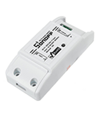
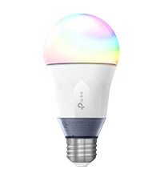
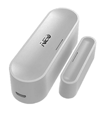
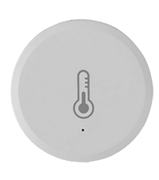

# Changelog

[See here](https://bcaro.github.io/wifilightV2-doc/fr_FR/changelog)

# Installation

The plugin requires installing dependencies. If the dependencies are not installed many devices will not function properly. However, if the installation fails, only finding the IP address of Tuya and Ewelink devices will not work. 

# Presentation

Warning :
The permanent functioning of the plugin cannot be guaranteed: incompatibility or partial compatibility of the product, poorly managed protocol, poor quality connection for example. Do not use the plugin to control sensitive devices that can generate any kind of disorder. The plugin is provided for testing purposes and not for an installation requiring optimal operation in all circumstances.

This plugin allows you to manage many LED strips, LED bulbs, electrical outlets, thermostats, temperature sensor, door sensor, etc. controlled by wifi directly or via a wifi box sold with the product. The principle of the plugin is never to use the cloud and therefore an internet connection between the plugin and the device via a remote server, all actions are therefore local to the home network. 

One exception: Govee products.

# Compatibilities and limitations

## Compatible products
 
There are many products that are compatible with the plugin but from very different brands or unbranded.
 
Compatible products:
- Mi.Light / EasyBulb / LimitlessLED bulbs connected to the controllers below: no status feedback!
- Mi.Light / EasyBulb / LimitlessLED strip-led connected to the controllers below: no status feedback!
- Mi.Light / EasyBulb / LimitlessLED V3.0 to V5.0 led controller (the miboxer is not compatible): no status feedback!
- Mi.Light / EasyBulb / LimitlessLED V6.0 / iBox1 / iBox2 led controller: no status feedback!
- MiLight-hub DIY led controller: with status feedback !!
- White and color Xiaomi Yeelight WiFi bulbs with status feedback!
- Xiaomi Yeelight color WiFi strip-led with status feedback!
- Xiaomi Yeelight WiFi ceiling light with status feedback!
- Xiaomi Yeelight V2 WiFi bedside lamp with status feedback!
- Xiaomi Mijia WiFi desk lamp with status feedback!
- Sonoff Basic R3 in DIY mode with status feedback !!
- Nanoleaf Aurora with status feedback!
- myStrom products with status feedback
- Govee products with status feedback !

Products that may be compatible and not guaranteed:
- LW12 / Lagute: RGB strip-led controller: status feedback!
- Wifi 320/370 RGB / RGBW strip-led controller: partial return!
- Magic UFO: RGBW strip-led controller, manages white!
- MagicHome: RGBW / RGBWW strip-led controller and RGBW bulbs / spots compatible with the MagicHome app!
- H801: RGBW strip-led controller, no status feedback !!
- Arilux AL-C01 / 02/03/04/06/10: RGB / RGBW / RGBWW strip-led controller, status feedback!
- Tapo LB100 / 110/120/130: bulbs with status feedback!
- Extel Meli lamp with status feedback!
- Xiaomi Philips: Desk lamp, bulb and ceiling light with status feedback !!!
- Bulbs, sockets, switch, shutter switches, humidifier, thermostat compatible with Tuya Smartlife with status feedback !!!
- Tapo HS100 HS110 electrical outlets with status feedback !!
- Magic home compatible pixel strip led controllers with status feedback!
- Peripherals controlled by the Ewelink app including Sonoffs in LAN mode with status feedback !!!
- Wifi gateways (including Lidl) using the Tuya protocol for Zigbee devices !!!
- Meross peripherals !!!
- Wiz Products !!
- Tapo !!

For these latter wifi controllers or peripherals, the exchange protocol does not come directly from the manufacturer who can therefore modify it at any time. Several versions exist on the market which are not all compatible with the plugin. Some particular products may not be compatible.

Warning :
- ! : easy integration for a person who reads the documentation before acting
- !! : in addition to !, requires following a particular procedure, suitable for a person who understands that a procedure is made to be followed scrupulously
- !!! : in addition to !! requires basic computer skills and be accustomed to doing research on the internet for a specific purpose

It is advisable to inquire about the forum to know the compatibility of a product that is not widely distributed.

Never modify the firmware of the products, which can make them incompatible with the plugin. 

Go to Jeedom forum [here](https://community.jeedom.com/t/plugin-wifilightv2-discussion-generale/2439)

## Limitations

Mi.Light / EasyBulb / LimitlessLED:
- All features are taken into account by the plugin (with ibox1 and 2 and with the DIY Milight-hub bridge)
- The MiBoxer bridge is not compatible
- Led Milight controllers (type YL etc.) without bridge.

LW12 / Lagute:
- The programming of custom modes is not possible, you must use the application supplied with the controller (Magic Home). On the other hand, the custom modes can be triggered with the plugin.
- There are several versions of LW12 which may not be compatible with the plugin.

Magic UFO, MagicHome and Arilux AL-C01 / 02/03/04/06/10:
- The programming of custom modes, radio mode and timers are not managed. You must use the application supplied with the controller (Magic Home). On the other hand, the custom modes can be triggered with the plugin.
- There are different models which may not be compatible with the plugin.
- Some Magic Home compatible devices are incompatible because they only work with the cloud

Xiaomi Yeelight:
- HSV orders are not supported. Flow and scene are created by creating commands with the JSON code corresponding to the desired effect (see the YeeLight API documentation).
- Xiaomi bedside lamp of the first version is not compatible.
- The Xiaomi Mijia desk lamp is partially compatible (no full status feedback).

Wifi 320/370:
- Scene mode status feedback is not managed, only ON / OFF is managed.
- There are different models which may not be compatible with the plugin.

H810:
- stage games are not supported.
- There are different models which may not be compatible with the plugin.

Tapo:
- The timers are not managed.
- Electricity consumption information is not managed for bulbs.

Extel Meli:
- The sound part of the lamp is not taken into account

Xiaomi Philips:
- All features are taken into account

Magic Home compatible pixel strip led controllers:
- custom scenes are not supported.

Compatible devices Tuya Smartlife:
- all the commands of validated peripherals (see the forum) of firmware 1.0 and firmware 2.0 are compatible (in particular the Neo CoolCam sockets).
- not compatible with cloud devices, especially opening sensors

Sonoff DIY:
- Basic R3 with firmware 3.3.0 peripherals with one contact.

Ewelink and Sonoff LAN:
- peripherals with firmware 3.0.1 (list given below in the eWelink paragraph)
- not zigbee compatible
- not compatible with cloud devices, in particular opening sensors and lamps or strip LEDs.

Meross:
- roller shutter control: partial operation
- garage door control: partial operation

Nanoleaf Aurora:
- Rhythm not implanted

Tuya Wifi gateway and Zigbee devices:
- Configuration is manual or semi-automatic except for a limited number of peripherals.

Wiz:
- only the lamp has been tested, awaiting user feedback for other devices

myStrom:
- only the ordered socket has been tested, waiting for users to return for other devices

- the connection with the products is via the cloud and requires internet.
- only the color intensity and color temperature On/Off controls work
- these commands do not work on all Govee modules

Govee:
- the connection with the products is via the cloud and requires internet.
- only the color intensity and color temperature On/Off controls work
- these commands do not work on all Govee modules 

# Configuration of the wifi module

## Install peripherals

Download the manufacturer's mobile application and follow the instructions in order to control the device with the mobile. For each wifilightV2 device, detailed help is provided in the configuration page.

As long as the device is not controlled with the mobile app, the plugin will not be able to work.

Consult the help and forums of the device manufacturer.

## Configure the router
You must configure the DHCP of your router (generally provided by your access provider) to modify the allocation of the IP address of the wifi module or of the bulb or socket so that it is static. Note this address. In general, it will be of the form:
192.168.1.xxx
where xxx corresponds to the address of the wifi module (2 to 254)

Consult the forums of your box to learn how to configure your DHCP.

After this change, verify that the mobile application is still controlling the device.

You can then go to the configuration of the wifilightV2 plugin.

## Plugin configuration

wifilightV2 does not create devices automatically except:

- Tuya Smartlife
- Ewelink
- Govee 

Need help ? :
- Use the question mark icon to get help on each configuration item.

Settings :
- To configure a device, choose the Plugins / Communicating objects / wifilightV2 menu
- Then click on the button at the top left Add a WiFi module
- Enter the name of the wifi module
- Enter the parent object
- Choose the Light category (by default)
- Activate and make visible (default)
- Enter the IP address of the module of the WiFi socket or bulb (see the FAQ for more explanations)
- For the Milight-hub, an identifier and a port must be configured
- You can load images into the /data/myImages folder of the plugin using the Jeexplorer plugin. These images can replace the images associated with devices in the display page of all wifilightV2 devices. Useful for custom devices that are not associated with an image.
- For some peripherals, you are asked to enter the channel used, create a wifilightV2 device per channel
- For some devices, you are asked to enter a token or (and) an identifier, consult the help on the device configuration page
- For Tuya peripherals, it is possible to force the interrogation of the status every minute, useful for outlets with consumption.
- For some controllers it is necessary to indicate the number of leds of the pixel strip leds
- For some controllers it is necessary to indicate the order of the colors if the default colors do not match
- Enter the brand or type of device
- Enter the exact subtype of the controller, bulb, socket or strip-led, this is essential to create the commands to drive the device
- Enter the number of commands sent: allows you to repeat the command for a remote device in the event of poor transmission. (1 by default). Some bulbs or sockets do not manage this repetition because the plugin ensures by feedback of the state of the transmission. Some relative commands (increments) are not repeated.
- Enter the sending delay in case of repetition (0 ms by default, 100 ms max)
- Enter the intensity increment% when pressing the light intensity increment or decrement buttons
- Configure the number of orders created, the creation of all orders (energy colors effects) can dramatically slow down the interface
- Enter the group number for synchronization, see below 

## Adding commands
When saving the module, the orders are automatically created.

Configure the "Creation of orders" parameter to create all or part of the orders.

the name of the commands can be changed. Automatically created and deleted orders are recreated during a save.

When all the orders are created, they can burden the interface, it is possible not to display them by configuring the creation of the orders.

## Device modification

- a change of type or subtype deletes all commands
- save twice after change

# Status feedback

## Compatibility

Status feedback is immediate for the following devices:
- Yeelight
- compatible with Ewelink
- compatible with the Tuya smart live app
- Sonoff in LAN mode
- Tuya / Zigbee compatible
- Sonoff in DIY mode (requires recent firmware, otherwise interrogation every minute)

For example, if a switch is flipped, Jeedom will know it immediately.

For peripherals:
 - LW12 / Lagute
 - Magic UFO / Home
 - Arilux
 - Wifi 3x0 (partially)
 - TP-Link
 - Xiaomi Philips
 - Extel Meli
 - Nanoleaf Aurora
 - Meross
 - Mi.Light connected to the Milight-hub bridge
 - Wiz
 - myStrom
 - Govee
 - Tapo

The plugin regularly polls the device to know its status. The delay for Jeedom to know the status can exceed 1 minute.

For the other peripherals there is no status feedback.

The stateGet command allows, for devices that return their state, to force the update of the state by polling the device. 

## Update by scenario

The xxxxGet and Etat commands can be used in a Jeedom scenario.

## Connection information

The ConnectedGet command retrieves the connection status of each device. It is updated every minute.
- -1: peripheral with OK status feedback
- -2: unable to prepare for connection to the device
- -3: device not connected
- -4: no response from the device
- -5: bad response from the device
- -6: peripheral without status feedback

On the devices page, an emoticon indicates whether the connection is OK or KO. The indifferent emoticon is used in cases where the plugin cannot know the state of the connection, that is to say the devices which do not return their state. Note that for devices with a gateway (Tuya Zigbee, Meross), the connection status is that of the gateway and is applied to all devices connected to the gateway.

# Synchronization

## Principle

It is possible to synchronize several devices of different brands:

All devices that have the same group number are synchronized

Group 0 is not synchronized (default group)

When using a command from a device in the group, the same command is applied to all devices in the same group.

If the command does not exist for the synchronized device, it is simply ignored.

Be careful, the peripherals will not be ordered exactly at the same time because of latency delays when sending orders which are done one after the other.

## Configuration

All you have to do is put a number other than zero in the group field when configuring the device. All equipment with the same numbers will be synchronized.

# Kelvin of lamps

There are 2 cursors for the temperature in Kelvin. Kelvin expressed in% from 0 (hot) to 100 (cold) and KelvinVal expressed in Kelvin from min to max.
The default values ​​mostly correspond to the manufacturer's data. For some lamps which do not give the min and max values, the plugin uses 2700 to 6500 by default.
For some lamps, the min and max values ​​may be incorrect and the extreme values ​​not understood by the lamp. These values ​​must be adjusted so that they are within the limits accepted by the lamp.
You can notify the developer to change the default configuration to avoid these adjustments.

# color list

For color bulbs, you must have created the device in extended + colors + disco mode. A choice list is then associated with each color. If the color commands are deleted, the automatically created choice list will not be modified but the drop-down list will no longer be able to access this color. In order not to be disturbed in the interface, it is necessary to suppress the display of the color controls.

# list of Disco and Custom modes

Some lamps have disco and custom modes. A choice list is associated with each option of these modes. If the disco or custom orders are deleted, the automatically created selection list will not be modified. For custom orders, you can add new orders but you will have to manually modify this new order in the list. You must have created the device in extended + colors + disco mode. If the individual Disco and Custom modes are deleted, the drop-down list will no longer be able to access that mode. In order not to be disturbed in the interface, it is necessary to suppress the display of the disco and custom commands.

For example, the action list command for customs has the internal name: CMD_LIST_CUSTOM. Its parameter corresponds to the construction of this list:

    Scene01|Extinction;Scene02|Ignition
 
The list will show Power off and Power on and the commands that will be executed will be those with internal name Scene01 or Scene02. If you add a new custom command, for example Scene03 whose name is Flash, you will need to modify the parameter as follows:

    Scene01|Extinction;Scene02|Ignition;Scene03|Flash

If the Scene01 command is subsequently deleted, you will have to manually modify the CMD_LIST_CUSTOM parameter:

    Scene02|Ignition;Scene03|Flash
   

# Mi.Light

You must create one device per channel in the plugin.

## Ibox 1/2 and Mi.Light Box

### End of sale

Mi.Light no longer broadcasts the ibox1 and 2 which replaced them by the Miboxer which is purely cloud and is not compatible with the plugin.

### Configuration

Since version 1.0.58 of iBox 1 and 2, it may be necessary to modify their configuration so that they can communicate with Jeedom.

Connect in http (with a web browser) to the IP address of your iBox. The default credentials are admin / admin. Go to the "Other Setting" tab and in "Network Parameters setting / Protocol" choose UDP and save.

It is necessary to leave the Port field empty (not even a space).

# MiLight-Hub

### An alternative hub

Several projects have resulted in hubs compatible with Mi.Light bulbs and remote controls in order to circumvent the limitations of the manufacturer's hubs and which become even more interesting today with the disappearance of iBox1 and 2. The plugin is compatible with the project of [Sidoh](https://github.com/sidoh/esp8266_milight_hub) and offers 2 modes to drive the bulbs. The first mode is the historical mode of iBox1 and 2, which allows you to use your peripherals as usual, there will be 2 configuration parameters to add. The 2nd mode is completely new and has the advantages of very high reactivity and partial status feedback every minute. 

### Assembling the Milight-hub

The hub is therefore DIY, so you have to mount it and program it with the information provided by [Sidoh](https://github.com/sidoh/esp8266_milight_hub). A tutorial is available  [on the forum ](https://community.jeedom.com/t/tuto-realiser-un-hub-milight-en-remplacement-des-ibox1-et-ibox2/47836?u=bernardfr.caron).

### Mi.Light historical mode

In this mode, all you have to do is enter the Port parameter with the UDP mode port of the Milight-hub. See  [Sidoh](https://github.com/sidoh/esp8266_milight_hub)  or [on the forum](https://community.jeedom.com/t/tuto-realiser-un-hub-milight-en-remplacement-des-ibox1-et-ibox2/47836?u=bernardfr.caron) for more details.

### ESP mode

In this mode, the choice of peripherals is made by the type of remote control and not by the type of lamp as in historical mode. After having entered the usual parameters, you must enter the identifier of the group of remote controls, see  [Sidoh](https://github.com/sidoh/esp8266_milight_hub) or [on the forum](https://community.jeedom.com/t/tuto-realiser-un-hub-milight-en-remplacement-des-ibox1-et-ibox2/47836?u=bernardfr.caron) for more details. This mode offers partial status feedback updated every minute.

To pair a lamp with the Milight-Hub, turn on the lamp and click on Sync ON. Use Sync OFF to unpair. To appear a remote control, select the ON of the channel to synchronize as soon as the power is turned on and click on Sync ON.

To know the characteristics of the hub, click on getKey, the result is obtained in getKeyget by clicking on Test.

# Xiaomi Yeelight

## Configuration
It is essential to activate the local network control via the Xiaomi Yeelight app.

## Choice of version

The plugin allows the choice between 2 versions:

- V1: the connection between the plugin and the device is not permanent, the reaction time is a little longer and the status feedback is not immediate.
- V2: the connection is permanent so the plugin is more responsive and the status feedback is immediate. On the other hand, this leads to a greater sensitivity to bad wifi connections, causing disconnections with the impossibility for a few minutes to access the device.

## Scene mode
Scene modes can be configured. Several scene modes are preprogrammed in the plugin but it is possible to add other scene modes.

It is enough to respect certain conditions:
- Add a wifilightV2 action type Default command
- Give it a name (for example Scene Flashing)
- In parameters, put the Yeelight scene command, for example:
 
    "id":1, "method":"set_scene","params":["cf",0,0,"500,1,255,100,1000,1,16776960,70"]

Do not put the start and end braces as well as the newline characters, the plugin will add them automatically
Take inspiration from the preconfigured controls to create these additional scene modes.
For Yeelight syntax, see  [here](https://www.yeelight.com/download/Yeelight_Inter-Operation_Spec.pdf)

## State
In V2, when activating the plugin and as soon as the daemon is started as well as every minute, the plugin searches for the bulbs powered and connected to Jeedom.

As soon as the bulb is found, the state of the bulb is returned to the plugin immediately.

Note that the plugin can take up to 1 minute to find a light bulb and 4 minutes to find that a device is disconnected.

In V1, it can take up to a minute for the status to return.

# Tapo & Kasa TP-Link

Compatible devices are:

Tapo:
- bulbs L510 L530 L900 L920
- P100 P110 sockets

Kasa:
- bulbs KL50 KL60 KL110 KL120 KL130 LB100 LB110 LB120 LB130
- HS100 HS110 KP105 KP110 sockets

## TP-Link Cloud Setup

This part of the plugin requires the dependencies to be launched.

In the plugin configuration, fill in the email address and password for connecting to the Kasa or Tapo app and save. Then select: Tapo-Kasa Switch to inclusion. Devices are created automatically. The credentials are the same for Tapo and Kasa.

If the local IP address is not found by the plugin, match the mac address with the IP address given in the device settings of the Tuya application and your router and modify the IP address. The procedure to find the IP address uses a Linux system command, if it cannot be loaded or if the system is not compatible, the IP address cannot be found automatically.

For the devices in the list below, the subtype is found, in other cases the Tapo P100 is chosen by the plugin, you can change the subtype without losing the deviceId.

If the IP address was not found because the peripheral is not connected, give it the address: 0.0.0.0 , connect it and restart the inclusion procedure.

If a device with the same deviceID already exists, the inclusion will not occur.

Thereafter, device control is local.

Notes:
- HS100 HS110 KP105 KP110 sockets may need to use V2 protocol, make the modification manually.
- All TP-link devices present in the cloud are created, especially TP-link wifi routers or hotspots. As the plugin does not recognize them, a TAPO P100 socket is created, just remove unnecessary devices.

# Xiaomi Philips

It is essential to recover a token allowing the plugin to communicate with Xiaomi Philips devices.

The procedure is complex and requires several manipulations. Do a search on the web with the keyword: Xiaomi token or on the forum [here](https://community.jeedom.com/t/xiaomi-philips-et-wifilightv2/48064) .

#Meross

Compatible devices are:
- single sockets: MSS110 MSS210
- single sockets + consumption: MSS310 (consumption only goes up every minute)
- MSS120 MSS620 double sockets
- MSS420 quad sockets
- MSS425 quintuple sockets
- color lamps: MSL120 BR30
- MSL420 MSL430 MSL450 lamps
- dimmer lamps: MSL100
- strip led: MSL320 MSL320 pro
- hub: MSH300
- thermostatic heads: MTS100 MTS150
- MRS100 rolling shutters (status feedback and positioning not functional)
- MSG100 garage
- MSS710 switch
- MSS510 MSS550 switches
- MAP100 beta purifier
- MOD100 beta diffuser
- MSXH0 beta humidifier 

Other peripherals can be made compatible: contact the developer.

You must create a device in the plugin for each socket ordered and assign it a channel from 1 to n corresponding to the n sockets. Channel 0 is used to operate all sockets at the same time.
Caution: some old sockets behave differently, use version V1 in the subtype.

## type "Meross" for firmware <2.2.2
Do not create new devices with this option, preferably use Meross V2, this type is present to ensure compatibility with devices configured before the arrival of V2. No help will be given to find the necessary parameters for this type.

## type "Meross V2" for any firmware including 2.2.2
In order to obtain a key, you must enter the login and password of the Meross account, save and click on getKey in the commands tab. It is retrieved from the Meross servers and saved in the Key field. You can copy this key into all your Meross devices and erase the login and password, but then you no longer have to click on getKey.

Warning: repeated uses of getgey can block access to Meross servers which can last several hours. Make a copy of the Key on all your Meross devices, it depends on the user account and not on the device.

## Hub Meross
For equipment connected to the Meross MSH300 hub and after indicating its ip address and saving it, press getKey which retrieves the key and all the peripherals connected to the Hub. When adding a new peripheral to the hub, simply do getKey to create it in the plugin.

## More precise recovery of consumption.

Create a scenario triggered only once when Jeedom starts: put a loop on 1,000,000. Put another loop inside 1,000,000 these 2 nested loops provided with a pause will prevent the exit of the scenario for hundreds years. In the inner loop put a 10s pause and a call to device stateGet to update device information. The pause can be reduced up to 1s depending on the power and complexity of the installation.

- Allows you to retrieve the opening information of the garage module
- Allows a more precise calculation of consumption: then recover the power, divide it by 360 (for a scanning period of 10s) and add it to a variable which will be called consumption. The 360 provides the consumption in kWh. 

# Sonoff in DIY mode

## Compatibility

Compatible peripherals are:
- Sonoff D1 smart Dimmer
- Sonoff BASICR3 and RFR3
- Sonoff MINI

## Configuration

For firmware from 3.3.0 and below 3.5.0 i.e. DIY 1.0 mode, Sonoff gives all the elements [here]( https://github.com/itead/Sonoff_Devices_DIY_Tools/tree/master/tool) to configure the modules in DIY mode.

A mobile phone and a Windows PC with WiFi card are required.
The software to run to find the Sonoff gives in the left column the identifier needed to configure the device.

The Sonoff device must be in firmware 3.3.0 or higher, the above Windows app allows you to update the firmware.

For firmware from 3.5.0, the procedure is simpler and is detailed  [here](https://community.jeedom.com/t/sonoff-diy-et-wifilightv2-en-firmware-3-5-0/48060) .

# SonOff Ewelink and Cloud

This procedure automates the creation of most Ewelink and Sonoff devices. However, access to devices remains local. The device must be in firmware 3.0.1 or above, the Ewelink APP can update the firmware.

## Plugin Setup

In the configuration of the plugin, enter the login (email address only) and the password for connecting to the Ewelink app and save. Then select: Ewelink Switch to inclusion. Devices are created automatically.

If the local IP address is not found by the plugin, make the connection between the mac address and the IP address given in the device settings of the Tuya application and your router and modify the IP address. The procedure to find the IP address uses a Linux system command, if it cannot be loaded or if the system is not compatible, the IP address cannot be found automatically.

This part of the plugin requires the dependencies to be launched.

For most sonoff devices the subtype is found, in other cases sonoff basic is chosen by the plugin, you can change the subtype without losing the ApiKey and deviceID.

If a device with the same deviceID already exists, the inclusion will not occur.

### Remarks :
- some devices are not created (Ewelink cloud does not provide the data)
- pure cloud devices will be integrated but the plugin will not be able to access them
- if the IP address was not found because the peripheral is not connected, give it the address: 0.0.0.0 , connect it and restart the inclusion procedure.

## APiKey DeviceID

Follow the signs [here]( https://blog.ipsumdomus.com/sonoff-switch-complete-hack-without-firmware-upgrade-1b2d6632c01 ) or [on the forum](https://community.jeedom.com/t/plugin-wifilightv2-sonoff-ewelink-lan/2632 ) to retrieve these 2 pieces of information or do a search on the web and the jeedom forum with the key words: Ewelink or Sonoff Apikey. The deviceid is to be put in the plugin identifier. The Apikey is to be put in the token. Do not put spaces or quotes.

## Login

When a device connects to wifi, the plugin will be immediately notified. On the other hand, when a device is disconnected, the plugin will only be able to know it if a command is sent to it by the plugin.

## Compatibility

Many brands are compatible including Sonoff. The products tested are as follows:
- Switches, wall sockets, switch: simple of all brands
- Switches, wall sockets, switch: multiple of all brands
- Switches, wall sockets, switch: simple with variator of all brands
- Sonoff D1 smart Dimmer
- Sonoff TH10 / 1H16 temperature sensor. New config for firmware> = 3.4 with ON / OFF OK
- Sonoff basic, RF, POW, Mini
- Sonoff Dual R2
- Sonoff Dual R3 (consumption recovery and engine configuration are to be tested, the engine configuration is not fully implemented)
- Sonoff 4CH / 4CH PRO
- Sonoff Touch
- Sonoff S20 / S26
- Sonoff T1 / TX
- Sonoff SLAMPHER
- Sonoff T4EUC1
- Ifan 2/3/4 for test purpose
- Sonoff RF bridge 433 for the sensors only (door, presence detector, remote control)

The sonoff DW2 is not compatible because it is purely cloud and does not go into Access Point allowing to find apiKey and DeviceID. The same is likely to be true for all ewelink compatible door sensors.

The Zigbee Hub is not compatible (and purely cloud).

No bulb or led strip is compatible.

However, the compatibility of these devices is not guaranteed because the protocol can be modified by the manufacturers. Do not modify the firmware of the device without having verified that it is compatible with the plugin.

For multichannel devices (like the Sonoff 4CH) you have to create as many wifilightV2 devices as there are channels, a copy of the first one created easy, then you have to change the channel number.

For devices not present in this list (Sonoff Ifan for example) or if the configuration does not work and after integrating the device in Jeedom (with the Sonoff Basic configuration for example) locate in the logs:

    Receive after decode: {...............}

and give pn the [forum](https://community.jeedom.com/t/plugin-wifilightv2-sonoff-ewelink-lan/2632) the content of the braces to allow the integration of the module into the plugin.

## Tuya Smartlife and Cloud Tuya

This procedure automates the creation of most Tuya and Tuya / Zigbee devices. However, access to peripherals remains local.

## Configuration of the Tuya platform

Follow this first [tutorial ](https://linkdhome.com/articles/local-tuya-device-control-in-homekit) and go to the "Overview" tab to retrieve: Access ID and Access Secret. In the plugin configuration, enter these 2 parameters in the Tuya part and save, then select: Tuya Go to inclusion. The devices are created automatically.

If the local IP address is not found by the plugin, make the connection between the mac address and the IP address given in the device settings of the Tuya application and your router and modify the IP address. The procedure for finding the IP address uses a command from the Linux system, if it cannot be loaded or the system is not compatible, the IP address cannot be found automatically.

This part of the plugin requires the launch of dependencies.

If a device with the same devId already exists, the inclusion will not happen.

### Remarks :
- some devices are not created (Tuya cloud does not provide data)
- purely cloud devices will be integrated but the plugin will not be able to access them
- the colors according to the 3 known formats are created as well as the related saturation and intensity controls
- peripherals with coded information (actuator part of alarms in general) are not managed
- devices with non-standard information (in general can be solved with a code block in a scenario) are not managed
- the plugin does not decode complex commands and then puts in parameters the Json from the Tuya cloud
- deleting an order created by the plugin via the Tuya cloud can no longer be recreated
- if the IP address was not found because the device is not connected, give it the address: 0.0.0.0, connect it and restart the inclusion procedure.

### Tips:
- if the automatic procedure does not work, go to [device learning mode ](./tuya#tocAnchor-1-12-7) and act only on the corresponding buttons of the Tuya Smartlife app. If other buttons are used, the plugin will create duplicates of the orders created via the Tuya cloud.
- in general, orders can be created manually or in learning mode
- the min and max of a numerical value are uploaded from the cloud. As needed, modify the #slider# and #value# parameters as well as the Jeedom min and max. 

### Participation in the improvement of this part:

You can help improve automatic creation by providing as much information as possible: the Json from the Tuya cloud, the changes made, the logs or any relevant remark.

To get the Json from the Tuya cloud:
- in Tuya IOT Platform: Cloud > Development > choose the project > Devices > Copy the device ID of the device
- Cloud > Api Explorer > (in the new window) Smart Home Management System > Device Control > Get Device Specification Attribute (the 2nd in the list without s to Attribute)
- paste the device ID > Submit Request> Copy (right window link)

[See specific documentation ](./tuya#tocAnchor-1-1)

## Manual or semi-manual creation of Tuya and Tuya/Zigbee devices

This procedure requires you to manually copy the localkey from the Tuya cloud.

  [See specific documentation for Tuya / Zigbee gateways](./tuya#tocAnchor-1-1)
 
  [See specific documentation for Tuya Wifi products](./tuya#tocAnchor-1-10)

Warning :

Lidl Tuya / Zigbee products must never have been paired with the Lidl app. They must be paired only with the Tuya Smartlife application, otherwise they can no longer be used by the plugin. 

# Nanoleaf

## Key

Press the Nanoleaf power button for 5-7 s and press the getKey command of the plugin. Check that the Apikey has been placed in the "token" field of the plugin configuration.

## Custom effects

Create an effect with the NanoLeaf app and give it a name. Create an action / default command in the list of device commands in the plugin. Put the name in parameters. Then give a unique identifier and a name, they can be identical to the name of the command.

## Sending a custom command

Create an action/default command, in internal name put a name and in parameters, put the json of the custom command except the external braces but with the write command, for example:

     "write": {"command": "request", "animName": "Northern Lights"}

See the Nanoleaf documentation for creating these effects.

# Govee

Compatible wifi devices are:
- bulbs:
    H6002 H6003 H6008 H6049 H6050 H6051 H6052 H6054 H6059 H605B H6061 H6062 H6071 H6072 H6073 H6075 H6076 H6083 H6085 H6086 H6087 H6089 H6104 H6109 H610A H611A H611B H611C H611Z H6110 H614A H614B H614C H614D H614E H6117 H6121 H6135 H6137 H6141 H6142 H6143 H6144 H6148 H615A H615B H615C H615D H6154 H6159 H6160 H6163 H6172 H6182 H6188 H618A H618C H618E H6195 H6198 H6199 H619A H619B H619C H619D H619E H619Z H61A0 H7005 H7021 H7022 H7028 H7050 H7060 MSSFH20 MSS4 MSS425K
- sockets: H5001 H5080 H5081 H7014

Dual socket is not supported but could be if a user has one and wants to help improve the plugin.

## Installation
The installation, creation and configuration of devices is fully automatic:
- get the API key from the application provided by Govee
- in the plugin configuration, put this API key in the Govee field and save.
- click on Govee inclusion: the devices are created automatically.

## Remarks
Pay attention to the following points:
- when a device with the same MAC address is already present in the plugin, it will not be recreated or modified
- if a device is deleted from the Govee account it will not be deleted from the plugin, it will have to be done manually
- if a device model is not known, the Bulb type will be used
- if the internet connection or the Govee servers are not functional, the plugin will not be able to access the device
- the plugin can only change the color, intensity, color temperature and ON / OFF on the device.
- for some models, the intensity variation does not work, as does the color temperature or the color.

# Help ?

Go to Jeedom forum [here](https://community.jeedom.com/t/plugin-wifilightv2-discussion-generale/2439)