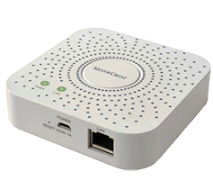
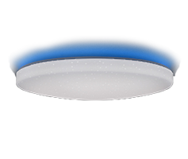

# Presentación

Este complemento puede gestionar muchas tiras LED o bombillas LED o enchufes eléctricos controlados por wifi o radiofrecuencia de 2,4 GHz a través de una caja wifi que se vende con el producto.

    

 

# Compatibilidad y limitaciones.

## Productos compatibles

Hay muchos productos compatibles con el complemento, pero marcas o marcas muy diferentes.

Productos compatibles:
-   Bombillas Mi.Light / EasyBulb / LimitlessLED conectadas a los controladores a continuación: sin comentarios \ *
-   Strip-led Mi.Light / EasyBulb / LimitlessLED conectado a los controladores a continuación: sin comentarios de estado \ *
-   Controlador LED Mi.Light / EasyBulb / LimitlessLED V3.0 a V5.0 (el miboxer no es compatible): sin comentarios \ *
-   Mi.Light / EasyBulb / LimitlessLED led controller V6.0 / iBox1 / iBox2: no hay comentarios de estado \ *
-   Ampoules WiFi Xiaomi Yeelight blanches et couleur avec retour d'état \*
-   Color de Xiaomi Yeelight WiFi con LED de banda con retroalimentación de estado \ *
-   Plafonnier WiFi Xiaomi Yeelight avec retour d'état \*
-   Lampe de bureau WiFi Xiaomi Mijia avec retour d'état \*
-   Sonoff Basic R3 en modo bricolaje con retroalimentación de estado \ * \ *

Productos que pueden ser compatibles y sin garantía:
-   LW12 / Lagute: controlador de tira de RGB: retorno de estado \ *
-   Wifi 320/370 RGB / RGBW controlador de tira: retorno de estado parcial \ *
-   Magic UFO: controlador de tira RGBW, maneja el blanco \ *
-   MagicHome: controlador LED de tira RGBW / RGBWW y focos / focos RGBW compatibles con la aplicación MagicHome \ *
-   H801: controlador de tira RGBW, sin estado de retorno \ * \ *
-   Arilux AL-C01/02/03/04/06/10 : RGB/RGBW/RGBWW strip-led contrôleur, retour d’état \*
-   TP-Link LB100/110/120/130 : ampoules avec retour d’état \*
-   Lampe Extel Meli avec retour d'état \*
-   Xiaomi Philips: lámpara de escritorio, bombilla y lámpara de techo con retorno de estado \ * \ * \ *
-   Bombillas, enchufes, interruptores, interruptores de aleta, humidificador, termostato compatible con aplicaciones Tuya Smart live o Jinvoo smart o eFamilyCloud con comentarios de estado \ * \ * \ *
-   TP-link HS100 HS110 enchufes eléctricos con retroalimentación de estado \ * \ *
-   Controladores de tira de píxeles LED compatibles con Magic Home con retroalimentación de estado \ *
-   Dispositivos controlados por la aplicación Ewelink, incluido Sonoff en modo LAN con comentarios de estado \ * \ * \ *

Para estos controladores, bombillas o enchufes, el protocolo de intercambio no viene directamente del fabricante, que puede cambiarlo en cualquier momento. Existen varias versiones en el mercado que no son todas compatibles con el complemento.

Asteriscos:
- \ *: integración fácil para una persona que lee la documentación antes de actuar
- \ * \ *: además de \ *, requiere seguir un procedimiento particular, adaptado a una persona que entiende que un procedimiento está hecho para ser seguido escrupulosamente
- \ * \ * \ *: además de \ * \ * requiere habilidades informáticas básicas y está acostumbrado a investigar en Internet para un propósito específico

Productos incompatibles y quienes no serán:
-   El puente Mi.light MiBoxer (excepto el cuadro ON / OFF)
-   Controladores Led Milight (tipo YL, etc.) sin puente.
-   Las bombillas led, enchufes o controladores que contienen un receptor bluetoooth en lugar de un receptor de radio de 2.4 Ghz o WiFi.
-   Los controladores de tira led o bombillas y bombillas o enchufes que utilizan una conexión WiFi punto a punto con la aplicación móvil.
-   La lámpara de cabecera de Xiaomi no es compatible (por construcción).

## Prueba de compatibilidad

A petición, se puede proporcionar un complemento de prueba para productos no validados.

Es recomendable consultar en el foro para conocer la compatibilidad de un producto poco difundido.

Vaya al foro de Jeedom [aquí] (https://community.jeedom.com/t/plugin-wifilightv2-discussion-generale/2439)

# limitaciones

Mi.Light / EasyBulb / LimitlessLED:
-   Todas las características son tomadas en cuenta por el complemento.
-   El puente MiBoxer no es compatible.

LW12 / Lagute:
-   No es posible programar modos personalizados, es necesario usar la aplicación provista con el controlador (Magic Home). Por otro lado, los modos personalizados se pueden activar con el complemento.
-   Hay varias versiones de LW12 que pueden no ser compatibles con el complemento.

Magic UFO, MagicHome y Arilux AL-C01 / 02/03/04/06/10:
-   La programación en modo personalizado, el modo de radio y los temporizadores no son compatibles. Debe usar la aplicación suministrada con el controlador (Magic Home). Por otro lado, los modos personalizados se pueden activar con el complemento.
-   Existen diferentes modelos que pueden no ser compatibles con el complemento.

Xiaomi Yeelight:
-   Los comandos HSV no son compatibles. El flujo y la escena se crean mediante la creación de comandos con el código JSON correspondiente al efecto deseado (consulte la documentación de la API de YeeLight).
-   La lámpara de noche Xiaomi no es compatible.
-   La lámpara de escritorio Xiaomi Mijia es parcialmente compatible (sin comentarios de estado completos).

Wifi 320/370:
-   El estado de los modos de escena no se gestiona, solo se gestiona ON / OFF.
-   Existen diferentes modelos que pueden no ser compatibles con el complemento.

H810:
-   los juegos de escenario no se gestionan.
-   Existen diferentes modelos que pueden no ser compatibles con el complemento.

TP-Link:
-   Los temporizadores no se gestionan.
-   La información de consumo de energía no es compatible con las bombillas.

Extel Meli:
-   La parte de sonido de la lámpara no se tiene en cuenta.

Xiaomi Philips:
-   Todas las funciones son tomadas en cuenta.

Controladores LED de tira de píxeles compatibles con Magic Home:
-   No se admiten escenas personalizadas.

Dispositivos compatibles Tuya Smart / Jinvoo / eFamilyCloud:
-   Todos los comandos para dispositivos validados (ver el foro) de firmware 1.0 y firmware 2.0 son compatibles (especialmente los sockets Neo CoolCam).

Sonoff DIY:
-   Basic R3 con dispositivos de firmware 3.3.0 con un solo contacto.

Ewelink y Sonoff LAN:
-   dispositivos con firmware 3.0.1 (la lista se proporciona a continuación en la sección eWelink)

# Configuración del módulo WiFi

## Instalar dispositivos

Descargue la aplicación móvil del fabricante y siga las instrucciones para controlar el dispositivo con el móvil. Para cada dispositivo wifilightV2, se proporciona ayuda detallada en la página de configuración.

Mientras el dispositivo no esté controlado con la aplicación móvil, el complemento no funcionará.

Consulte la ayuda y los foros para el generador de dispositivos.

## Configurar el enrutador
Es necesario configurar el DHCP de su enrutador (generalmente proporcionado por su proveedor de servicios) para modificar la atribución de la dirección IP del módulo wifi o la bombilla o la captura para que sea estático. Califica esta dirección. En general, tendrá la forma: 192.168.1.xxx donde xxx es la dirección del módulo wifi (2 a 254)

Verifique los foros en su casilla para aprender cómo configurar su DHCP.

Después de este cambio, verifique que la aplicación móvil aún controle el dispositivo.

Luego puede ir a la configuración del complemento wifilightV2.

## Instalación y configuración de complementos

wifilightV2 no crea ningún dispositivo automáticamente, debe crearlos en el complemento antes de configurarlos.

Ayuda :
-   Use el icono de signo de interrogación para obtener ayuda en cada elemento de configuración.

Ajuste:
-   Para configurar un dispositivo, elija el menú Complementos / Comunicar objetos / wifilightV2
-   Luego haga clic en el botón en la parte superior izquierda Agregar un módulo Wifi
-   Ingrese el nombre del módulo wifi
-   Ingrese el objeto padre
-   Elija la categoría Luz (predeterminado)
-   Habilitar y hacer visible (predeterminado)
-   Ingrese la dirección IP del módulo de la toma WiFi o la bombilla (consulte las preguntas frecuentes para obtener más información)
-   Para algunos dispositivos se le solicita ingresar al canal utilizado, crear un dispositivo wifilightV2 por canal
-   Para algunos dispositivos se le solicita que ingrese un token o (y) un identificador, consulte la ayuda en la página de configuración del dispositivo
-   Para algunos dispositivos es posible suprimir la retroalimentación si causa microcortes
-   Para algunos controladores es necesario indicar el número de leds de los leds de la tira de píxeles
-   Para algunos controladores es necesario indicar el orden de los colores si los colores por defecto no corresponden
-   Ingrese la marca o tipo de dispositivo
-   Ingrese el subtipo exacto del controlador, bombilla, enchufe o tira de led, esto es esencial para crear los comandos para controlar el dispositivo
-   Ingrese el número de envíos de comandos: le permite repetir el comando para un dispositivo remoto en caso de una transmisión incorrecta. (1 por defecto). Algunas bombillas o enchufes no manejan esta repetición porque el complemento se asegura mediante el retorno del estado de la transmisión. Algunos comandos relativos (incrementos) no se repiten.
-   Ingrese el retraso de envío en caso de repetición (predeterminado 0 ms, 100 ms máx.)
-   Ingrese el% de incremento de intensidad al presionar los botones para aumentar o disminuir la intensidad de la luz
-   Ingrese el número de grupo para la sincronización, vea a continuación

## Agregar comandos
Al guardar el módulo, los comandos se crean automáticamente.

El nombre de los comandos se puede cambiar. Los comandos creados y eliminados automáticamente se recrean durante una copia de seguridad.

cuando se crean todos los comandos, pueden pesar la interfaz, es posible no mostrarlos configurando la creación de los comandos.

## Cambiar el tipo o subtipo de dispositivo

-   eliminar todos los pedidos
-   cambiar el tipo o subtipo de dispositivo
-   ahorre 2 veces

# Operación de retroalimentación de estado y estado de conexión

## Compatibilidad del retorno estatal

La retroalimentación de estado es inmediata para los siguientes dispositivos:
- Yeelight
- compatible con ewelink
- compatible con la aplicación inteligente Tuya en vivo
- Sonoff en modo LAN

Por ejemplo, si se opera un interruptor, Jeedom lo sabrá de inmediato.

Para dispositivos:
 - LW12 / Lagute
 - OVNI Mágico / Inicio
 - Arilux
 - Wifi 3x0 (parcialmente)
 - TP-Link
 - Xiaomi Philips
 - Extel Meli
 - Sonoff en modo bricolaje

El complemento consulta regularmente el dispositivo para conocer su estado. El retraso para que Jeedom conozca el estado puede exceder 1 minuto.

Para otros dispositivos no hay comentarios de estado;

## Actualización por escenario

Los comandos xxxxGet y Status se pueden usar en un escenario Jeedom.

## Información de conexión

El comando ConnectedGet recupera el estado de conexión de cada dispositivo. Se actualiza cada minuto.
-  -1: dispositivo con retroalimentación de estado OK
-  -2: no se puede preparar la conexión del dispositivo
-  -3: dispositivo no conectado
-  -4: no hay respuesta del dispositivo
-  -5: respuesta incorrecta del dispositivo
-  -6: Dispositivo sin retorno de estado

# Cómo funciona la sincronización

## Principio de sincronización

Es posible sincronizar múltiples dispositivos de diferentes marcas:

Todos los dispositivos que tienen el mismo número de grupo están sincronizados

El grupo 0 no está sincronizado (grupo predeterminado)

Cuando se usa un comando de un dispositivo en el grupo, el mismo comando se aplica a todos los dispositivos en el mismo grupo

Si el comando no existe para el dispositivo sincronizado, simplemente se ignora.

Advertencia, los dispositivos no se ordenarán exactamente al mismo tiempo debido a la latencia al enviar pedidos uno tras otro.

## Configuración de sincronización

Simplemente ponga un número diferente de cero en el campo de grupo al configurar el equipo. Todos los equipos con los mismos números serán sincronizados.

# Estuche especial de cajas Mi.Light

## Configurar iBox 1 o 2

Desde la versión 1.0.58 de iBox 1 y 2, puede ser necesario modificar su configuración para que puedan interactuar con Jeedom.

Conéctese a http (con un navegador web) a la dirección IP de su iBox. Las credenciales predeterminadas son admin / admin. Vaya a la pestaña &quot;Otra configuración&quot; y en &quot;Configuración de parámetros de red / Protocolo&quot; elija UDP y guarde.

# Caso especial de Xiaomi Yeelight

## Configuración de la bombilla
Es esencial habilitar el control de LAN a través de la aplicación Xiaomi Yeelight.

## Modo de escena Xiaomi Yeelight
Es posible configurar los modos de escena. Varios modos de escena están preprogramados en el complemento, pero es posible agregar otros modos de escena.

Es suficiente respetar ciertas condiciones:
-   Agregue un comando de acción wifilightV2 de tipo Predeterminado
-   Ponle un nombre (por ejemplo, Scene Blink)
-   En los parámetros, coloque el comando de escena Yeelight, por ejemplo: &quot;id&quot;: 1, &quot;method&quot;: &quot;set_scene&quot;, &quot;params&quot;: [&quot;cf&quot;, 0,0, &quot;500,1,255,100,1000,1,16776960, 70 &quot;]

No coloque las llaves de inicio y fin, así como los caracteres de nueva línea, el complemento los agregará automáticamente. Inspire comandos preconfigurados para crear estos modos de escena adicionales.

## Actualizar estado en Jeedom
Al activar el complemento y tan pronto como se inicia el demonio y cada minuto, el complemento busca las bombillas alimentadas y conectadas a Jeedom.

Tan pronto como se encuentra la bombilla, el estado de la bombilla se vuelve a montar en el complemento de inmediato.

Tenga en cuenta que el complemento puede tomar hasta 1 minuto para encontrar una bombilla y 4 minutos para encontrar que un dispositivo está desconectado.

# Caso especial de dispositivos TP-Link

## Configuración de la bombilla

Desde mediados de 2019, salen nuevos dispositivos en la versión 2 del protocolo. El protocolo V2 requiere recuperar un token (token) que permita que el complemento interactúe con los dispositivos TP-Link.

Para obtener este token, es necesario capturar los marcos intercambiados entre la aplicación Kasa en el teléfono y el dispositivo que se agregará en el complemento. En Android debes usar Packet Capture.

El complemento luego permite extraer el token. Debe copiar el marco recuperado en el campo Parámetros del comando GetKey y ejecutar este comando. Si el marco es decodificable, el token se mostrará en los registros y en el centro de mensajes (tenga cuidado: elimine el mensaje cada vez que lo lea).

El marco para poner en &quot;Parámetros&quot; debe tener el siguiente ritmo (el ... reemplazar otros valores):

00 00 00 5f d0 f2 91 fe 90 e4 81 f9 8d af 95 ... 99 bb 81 fa 87 fa 87

Los datos están separados por espacios y representan números hexadecimales que provienen directamente de Packet Capture. En general, el marco comienza con 3 ceros y aquí 5f da el tamaño del marco en hexadecimal o 95 en decimal.

No se brindará ayuda para recuperar el marco de Packet Capure.

Por el momento, solo los enchufes son utilizables en V2, para contactar al autor si tiene bombillas en V2.

# Caso especial de Philips Xiaomi

## Configuración de la bombilla

Es esencial recuperar un token que permita que el complemento interactúe con los dispositivos Philips Xiaomi.

El procedimiento es complejo y requiere varias manipulaciones. Haga una búsqueda en la web con la siguiente palabra clave: token Xiaomi.

No se brindará ayuda para recuperar el token.

# Caso especial de Sonoff en modo bricolaje

## Configuración del modo de bricolaje

Sonoff proporciona todos los elementos [aquí] (https://github.com/itead/Sonoff_Devices_DIY_Tools/tree/master/tool) para configurar los módulos en modo DIY.

Se requiere un teléfono móvil y una PC con Windows con tarjeta WiFi. El software a ejecutar para encontrar el Sonoff le da en la columna izquierda el identificador necesario para configurar el dispositivo.

El dispositivo Sonoff debe ser firmware 3.3.0 o superior, la aplicación de Windows anterior permite actualizar el firmware.

# Caso especial de dispositivos compatibles con la aplicación Ewelink en modo LAN

## Recuperando APiKey y DeviceID

Siga las instrucciones [aquí] (https://blog.ipsumdomus.com/sonoff-switch-complete-hack-without-firmware-upgrade-1b2d6632c01) para recuperar estos 2 datos. El deviceid debe poner el identificador del complemento. El Apikey es poner la ficha. No debe poner espacios ni comillas.

El dispositivo debe ser firmware 3.0.1 o superior, la aplicación Ewelink permite actualizar el firmware.

## Información de conexión

Cuando un dispositivo se conecta a wifi, el complemento será notificado de inmediato. Por otro lado, cuando se desconecta un dispositivo, el complemento solo puede saber si el complemento envía un comando.

## compatibilidad

Muchas marcas son compatibles, incluido Sonoff.
- Interrupteurs, prises murales, switch : simples de toutes marques
- Interrupteurs, prises murales, switch : multiples de toutes marques
- 2 types de lampes (tester les 2 types)
- Sonoff TH10/1H16 capteur de température
- Sonoff basic, RF, POW, Mini
- Sonoff Dual
- Sonoff 4CH/4CH PRO
- Sonoff Touch
- Sonoff S20/S26
- Sonoff T1/TX
- Sonoff SLAMPHER
- Sonoff T4EUC1
- Sonoff RF bridge 433 pour les capteurs uniquement (porte, détecteur, télécommande)

Pour les périphériques multicanaux (comme le Sonoff 4CH) il faut créer autant d'équipements wifilightV2 que de canal, une copie du premier créé facile la tache, ensuite il faut changer le n° de canal.

Pour les autres périphériques (Sonoff Ifan, variateur de lumière par exemple) ou si la configuration ne fonctionne pas et après avoir intégré le périphérique dans Jeedom (avec la configuration Sonoff Basic par exemple) repérer dans les logs :

    Receive after decode :{...............}

et donner dans le [forum](https://community.jeedom.com/t/plugin-wifilightv2-sonoff-ewelink-lan/2632) le contenu des accolades afin de permettre l'intégration du module dans le plugin.

# Cas particulier des périphériques compatibles Tuya Smart/Jinvoo/eFamilyCloud apps

## Compatibilité

De nombreuses marques sont compatibles avec le plugin. Consulter le forum pour plus d'informations. Le plugin permet de contrôler de nombreux actionneurs.
Il peut récupérer l'état des périphériques dès que celui-ci envoie une information de changement d'état ou quand il les interroge toutes les minutes. Si un interrupteur mural est utilisé, Jeedom le saura immédiatement.

Les équipements suivants sont compatibles en firmware 1.0. et en firmware 2.0.

-  prises simples avec et sans retour sur la consommation, en particulier les prises wifi Neo Coolcam
-  prises multiples avec et sans consommation avec et sans USB
-  commande de volets roulants
-  interrupteurs muraux : 1, 2 ou 3 inters
-  interrupteur mural avec variateur
-  humidificateur NEWKBO 300 ml et uniquement celui-ci
-  thermostat BHT-6000GCLW / BHT 6000 et uniquement ces modèles
-  ampoules RGBW globe et modèles similaires en fonctionnement

Néanmoins, la compatibilité de ces périphériques n'est pas garantie car le protocole peut être modifié par les constructeurs.

Pour les périphériques multicanaux (comme les prises multiples) il faut créer autant d'équipements wifilightV2 que de canal, une copie du premier créé facile la tache, ensuite il faut changer le n° de canal.

Les capteurs de présence et d'ouverture ne sont pas compatibles car ils ne dialoguent pas en local.

Le plugin teste les périphériques (mais ils doivent être ajoutés manuellement) et affiche un message dans le centre de messages lorsqu'un périphérique a été configuré avec le mauvais firmware.

## Configuration du périphérique

Il est indispensable de récupérer une clé locale (LocalKey) et un identifiant permettant au plugin de dialoguer avec les périphériques.

La procédure est complexe et nécessite plusieurs manipulations. Faire une recherche sur le web avec comme mot clé : Tuya localkey, sur Github en particulier ou sur le forum Jeedom.

Le périphérique ne doit pas être connecté à une application sur téléphone mobile, sinon il ne répondra pas aux ordres de Jeedom. Il faut donc fermer toute application possiblement connectée au périphérique.

Si le périphérique est désinstallé puis réinstallé dans l'application mobile, alors sa clé sera modifiée. Il faudra retrouver la clé avec la procédure ci-dessus. 

Aucune aide ne sera donnée pour récupérer la clé ou l'identifiant.

Tout changement de configuration nécessite de redémarrer le démon.

## Configuration de la récupération de la consommation des prises

Selon les marques, la consommation n'est pas envoyée de façon unique par la prise. Pour récupérer ce paramétrage, installer la prise dans Jeedom et conserver le retour d'état dans la configuration, puis aller dans les logs de wifilightV2. La prise est interrogée toutes les minutes. Repérer la message qui ressemble à :

return decoded : {"devId":"xxxxxxxxx","dps":{"1":false,"2":false,"9":0,"10":0,"18":0,"19":0,"20":2281,"21":1,"22":726,"23":28971,"24":19417,"25":1070}}

L'index "20" correspond ici à la tension d'alimentation en centaine de mV soit : 228.1 V, elle doit légèrement bouger. Les index "18" et "19" correspondent au courant (mA) et à la puissance en W, ici aucun appareil n'est branché et donc les informations sont à zéro. C'est un bon moyen de trouver la tension, en branchant un appareil, ces 2 valeurs doivent être modifiées et la tension est juste après.

La syntaxe est alors : 20;18;19 qu'il faut mettre dans le champ 'Paramétrage de l'énergie'.

Pour les plugs 1 prise, en général il faut : 6;4;5 (mis par défaut par le plugin).

Pour les plugs 2 prises, en général il faut : 9;7;8 (mis par défaut par le plugin).

Pour les autres prises, la valeur 20;18;19 est mise par défaut.

## Personnalisation des commandes

Devant la diversité des périphériques compatibles Tuya, il peut être nécessaire de créer des commandes personnalisées.

Créer une nouvelle commande action/défaut, lui donner un nom et mettre la commande Tuya dans paramètres. Les commandes Tuya sont au format JSON et contiennent dps:{xxxxxx}. C'est le xxxxxx qu'il faut mettre dans paramètres. 

Exemples :

Pour lever un volet roulant : xxxxxx vaut "1":"1" . 

Pour mettre la prise n°2 d'un plug à on : xxxxxx vaut "2":true .

Voir le paragraphe suivant pour l'interprétation des logs.

## Périphérique custom

Il est possible de créer un périphérique entièrement custom et pas seulement une commande custom comme précédemment. La procédure nécessite que le périphérique renvoie son état dans les logs, sinon il n'y a pas de soulution.

### Configuration
-   désactiver tous les périphériques wifilightV2 sauf celui à tester
-   bien configurer le périphérique (adresse IP statique, LocalKey, Id, App Tuya arrêtée)
-   vérifier que le demon tourne, sinon le démarrer
-   configurer les logs wifilightV2 en mode debug
-   effacer les logs

### Récupération des informations
-   appuyer sur un bouton du périphérique (on,off,haut,bas,etc.) ou sur l'appli Smart Live
-   repérer dans les logs le passage ressemblant à ceci :

        Receive after decode :{devId:50701244cc50e37e9aff,dps:{"1":"off","101":true}}
        [2019-10-13 09:15:30][DEBUG] :       >>> : devId | 50701244cc50e37e9aff : 50701244cc50e37e9aff
        [2019-10-13 09:15:30][DEBUG] :       >>> : dps | Array : Array
        [2019-10-13 09:15:30][DEBUG] :       >>>>>>>>>>> : 1 | stop : stop
        [2019-10-13 09:15:30][DEBUG] :       >>>>>>>>>>> : 101 | 1 : 1

    Ici, le bouton off a été sélectionné sur le périphérique et on observe que le dps 1  a changé.

        Receive after decode :{devId:50701244cc50e37e9aff,dps:{"1":"on","101":true}}
        [2019-10-13 09:15:30][DEBUG] :       >>> : devId | 50701244cc50e37e9aff : 50701244cc50e37e9aff
        [2019-10-13 09:15:30][DEBUG] :       >>> : dps | Array : Array
        [2019-10-13 09:15:30][DEBUG] :       >>>>>>>>>>> : 1 | stop : stop
        [2019-10-13 09:15:30][DEBUG] :       >>>>>>>>>>> : 101 | 1 : 1

    Ici, le bouton on a été sélectionné sur le périphérique et on observe que le dps 1  a changé.

-   Créer une nouvelle commande action/défaut dans les commandes du périphérique :
    *    Dans la colonne interface mettre ON comme nom du bouton
    *    Dans la colonne nom interne et n° de commande, mettre comme Id unique : ON, comme dps : 1 (sans les double guillemets) et comme paramètre : "on" (si le on n'est pas entouré de guillemets, il faut les enlever).
-   Créer une nouvelle commande action/défaut dans les commandes du périphérique :
    *    Dans la colonne interface mettre OFF comme nom du bouton
    *    Dans la colonne nom interne et n° de commande, mettre comme Id unique : OFF, comme dps : 1 (sans les double guillemets) et comme paramètre : "off" (si le off n'est pas entouré de guillemets, il faut les enlever).
-   Créer une nouvelle commande info/autre dans les commandes du périphérique :
    *    Dans la colonne interface mettre ETAT comme nom de l'info
    *    Dans la colonne nom interne et n° de commande, mettre comme Id unique : ETAT, comme dps : 1 (sans les double guillemets) et rien dans paramètres.

    Dans le cas d'une information numérique :

        Receive after decode :{devId:50701244cc50e37e9aff,dps:{"3":850,"101":true}}
        [2019-10-13 09:15:30][DEBUG] :       >>> : devId | 50701244cc50e37e9aff : 50701244cc50e37e9aff
        [2019-10-13 09:15:30][DEBUG] :       >>> : dps | Array : Array
        [2019-10-13 09:15:30][DEBUG] :       >>>>>>>>>>> : 3 | 850 : 850
        [2019-10-13 09:15:30][DEBUG] :       >>>>>>>>>>> : 101 | 1 : 1

    Ici, un curseur d'intensité a été sélectionné sur le l'application du périphérique et on observe que le dps 3  a changé.

-   Créer une nouvelle commande action/curseur dans les commandes du périphérique :
    *    Dans la colonne interface mettre Intensité comme nom du curseur
    *    Dans la colonne nom interne et n° de commande, mettre comme Id unique : Intensite, comme dps : 3 (sans les double guillemets) et comme paramètre : #slider# (ici la valeur numérique n'est pas entourée de guillemets, il ne faut donc pas les mettre).
-   Créer une nouvelle commande info/autre dans les commandes du périphérique :
    *    Dans la colonne interface mettre IntensiteGet comme nom de l'info
    *    Dans la colonne nom interne et n° de commande, mettre comme Id unique : IntensiteGet, comme dps : 3 (sans les double guillemets)et rien dans paramètres.

Remarques :
-   rien dans les logs : mauvaise adresse IP ou périphérique qui ne renvoie pas son état
-   retour avec erreur : Id incorrect
-   retour non décodé : localkey incorrect
-   la commande ne fonctionne pas : vérifier la commande

## Mise à jour de l'état dans Jeedom
Lors de l'activation du plugin et dès que le démon est lancé ainsi que toutes les minutes, le plugin recherche les périphériques alimentés et connectés à Jeedom.

Dès que le périphérique est trouvé, l'état du périphérique est remonté au plugin immédiatement.

Noter que le plugin peut mettre jusqu'à 1 minute pour trouver qu'un périphérique est connecté ou déconnecté.

# FAQ

## Quels périphériques peuvent être utilisés ?

Lire la documentation

## Rien ne se passe

Faire d'abord fonctionner le périphérique avec l'application mobile fournie par le constructeur.

Utiliser le bouton <tester> dans le menu Plugin/Objets Connectés/wifilightV2/commandes.

Aucune aide ne sera apportée sans que les périphériques soient opérationnels avec l'application constructeur sur un téléphone portable.
Il est nécessaire de donner une adresse IP fixe au périphérique.

## Je ne sais pas configurer ma box internet

Aucune aide ne sera apportée sur la box et les notions nécessaires pour configurer le routeur pour attribuer une adresse IP fixe. Consulter les forums de la box.

## Toutes les commandes ne sont pas créées lors d'un changement de modèle de périphérique

Sauvegarder 2 fois.

## La gestion de l'intensité des ampoules blanches  Mi.Light/EasyBulb/LimitlessLED n'est pas pratique

Le constructeur des leds n'a pas prévu de pouvoir affecter directement l'intensité de l'ampoule. On ne peut qu'incrémenter ou décrémenter par rapport à la valeur précédente. Le plugin ne fait que reproduire ce fonctionnement. Le curseur qui est proposé est en conséquence capricieux.

## La gestion de l'intensité de la couleur a quelquefois des comportements imprévus

Aucun protocole ne gère l'intensité de la couleur, bien que généralement les applications mobiles le fassent. Tant que Jeedom gère couleur et intensité, tout se passe bien. Mais si l'intensité est modifiée par une application mobile, les résultats ne sont pas toujours ceux attendus. Le plugin essaye de corriger le souci quand la lampe ou le contrôleur possède un retour d'état.

## Y a-t-il un retour d'état ?

Lire la documentation

## Impossible de faire fonctionner les ampoules Xiaomi Yeelight

Il est indispensable d'activer le mode contrôle par réseau local via l'application  Xiaomi Yeelight.

## Je ne contrôle pas le son des ampoules Extel Meli

Le son n'est pas géré par le plugin

## Impossible de faire fonctionner les ampoules Xiaomi Philips

Pour dialoguer avec les ampoules Xiaomi Philips, il est nécessaire de transmettre un jeton ou token en anglais. Sans ce jeton, l'ampoule ne prendra pas en compte les ordres qui lui sont envoyés. Ce jeton se trouve dans l'application Mi-Home et, selon votre téléphone, il existe plusieurs méthodes pour récupérer le jeton. La procédure est décrite sur plusieurs sites mais elle n'est pas reproduite ici pour deux raisons principales :

-   Xiaomi a déjà modifié son protocole ce qui a obligé à modifier la procédure pour récupérer le jeton, il pourrait encore le faire.
-   De nouvelles procédures plus simples peuvent être mises à disposition des internautes.
-   Cette documentation ne sera pas maintenue aussi rapidement qu'une simple recherche sur le web avec les mots clés : xiaomi token .

## Impossible de faire fonctionner les périphériques compatibles Tuya/Smart live/Jinvoo/eFamilyCloud apps

Pour dialoguer avec ces ampoules, prises et autres périphériques, il est nécessaire de transmettre une clé locale ou Localkey ou token en anglais et un identifiant. Sans ces paramètres, l'ampoule ne prendra pas en compte les ordres qui lui sont envoyés. Il existe plusieurs méthodes pour récupérer ces informations. La procédure est décrite sur plusieurs sites mais elle n'est pas reproduite ici pour deux raisons principales :

-   Les applications ont été mises à jour, ce qui a obligé à modifier la procédure pour récupérer les informations.
-   De nouvelles procédures plus simples peuvent être mises à disposition des internautes.
-   Cette documentation ne sera pas maintenue aussi rapidement qu'une simple recherche sur le web avec les mots clés : Tuya LocalKey et en particulier sur Github.

## Erreur lors de l'envoi de commande / roue crantée sans arrêt / Emission sans arrêt
-   les équipements wifilightV2 doivent être mis à jour
-   aller dans chaque équipement et sauvegarder 2 fois
-   tester avec un nouvel équipement si cela persiste

## Pont Mi.Light IBox1, iBox2, V6 : commande prise en compte aléatoirement
-   les ordres sont envoyés trop rapidement
-   dans les scénarios, mettre des pauses de durée suffisante

## Pont Mi.Light IBox1, iBox2, V6 : commande non prise en compte
-   lors de l'appairage avec l'application Mi.Light sur mobile et lors de la configuration de wifilightV2, bien choisir la même télécommande.

## LW12 Magic UFO Arilux Wifi3x0 H801 Contrôleurs compatibles Magic Home Tuya/Jinvoo/eFamilyCloud
-   de nombreuses versions existent et certaines peuvent être incompatibles avec le plugin. Contacter l'auteur pour une éventuelle mise à jour.

## Des commandes sont manquantes lors de la création ou de la modification du sous type d'ampoule
-   sauvegarder l'équipement (2 fois)

# Comment obtenir de l'aide ?

Aller sur le forum de Jeedom [ici](https://community.jeedom.com/t/plugin-wifilightv2-sonoff-ewelink-lan/2632)

# Bogues connus

La mémoire diminue drastiquement
-   Bogue corrigé.

Pour les prises compatibles Tuya des microcoupures surviennent régulièrement
-   Bogue corrigé.