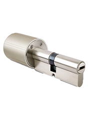
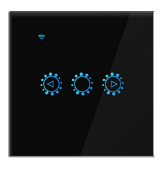
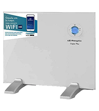
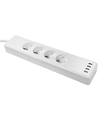

# Changelog

[ver aquí](https://bcaro.github.io/wifilightV2-doc/fr_FR/changelog)

# Presentación

Atención :
No se puede garantizar el funcionamiento permanente del plugin: incompatibilidad o compatibilidad parcial del producto, protocolo mal gestionado, mala calidad de conexión, por ejemplo. No utilices el plugin para controlar dispositivos sensibles que puedan generar algún tipo de desorden. El complemento se proporciona con fines de prueba y no para una instalación que requiera un funcionamiento óptimo en todas las circunstancias.

Este complemento le permite administrar muchas tiras de LED, bombillas LED, enchufes eléctricos, termostatos, sensor de temperatura, sensor de puerta, etc. controlado por wifi directamente o mediante una caja wifi que se vende con el producto. El principio del complemento es nunca usar la nube y, por lo tanto, una conexión a Internet entre el complemento y el dispositivo a través de un servidor remoto, por lo tanto, todas las acciones son locales a la red doméstica.

# Compatibilidades y limitaciones

## Productos compatibles
 
Hay muchos productos que son compatibles con el complemento pero de marcas muy diferentes o sin marca.
 
Productos compatibles:
- Bombillas Mi.Light/EasyBulb/LimitlessLED conectadas a los controladores a continuación: sin retroalimentación de estado !
- Tira de led Mi.Light/EasyBulb/LimitlessLED conectada a los controladores siguientes: sin retroalimentación de estado !
- Controlador led Mi.Light/EasyBulb/LimitlessLED V3.0 a V5.0 (el miboxer no es compatible): sin retroalimentación de estado !
- Controlador led Mi.Light/EasyBulb/LimitlessLED V6.0/iBox1/iBox2: sin retroalimentación de estado !
- Controlador LED MiLight-hub DIY: con retroalimentación de estado !
- Bombillas blancas y en color Xiaomi Yeelight WiFi con retroalimentación de estado !
- Tira de WiFi en color Xiaomi Yeelight con retroalimentación de estado !
- Luz de techo WiFi Xiaomi Yeelight con retroalimentación de estado !
- Lámpara de cabecera WiFi Xiaomi Yeelight V2 con retroalimentación de estado !
- Lámpara de escritorio Xiaomi Mijia WiFi con retroalimentación de estado !
- Sonoff Basic R3 en modo DIY con retroalimentación de estado !!
- Nanoleaf Aurora con comentarios de estado !
- Productos myStrom con retroalimentación de estado !!

Productos que pueden ser compatibles y no garantizados:
-   LW12/Lagute: controlador de tira RGB: retroalimentación de estado !
-   Controlador de tira WiFi RGB 320/370 RGB/RGBW: retroalimentación parcial del estado !
-   Magic UFO: controlador de tira RGBW, maneja el blanco !
-   MagicHome: controlador de tira RGBW/RGBWW y focos  RGBW compatibles con la aplicación MagicHome !
-   H801: Controlador de tira de RGBW, sin comentarios de estado !!
-   Arilux AL-C01/02/03/04/06/10: controlador de tira RGB/RGBW/RGBWW, retroalimentación de estado !
-   TP-Link LB100/110/120/130: bombillas con retroalimentación de estado !
-   Lámpara Extel Meli con retroalimentación de estado !
-   Xiaomi Philips: lámpara de escritorio, bombilla y lámpara de techo con retroalimentación de estado !!!
-   Bombillas, enchufes, interruptores, interruptores de obturación, humidificador, termostato compatible con aplicaciones Tuya Smart live o Jinvoo smart o eFamilyCloud con comentarios de estado !!!
-   TP-link HS100 HS110 enchufes eléctricos con retroalimentación de estado !!
-   Controladores de tira de píxeles compatibles con Magic Home con retroalimentación de estado !
-   Periféricos controlados por la aplicación Ewelink, incluidos Sonoffs en modo LAN con comentarios de estado !!!
- Pasarelas Wifi (incluido Lidl) usando el protocolo Tuya para dispositivos Zigbee !!!
- Periféricos Meross !!!
- Productos Wiz !!

Para estos últimos controladores o periféricos wifi, el protocolo de intercambio no proviene directamente del fabricante, que por lo tanto puede modificarlo en cualquier momento. Existen varias versiones en el mercado que no son todas compatibles con el complemento. Es posible que algunos productos en particular no sean compatibles.

Atención :
- ! : fácil integración para una persona que lee la documentación antes de actuar
- !! : además de!, requiere seguir un procedimiento particular, adecuado para una persona que entiende que un procedimiento está hecho para ser seguido escrupulosamente
- !!! : ademas de !! Requiere conocimientos informáticos básicos y estar acostumbrado a realizar investigaciones en Internet para un propósito específico.

Es recomendable consultar sobre el foro para conocer la compatibilidad de un producto que no se distribuye ampliamente.

Nunca modifique el firmware de los productos, lo que puede hacerlos incompatibles con el complemento.

Vaya al foro de Jeedom [aquí](https://community.jeedom.com/t/plugin-wifilightv2-discussion-generale/2439)

## Limitaciones

Mi.Light/EasyBulb/LimitlessLED:
- El plugin tiene en cuenta todas las funciones (con ibox1 y 2 y con el puente DIY Milight-hub)
- El puente MiBoxer no es compatible
- Controladores Led Milight (tipo YL etc.) sin puente.

LW12/Lagute:
- La programación de modos personalizados no es posible, debe utilizar la aplicación suministrada con el controlador (Magic Home). Por otro lado, los modos personalizados se pueden activar con el complemento.
- Hay varias versiones de LW12 que pueden no ser compatibles con el complemento.

Magic UFO, MagicHome y Arilux AL-C01/02/03/04/06/10:
- No se gestiona la programación de modos personalizados, modo radio y temporizadores. Debe utilizar la aplicación suministrada con el controlador (Magic Home). Por otro lado, los modos personalizados se pueden activar con el complemento.
- Hay diferentes modelos que pueden no ser compatibles con el complemento.
- Algunos dispositivos compatibles con Magic Home son incompatibles porque solo funcionan con la nube

Xiaomi Yeelight:
- No se admiten pedidos HSV. El flujo y la escena se crean creando comandos con el código JSON correspondiente al efecto deseado (consulte la documentación de la API de YeeLight).
- La lámpara de noche Xiaomi de la primera versión no es compatible.
- La lámpara de escritorio Xiaomi Mijia es parcialmente compatible (sin información completa sobre el estado).

Wifi 320/370:
- La retroalimentación del estado del modo de escena no se gestiona, solo se gestiona ON / OFF.
- Hay diferentes modelos que pueden no ser compatibles con el complemento.

H810:
- Los juegos de escenario no son compatibles.
- Hay diferentes modelos que pueden no ser compatibles con el complemento.

TP-Link:
- Los temporizadores no se gestionan.
- La información de consumo eléctrico no se gestiona para bombillas.

Extel Meli:
- No se tiene en cuenta la parte sonora de la lámpara

Xiaomi Philips:
- Todas las características se tienen en cuenta.

Controladores LED de tira de píxeles compatibles con Magic Home:
- No se admiten escenas personalizadas.

Dispositivos compatibles Tuya Smart/Jinvoo/eFamilyCloud:
- Todos los comandos de los periféricos validados (ver el foro) de firmware 1.0 y firmware 2.0 son compatibles (en particular los sockets Neo CoolCam).
- no compatible con dispositivos en la nube, especialmente sensores de apertura

Sonoff DIY:
- R3 básico con firmware 3.3.0 periféricos con un contacto.

Ewelink y Sonoff LAN:
- periféricos con firmware 3.0.1 (lista a continuación en el párrafo eWelink)
- no compatible con zigbee
- no compatible con dispositivos en la nube, en particular sensores de apertura y lámparas o tiras de LED.

Meross:
- control de persiana enrollable: funcionamiento parcial
- control de la puerta del garaje: funcionamiento parcial

Aurora de nanohojas:
- Ritmo no implantado

Pasarela Tuya Wifi y dispositivos Zigbee:
- La configuración es manual o semiautomática excepto por un número limitado de periféricos.

Fenómeno:
- solo se ha probado la lámpara, esperando comentarios del usuario para otros dispositivos

myStrom:
- solo se ha probado el enchufe solicitado, esperando que los usuarios regresen para otros dispositivos

# Configuración del módulo wifi

## Instalar periféricos

Descarga la aplicación móvil del fabricante y sigue las instrucciones para controlar el dispositivo con el móvil. Para cada dispositivo wifilightV2, se proporciona ayuda detallada en la página de configuración.

Mientras el dispositivo no esté controlado con la aplicación móvil, el complemento no podrá funcionar.

Consulte la ayuda y los foros del fabricante del dispositivo. 

## Configurar el enrutador
Debe configurar el DHCP de su enrutador (generalmente proporcionado por su proveedor de acceso) para modificar la asignación de la dirección IP del módulo wifi o de la bombilla o zócalo para que sea estático. Anote esta dirección. En general, será de la forma:
192.168.1.xxx
donde xxx corresponde a la dirección del módulo wifi (2 a 254)

Consulte los foros de su caja para aprender a configurar su DHCP.

Después de este cambio, verifique que la aplicación móvil aún controle el dispositivo.

Luego puede ir a la configuración del complemento wifilightV2.

## Configuración del complemento

wifilightV2 no crea ningún dispositivo automáticamente (a excepción de los dispositivos Tuya / Zigbee en modo de inclusión), deben crearse en el complemento antes de configurarlos.

Ayuda :
- Utilice el icono del signo de interrogación para obtener ayuda sobre cada elemento de configuración.

Ajustes :
- Para configurar un dispositivo, elija el menú Plugins/Objetos conectados/wifilightV2
- Luego haga clic en el botón en la parte superior izquierda Agregar un módulo WiFi
- Ingrese el nombre del módulo wifi
- Ingrese el objeto principal
- Elija la categoría Luz (por defecto)
- Activar y hacer visible (predeterminado)
- Ingrese la dirección IP del módulo de la toma o bombilla WiFi (consulte las preguntas frecuentes para obtener más explicaciones)
- Para la caja milight-hub, se debe configurar un identificador y un puerto
- Puede cargar imágenes en la carpeta / data del complemento utilizando el complemento Jeexplorer. Estas imágenes pueden reemplazar las imágenes asociadas con los dispositivos en la página de visualización de todos los dispositivos wifilightV2. Útil para dispositivos personalizados que no están asociados con una imagen.
- Para algunos periféricos, se le pide que ingrese el canal utilizado, cree un dispositivo wifilightV2 por canal
- Para algunos dispositivos, se le pide que ingrese un token o (y) un identificador, consulte la ayuda en la página de configuración del dispositivo
- Para periféricos Tuya, es posible forzar la interrogación del estado cada minuto, útil para enchufes con consumo.
- Para algunos controladores es necesario indicar el número de leds de los leds de la tira de píxeles
- Para algunos controladores es necesario indicar el orden de los colores si los colores predeterminados no coinciden
- Ingrese la marca o tipo de dispositivo
- Ingrese el subtipo exacto del controlador, bombilla, zócalo o tira de led, esto es esencial para crear los comandos para conducir el dispositivo
- Ingrese el número de comandos enviados: le permite repetir el comando para un dispositivo remoto en caso de mala transmisión. (1 por defecto). Algunas bombillas o enchufes no gestionan esta repetición porque el plugin asegura por retroalimentación el estado de la transmisión. Algunos comandos relativos (incrementos) no se repiten.
- Introduzca el retardo de envío en caso de repetición (0 ms por defecto, 100 ms máx.)
- Ingrese el% de incremento de intensidad al presionar los botones de incremento o decremento de intensidad de luz
- Configure la cantidad de comandos creados, la creación de todos los comandos (efectos de colores de energía) puede sobrecargar la interfaz
- Ingrese el número de grupo para la sincronización, vea a continuación

## Agregar comandos
Al guardar el módulo, los pedidos se crean automáticamente.

Configure el parámetro "Creación de pedidos" para crear todos o parte de los pedidos.

el nombre de los comandos se puede cambiar. Los pedidos creados y eliminados automáticamente se recrean durante un guardado.

Cuando se crean todos los pedidos, pueden sobrecargar la interfaz, es posible no visualizarlos configurando la creación de los pedidos.

## Modificación de dispositivo

- un cambio de tipo o subtipo elimina todos los comandos
- guardar dos veces después del cambio

# Comentarios de estado

## Compatibilidad

La información de estado es inmediata para los siguientes dispositivos:
- Yeelight
- compatible con Ewelink
- compatible con la aplicación Tuya smart live
- Sonoff en modo LAN
- Compatible con Tuya/Zigbee
- Sonoff en modo DIY (requiere firmware reciente, de lo contrario interrogación cada minuto)

Por ejemplo, si se acciona un interruptor, Jeedom lo sabrá de inmediato.

Para periféricos:
 - LW12 / Lagute
 - Ovni mágico / Hogar
 - Arilux
 - Wifi 3x0 (parcialmente)
 - TP-Link
 - Xiaomi Philips
 - Extel Meli
 - Aurora de nanohojas
 - Meross
 - Mi.Light conectado al puente Milight-hub
 - Wiz
 - myStrom

El complemento sondea periódicamente el dispositivo para conocer su estado. El retraso para que Jeedom conozca el estado puede exceder 1 minuto.

Para otros periféricos, no hay retroalimentación de estado.

El comando stateGet permite, para los dispositivos que devuelven su estado, forzar la actualización del estado sondeando el dispositivo. 

## Actualización por escenario

Los comandos xxxxGet y Etat se pueden utilizar en un escenario Jeedom.

## Información de conexión

El comando ConnectedGet recupera el estado de conexión de cada dispositivo. Se actualiza cada minuto.
- -1: periférico con retroalimentación de estado OK
- -2: no se puede preparar para la conexión al dispositivo
- -3: dispositivo no conectado
- -4: sin respuesta del dispositivo
- -5: mala respuesta del dispositivo
- -6: periférico sin retroalimentación de estado

En la página de dispositivos, un emoticón indica si la conexión es correcta o no. El emoticón indiferente se utiliza en los casos en que el plugin no puede conocer el estado de la conexión, es decir, los dispositivos que no devuelven su estado. Tenga en cuenta que para los dispositivos con una puerta de enlace (Tuya Zigbee, Meross), el estado de la conexión es el de la puerta de enlace y se aplica a todos los dispositivos conectados a la puerta de enlace.

# Sincronización

## Principio

Es posible sincronizar varios dispositivos de diferentes marcas:

Todos los dispositivos que tienen el mismo número de grupo están sincronizados

El grupo 0 no está sincronizado (grupo predeterminado)

Cuando se usa un comando de un dispositivo en el grupo, el mismo comando se aplica a todos los dispositivos en el mismo grupo

Si el comando no existe para el dispositivo sincronizado, simplemente se ignora.

Tenga cuidado, los periféricos no se pedirán exactamente al mismo tiempo debido a retrasos de latencia en el envío de pedidos que se hacen uno tras otro.

## Configuración

Todo lo que tiene que hacer es poner un número distinto de cero en el campo de grupo al configurar el dispositivo. Se sincronizarán todos los equipos con los mismos números.

# Kelvin de lámparas

Hay 2 cursores para la temperatura en Kelvin. Kelvin expresado en% de 0 (caliente) a 100 (frío) y KelvinVal expresado en Kelvin de mínimo a máximo.
Los valores predeterminados corresponden principalmente a los datos del fabricante. Para algunas lámparas que no dan los valores mínimo y máximo, el complemento usa 2700 a 6500 por defecto.
Para algunas lámparas, los valores mínimo y máximo pueden ser incorrectos y los valores extremos no son comprendidos por la lámpara. Estos valores deben ajustarse para que estén dentro de los límites aceptados por la lámpara.
Puede notificar al desarrollador que cambie la configuración predeterminada para evitar estos ajustes.

# lista de colores

Para las bombillas de colores, debe haber creado el dispositivo en modo extendido + colores + disco. A continuación, se asocia una lista de opciones con cada color. Si se eliminan los comandos de color, la lista de opciones creada automáticamente no se modificará, pero la lista desplegable ya no podrá acceder a este color. Para no ser molestado en la interfaz, es necesario suprimir la visualización de los controles de color.

# lista de modos Disco y Personalizado

Algunas lámparas tienen modos disco y personalizados. Una lista de opciones está asociada con cada opción de estos modos. Si la discoteca o los pedidos personalizados se eliminan, la lista de selección creada automáticamente no se modificará. Para pedidos personalizados, puede agregar nuevos pedidos, pero tendrá que modificar manualmente este nuevo pedido en la lista. Debes haber creado el dispositivo en modo discoteca + colores + extendidos. Si se eliminan los modos Disco y Personalizado individuales, la lista desplegable ya no podrá acceder a ese modo. Para no ser molestado en la interfaz, es necesario suprimir la visualización de la discoteca y los comandos personalizados.

Por ejemplo, el comando acción/lista para aduanas tiene el nombre interno: CMD_LIST_CUSTOM. Su parámetro corresponde a la construcción de esta lista:

    Scene01|Extinción;Scene02|Ignición

La lista mostrará Power off y Power on y los comandos que se ejecutarán serán aquellos con nombre interno Scene01 o Scene02. Si agrega un nuevo comando personalizado, por ejemplo Scene03 cuyo nombre es Flash, deberá modificar el parámetro de la siguiente manera:

    Scene01|Extinción;Scene02|Ignición;Scene03|Flash

Si el comando Scene01 se elimina posteriormente, deberá modificar manualmente el parámetro CMD_LIST_CUSTOM:

    Scene02|Ignición;Scene03|Flash

# Mi.Light

Tienes que crear un dispositivo por canal en el complemento.

## Ibox 1/2 y Mi.Light Box

### Fin de venta

Mi.Light ya no transmite el ibox1 y 2 que los reemplazó con el Miboxer que está puramente basado en la nube y no es compatible con el complemento.

### Configuración

Desde la versión 1.0.58 de iBox 1 y 2, puede ser necesario modificar su configuración para que puedan comunicarse con Jeedom.

Conéctese en http (con un navegador web) a la dirección IP de su iBox. Las credenciales predeterminadas son admin/admin. Vaya a la pestaña "Otra configuración" y en "Configuración de parámetros de red/Protocolo" elija UDP y guarde.

Debe dejar el campo Puerto vacío (ni siquiera un espacio).

## MiLight-Hub

### Un centro alternativo

Varios proyectos han dado como resultado hubs compatibles con bombillas Mi.Light y mandos a distancia para sortear las limitaciones de los hubs del fabricante y que se vuelven aún más interesantes hoy con la desaparición de iBox1 y 2. El plugin es compatible con el proyecto de [Sidoh ](https://github.com/sidoh/esp8266_milight_hub) y ofrece 2 modos para impulsar las bombillas. El primer modo es el modo histórico de iBox1 y 2, que le permite usar sus periféricos como de costumbre, habrá 2 parámetros de configuración para agregar. El segundo modo es completamente nuevo y tiene las ventajas de una reactividad muy alta y una retroalimentación de estado parcial cada minuto.

### Montaje del eje Milight

Por lo tanto, el concentrador es de bricolaje, por lo que debe montarse y programarse con la información proporcionada por [Sidoh](https://github.com/sidoh/esp8266_milight_hub). Hay un tutorial disponible [en el foro ](https://community.jeedom.com/t/tuto-realiser-un-hub-milight-en-remplacement-des-ibox1-et-ibox2/47836?u=bernardfr.caron).

### Modo histórico Mi.Light

En este modo, todo lo que tiene que hacer es ingresar el parámetro Port con el puerto del modo UDP del Milight-hub. Consulte [Sidoh](https://github.com/sidoh/esp8266_milight_hub) o [en el foro](https://community.jeedom.com/t/tuto-realiser-un-hub-milight-en-remplacement-des-ibox1-et-ibox2/47836?u=bernardfr.caron) para obtener más detalles.

### Modo ESP

En este modo, la elección de los periféricos se realiza por el tipo de mando a distancia y no por el tipo de lámpara como en el modo histórico. Después de haber ingresado los parámetros habituales, ingrese el identificador del grupo de controles remotos, vea [Sidoh](https://github.com/sidoh/esp8266_milight_hub) o [en el foro](https://community.jeedom.com/t/tuto-realiser-un-hub-milight-en-remplacement-des-ibox1-et-ibox2/47836?u=bernardfr.caron) para obtener más detalles. Este modo ofrece información de estado parcial que se actualiza cada minuto.

Para emparejar una lámpara con el Milight-Hub, encienda la lámpara y haga clic en Sync ON. Utilice Sync OFF para desvincular. Para que aparezca un control remoto, seleccione ON del canal para sincronizar tan pronto como se encienda la alimentación y haga clic en Sync ON.

Para conocer las características del hub, haga clic en getKey, el resultado se obtiene en getKetget haciendo clic en Test.

# Xiaomi Yeelight

## Configuración
Es fundamental activar el control de la red local a través de la aplicación Xiaomi Yeelight.

## Elección de la versión

El complemento permite elegir entre 2 versiones:

- V1: la conexión entre el complemento y el dispositivo no es permanente, el tiempo de reacción es un poco más largo y la retroalimentación del estado no es inmediata.
- V2: la conexión es permanente, por lo que el complemento responde mejor y la información de estado es inmediata. Por otro lado, esto conlleva una mayor sensibilidad a las malas conexiones wifi, provocando desconexiones con la imposibilidad durante unos minutos de acceder al dispositivo.

## Modo escena
Se pueden configurar los modos de escena. Varios modos de escena están preprogramados en el complemento, pero es posible agregar otros modos de escena.

Basta respetar determinadas condiciones:
- Agregue un comando predeterminado del tipo de acción wifilightV2
- Ponle un nombre (por ejemplo, Scene Flashing)
- En los parámetros, ponga el comando de escena Yeelight, por ejemplo:
    "id": 1, "método": "set_scene", "params": ["cf", 0,0, "500,1,255,100,1000,1,16776960,70"]

No coloque las llaves de inicio y final, así como los caracteres de nueva línea, el complemento los agregará automáticamente
Inspírate en los controles preconfigurados para crear estos modos de escena adicionales.
Para la sintaxis de Yeelight, consulte [aquí](https://www.yeelight.com/download/Yeelight_Inter-Operation_Spec.pdf)

## Estado
En V2, al activar el complemento y tan pronto como se inicia el demonio, así como cada minuto, el complemento busca las bombillas encendidas y conectadas a Jeedom.

Tan pronto como se encuentra la bombilla, el estado de la bombilla se devuelve al complemento inmediatamente.

Tenga en cuenta que el complemento puede tardar hasta 1 minuto en encontrar una bombilla y 4 minutos en encontrar que un dispositivo está desconectado.

En V1, el estado puede tardar hasta un minuto en volver. 

# TP-Link

Los periféricos compatibles son:
- Bombillas LB 100/110/120/130
- Zócalos HS110 V1/V2

## Configuración

Nota: algunos dispositivos de la versión 2 no necesitan recuperar un token: deje el campo en blanco en la configuración del dispositivo.
Desde mediados de 2019, se lanzaron nuevos dispositivos en el protocolo de la versión 2. El protocolo V2 requiere que recupere un token que permita que el complemento se comunique con los dispositivos TP-Link.

Para obtener este token, debe capturar los fotogramas intercambiados entre la aplicación Kasa en el teléfono y el dispositivo para agregar el complemento. En Android debes usar Packet Capture.

El complemento luego le permite extraer el token. Debe copiar el marco recuperado en el campo Parámetros del comando getKey y luego ejecutar este comando. Si el marco es decodificable, el token se mostrará en los registros y en el centro de mensajes (nota: borre el mensaje cada vez que lo lea).

El marco para poner en "Parámetros" debe tener la siguiente apariencia (el ... reemplaza otros valores):

    00 00 00 5f d0 f2 91 fe 90 e4 81 f9 8d af 95 ... 99 bb 81 fa 87 fa 87

Los datos están separados por espacios y representan números hexadecimales que se toman directamente de Packet Capture. En general, la trama comienza con 3 ceros y, aquí, 5f da el tamaño de la trama en hexadecimal, es decir, 95 en decimal.

No se brindará ayuda para recuperar la trama de Packet Capure.

Por ahora, solo los enchufes se pueden usar en V2, comuníquese con el autor si tiene bombillas V2.

# Xiaomi Philips

Es esencial recuperar un token que permita que el complemento se comunique con los dispositivos Xiaomi Philips.

El procedimiento es complejo y requiere varias manipulaciones. Haga una búsqueda en la web con la palabra clave: Token Xiaomi o en el foro [aquí](https://community.jeedom.com/t/xiaomi-philips-et-wifilightv2/48064).

No se brindará ayuda para recuperar la ficha.

# Meross

Los periféricos compatibles son:
- enchufes MSS210HK MSS210 MSS425EHK MSS425FHK
- conmutador MSS71
- Control de persiana enrollable MRS100 (retroalimentación de estado y posicionamiento no funcional)
- tomado con consumo MSS310: el consumo solo aumenta cada minuto
- Buje Meross MSH300
- MTS100 / 100H: cabezales termostáticos conectados al buje
- MSG100 (garaje): se ofrece en versión beta sin probar e incompleta
- los sensores de temperatura conectados al concentrador podrían ser compatibles (no probados)

Debe crear un dispositivo en el complemento para cada salida controlada y asignarle un canal de 1 an correspondiente a las n salidas. El canal 0 se utiliza para operar todas las salidas al mismo tiempo.
Advertencia: algunos sockets antiguos tienen un comportamiento diferente, use la versión V1 en el subtipo.

## tipo "Meross" para firmware <2.2.2
No cree nuevos periféricos con esta opción, preferiblemente use Meross V2, este tipo está presente para asegurar la compatibilidad con los periféricos configurados antes de la llegada de V2. No se brindará ayuda para encontrar los parámetros necesarios para este tipo.

## escriba "Meross V2" para todo el firmware, incluido el 2.2.2
Para obtener una clave, debe ingresar el nombre de usuario y la contraseña de la cuenta Meross, guardar y hacer clic en getKey. Se recupera de los servidores de Meross y se guarda en el campo Clave. Puede copiar esta clave en todos sus dispositivos Meross y borrar el nombre de usuario y la contraseña, pero luego ya no debe hacer clic en getKey.

Advertencia: el uso repetido de getgey puede bloquear el acceso a los servidores de Meross, lo que puede durar varias horas. Haga una copia de la clave en todos sus dispositivos Meross, depende de la cuenta del usuario y no del dispositivo.

## Hub Meross
Para los equipos conectados al concentrador Meross, debe crear un dispositivo en el complemento para cada dispositivo conectado al concentrador. También es necesario recuperar un identificador local. Utilice una herramienta que le permita recuperar el encabezado http de la aplicación Meross cuando se comunique con la válvula. La información buscada tiene este aspecto:

    "id": "01008D5B"

## Recuperación de consumos más precisa.

Cree un escenario que se active solo una vez cuando Jeedom comience: coloque un bucle en 1,000,000 Ponga otro bucle dentro de 1,000,000 Estos 2 bucles anidados provistos de una pausa evitarán la salida del escenario durante cientos de años. En el bucle interno, coloque una pausa de 10 segundos y una llamada a stateGet del dispositivo. Luego recupera la potencia, divídela por 360 y agrégala a una variable llamada consumo. La pausa se puede reducir hasta 1s dependiendo de la potencia y complejidad de la instalación.

# Sonoff en modo DIY

## Compatibilidad

Los periféricos compatibles son:
- Atenuador inteligente Sonoff D1
- Sonoff BASICR3 y RFR3
- Sonoff MINI

## Configuración

Para firmware desde 3.3.0 y por debajo de 3.5.0 es decir Modo DIY 1.0, Sonoff proporciona todos los elementos [aquí](https://github.com/itead/Sonoff_Devices_DIY_Tools/tree/master/tool) para configurar los módulos en modo DIY.

Se requiere un teléfono móvil y una PC con Windows con tarjeta WiFi.
El software a ejecutar para encontrar el Sonoff da en la columna de la izquierda el identificador necesario para configurar el dispositivo.

El dispositivo Sonoff debe tener el firmware 3.3.0 o superior, la aplicación de Windows anterior le permite actualizar el firmware.

Para el firmware de 3.5.0, el procedimiento es más simple y se detalla [aquí en el foro](https://community.jeedom.com/t/sonoff-diy-et-wifilightv2-en-firmware-3-5-0/48060).

# Sonoff / Ewelink LAN

## APiKey DeviceID

Siga las instrucciones [aquí](https://blog.ipsumdomus.com/sonoff-switch-complete-hack-without-firmware-upgrade-1b2d6632c01) o [en el foro de Jeedom](https://community.jeedom.com/t/plugin-wifilightv2-sonoff-ewelink-lan/2632) para recuperar esta información o hacer una búsqueda en la web y en el foro de jeedom con las palabras clave: Ewelink o Sonoff Apikey. El deviceid se debe colocar en el identificador del complemento. El Apikey se debe poner en el token. No ponga espacios ni comillas.

El dispositivo debe tener el firmware 3.0.1 o superior, la aplicación Ewelink le permite actualizar el firmware.

## Acceso

Cuando un dispositivo se conecta a wifi, el complemento se notificará de inmediato. Por otro lado, cuando se desconecta un dispositivo, el complemento solo podrá reconocerlo si el complemento le envía un comando.

## Compatibilidad

Muchas marcas son compatibles, incluido Sonoff. Los productos probados son los siguientes:
- Interruptores, enchufes de pared, interruptor: simple de todas las marcas
- Interruptores, enchufes de pared, interruptor: múltiples de todas las marcas
- Interruptores, enchufes de pared, interruptor: simple con variador de todas las marcas
- Atenuador inteligente Sonoff D1
- Sensor de temperatura Sonoff TH10/1H16. Nueva configuración para firmware> = 3.4 con ON/OFF OK
- Sonoff básico,RF,POW,Mini
- Sonoff Dual
- Sonoff 4CH/4CH PRO
- Sonoff Touch
- Sonoff S20/S26
- Sonoff T1/TX
- Sonoff SLAMPHER
- Sonoff T4EUC1
- Sonoff RF bridge 433 solo para los sensores (puerta, detector de presencia, control remoto)

El sonoff DW2 no es compatible porque es puramente en la nube y no entra en el punto de acceso, lo que permite encontrar apiKey y DeviceID. Es probable que ocurra lo mismo con todos los sensores de puerta compatibles con ewelink.

El Zigbee Hub no es compatible (y es puramente en la nube).

Ninguna bombilla o tira de led es compatible.

Sin embargo, la compatibilidad de estos dispositivos no está garantizada porque los fabricantes pueden modificar el protocolo. No modifiques el firmware del dispositivo sin haber verificado que es compatible con el plugin.

Para dispositivos multicanal (como el Sonoff 4CH) tienes que crear tantos dispositivos wifilightV2 como canales haya, una copia del primero creado fácilmente, luego tienes que cambiar el número de canal.

Para dispositivos no presentes en esta lista (Sonoff Ifan por ejemplo) o si la configuración no funciona y luego de integrar el dispositivo en Jeedom (con la configuración Sonoff Basic por ejemplo) ubique en los registros:

    Receive after decode :{...............}

y dar en el [foro](https://community.jeedom.com/t/plugin-wifilightv2-sonoff-ewelink-lan/2632) el contenido de las llaves para permitir la integración del módulo en el complemento.

# Zigbee / Tuya

 [Ver la documentación específica](./tuya#tocAnchor-1-1)

# Tuya

[Ver documentación específica](./tuya#tocAnchor-1-10)

# Lidl
Los productos Lidl Tuya / Zigbee nunca deben haberse emparejado con la aplicación Lidl. Solo necesitan emparejarse con la aplicación Tuya SmartLife.
[Ver la documentación específica](./tuya#tocAnchor-1-1)

# Nanohoja

## Llave

Presione el botón de encendido de Nanoleaf durante 5-7 sy presione el comando getKey del complemento. Compruebe que Apikey se haya colocado en el campo "token" de la configuración del complemento.

## Efectos personalizados

Crea un efecto con la aplicación NanoLeaf y dale un nombre. Cree una acción / comando predeterminado en la lista de comandos de dispositivo en el complemento. Pon el nombre en los parámetros. Luego dé un identificador único y un nombre, pueden ser idénticos al nombre del comando.

# Ayudar ?

Vaya al foro de Jeedom [aquí](https://community.jeedom.com/t/plugin-wifilightv2-discussion-generale/2439) 