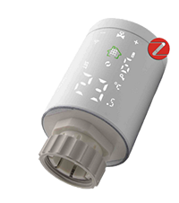
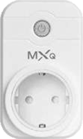
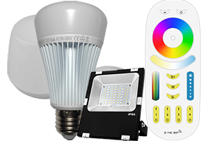

# Changelog

[ver aquí](https://bcaro.github.io/wifilightV2-doc/fr_FR/changelog)

# Instalación

El complemento requiere la instalación de dependencias. Si las dependencias no están instaladas, muchos dispositivos no funcionarán correctamente. Sin embargo, si la instalación falla, solo no funcionará encontrar la dirección IP de los dispositivos Tuya y Ewelink. 

# Presentación

Atención :
No se puede garantizar el funcionamiento permanente del plugin: incompatibilidad o compatibilidad parcial del producto, protocolo mal gestionado, mala calidad de conexión, por ejemplo. No utilices el plugin para controlar dispositivos sensibles que puedan generar algún tipo de desorden. El plugin se proporciona con fines de prueba y no para una instalación que requiera un funcionamiento óptimo en todas las circunstancias.

Este plugin le permite administrar muchas tiras de LED, bombillas LED, enchufes eléctricos, termostatos, sensor de temperatura, sensor de puerta, etc. controlado por wifi directamente o mediante una caja wifi que se vende con el producto. El principio del plugin es nunca usar la nube y, por lo tanto, una conexión a Internet entre el plugin y el dispositivo a través de un servidor remoto, por lo tanto, todas las acciones son locales a la red doméstica.

Una excepción: los productos Govee. 

# Compatibilidades y limitaciones

## Productos compatibles
 
Hay muchos productos que son compatibles con el plugin pero de marcas muy diferentes o sin marca.
 
Productos compatibles:
- lamparas Mi.Light/EasyBulb/LimitlessLED conectadas a los controladores a continuación: sin retroalimentación de estado !
- Tira de led Mi.Light/EasyBulb/LimitlessLED conectada a los controladores siguientes: sin retroalimentación de estado !
- Controlador led Mi.Light/EasyBulb/LimitlessLED V3.0 a V5.0 (el miboxer no es compatible): sin retroalimentación de estado !
- Controlador led Mi.Light/EasyBulb/LimitlessLED V6.0/iBox1/iBox2: sin retroalimentación de estado !
- Controlador LED MiLight-hub DIY: con retroalimentación de estado !
- Lamparas blancas y en color Xiaomi Yeelight WiFi con retroalimentación de estado !
- Tira de WiFi en color Xiaomi Yeelight con retroalimentación de estado !
- Luz de techo WiFi Xiaomi Yeelight con retroalimentación de estado !
- Lámpara de cabecera WiFi Xiaomi Yeelight V2 con retroalimentación de estado !
- Lámpara de escritorio Xiaomi Mijia WiFi con retroalimentación de estado !
- Sonoff Basic R3 en modo DIY con retroalimentación de estado !!
- Nanoleaf Aurora con comentarios de estado !
- Productos myStrom con retroalimentación de estado !!
- Productos Govee con retroalimentación de estado !!

Productos que pueden ser compatibles y no garantizados:
-   LW12/Lagute: controlador de tira RGB: retroalimentación de estado !
-   Controlador de tira WiFi RGB 320/370 RGB/RGBW: retroalimentación parcial del estado !
-   Magic UFO: controlador de tira RGBW, maneja el blanco !
-   MagicHome: controlador de tira RGBW/RGBWW y focos  RGBW compatibles con la aplicación MagicHome !
-   H801: Controlador de tira de RGBW, sin comentarios de estado !!
-   Arilux AL-C01/02/03/04/06/10: controlador de tira RGB/RGBW/RGBWW, retroalimentación de estado !
-   Tapo LB100/110/120/130: lamparas con retroalimentación de estado !
-   Lámpara Extel Meli con retroalimentación de estado !
-   Xiaomi Philips: lámpara de escritorio, lámpara y lámpara de techo con retroalimentación de estado !!!
-   Lamparas, enchufes, interruptores, interruptores de obturación, humidificador, termostato compatible con aplicacion Tuya Smartlife con comentarios de estado !!!
-   Tapo HS100 HS110 enchufes eléctricos con retroalimentación de estado !!
-   Controladores de tira de píxeles compatibles con Magic Home con retroalimentación de estado !
-   Periféricos controlados por la aplicación Ewelink, incluidos Sonoffs en modo LAN con comentarios de estado !!!
- Pasarelas Wifi (incluido Lidl) usando el protocolo Tuya para dispositivos Zigbee !!!
- Periféricos Meross !!!
- Productos Wiz !!
- Tapo !!

Para estos últimos controladores o periféricos wifi, el protocolo de intercambio no proviene directamente del fabricante, que por lo tanto puede modificarlo en cualquier momento. Existen varias versiones en el mercado que no son todas compatibles con el plugin. Es posible que algunos productos en particular no sean compatibles.

Atención :
- ! : fácil integración para una persona que lee la documentación antes de actuar
- !! : además de!, requiere seguir un procedimiento particular, adecuado para una persona que entiende que un procedimiento está hecho para ser seguido escrupulosamente
- !!! : ademas de !! Requiere conocimientos informáticos básicos y estar acostumbrado a realizar investigaciones en Internet para un propósito específico.

Es recomendable consultar sobre el foro para conocer la compatibilidad de un producto que no se distribuye ampliamente.

Nunca modifique el firmware de los productos, lo que puede hacerlos incompatibles con el plugin.

Vaya al foro de Jeedom [aquí](https://community.jeedom.com/t/plugin-wifilightv2-discussion-generale/2439)

## Limitaciones

Mi.Light/EasyBulb/LimitlessLED:
- El plugin tiene en cuenta todas las funciones (con ibox1 y 2 y con el puente DIY Milight-hub)
- El puente MiBoxer no es compatible
- Controladores Led Milight (tipo YL etc.) sin puente.

LW12/Lagute:
- La programación de modos personalizados no es posible, debe utilizar la aplicación suministrada con el controlador (Magic Home). Por otro lado, los modos personalizados se pueden activar con el plugin.
- Hay varias versiones de LW12 que pueden no ser compatibles con el plugin.

Magic UFO, MagicHome y Arilux AL-C01/02/03/04/06/10:
- No se gestiona la programación de modos personalizados, modo radio y temporizadores. Debe utilizar la aplicación suministrada con el controlador (Magic Home). Por otro lado, los modos personalizados se pueden activar con el plugin.
- Hay diferentes modelos que pueden no ser compatibles con el plugin.
- Algunos dispositivos compatibles con Magic Home son incompatibles porque solo funcionan con la nube

Xiaomi Yeelight:
- No se admiten pedidos HSV. El flujo y la escena se crean creando comandos con el código JSON correspondiente al efecto deseado (consulte la documentación de la API de YeeLight).
- La lámpara de noche Xiaomi de la primera versión no es compatible.
- La lámpara de escritorio Xiaomi Mijia es parcialmente compatible (sin información completa sobre el estado).

Wifi 320/370:
- La retroalimentación del estado del modo de escena no se gestiona, solo se gestiona ON / OFF.
- Hay diferentes modelos que pueden no ser compatibles con el plugin.

H810:
- Los juegos de escenario no son compatibles.
- Hay diferentes modelos que pueden no ser compatibles con el plugin.

Tapo:
- Los temporizadores no se gestionan.
- La información de consumo eléctrico no se gestiona para bombillas.

Extel Meli:
- No se tiene en cuenta la parte sonora de la lámpara

Xiaomi Philips:
- Todas las características se tienen en cuenta.

Controladores LED de tira de píxeles compatibles con Magic Home:
- No se admiten escenas personalizadas.

Dispositivos compatibles Tuya Smartlife:
- Todos los comandos de los periféricos validados (ver el foro) de firmware 1.0 y firmware 2.0 son compatibles (en particular los sockets Neo CoolCam).
- no compatible con dispositivos en la nube, especialmente sensores de apertura

Sonoff DIY:
- R3 básico con firmware 3.3.0 periféricos con un contacto.

Ewelink y Sonoff LAN:
- periféricos con firmware 3.0.1 (lista a continuación en el párrafo eWelink)
- no compatible con zigbee
- no compatible con dispositivos en la nube, en particular sensores de apertura y lámparas o tiras de LED.

Meross:
- control de persiana enrollable: funcionamiento parcial
- control de la puerta del garaje: funcionamiento parcial

Nanoleaf Aurora:
- Ritmo no implantado

Pasarela Tuya Wifi y dispositivos Zigbee:
- La configuración es manual o semiautomática excepto por un número limitado de periféricos.

Fenómeno:
- solo se ha probado la lámpara, esperando comentarios del usuario para otros dispositivos

myStrom:
- solo se ha probado el enchufe solicitado, esperando que los usuarios regresen para otros dispositivos

Govee:
- la conexión con los productos es a través de la nube y requiere internet.
- solo funcionan los controles de encendido / apagado de la intensidad del color y la temperatura del color
- estos comandos no funcionan en todos los módulos de Govee 

# Configuración del módulo wifi

## Instalar periféricos

Descarga la aplicación móvil del fabricante y sigue las instrucciones para controlar el dispositivo con el móvil. Para cada dispositivo wifilightV2, se proporciona ayuda detallada en la página de configuración.

Mientras el dispositivo no esté controlado con la aplicación móvil, el plugin no podrá funcionar.

Consulte la ayuda y los foros del fabricante del dispositivo. 

## Configurar el enrutador
Debe configurar el DHCP de su enrutador (generalmente proporcionado por su proveedor de acceso) para modificar la asignación de la dirección IP del módulo wifi o de la bombilla o zócalo para que sea estático. Anote esta dirección. En general, será de la forma:
192.168.1.xxx
donde xxx corresponde a la dirección del módulo wifi (2 a 254)

Consulte los foros de su caja para aprender a configurar su DHCP.

Después de este cambio, verifique que la aplicación móvil aún controle el dispositivo.

Luego puede ir a la configuración del plugin wifilightV2.

## Configuración del plugin

wifilightV2 no crea dispositivos automáticamente excepto:

- Tuya Smartlife
- Ewelink
- Govee
- Tapo
- Kasa (TP-Link)

Ayuda :
- Utilice el icono del signo de interrogación para obtener ayuda sobre cada elemento de configuración.

Ajustes :
- Para configurar un dispositivo, elija el menú Plugins/Objetos conectados/wifilightV2
- Luego haga clic en el botón en la parte superior izquierda Agregar un módulo WiFi
- Ingrese el nombre del módulo wifi
- Ingrese el objeto principal
- Elija la categoría Luz (por defecto)
- Activar y hacer visible (predeterminado)
- Ingrese la dirección IP del módulo de la toma o bombilla WiFi (consulte las preguntas frecuentes para obtener más explicaciones)
- Para la caja Milight-hub, se debe configurar un identificador y un puerto
- Puede cargar imágenes en la carpeta /data/myImages del plugin utilizando el plugin Jeexplorer. Estas imágenes pueden reemplazar las imágenes asociadas con los dispositivos en la página de visualización de todos los dispositivos wifilightV2. Útil para dispositivos personalizados que no están asociados con una imagen.
- Para algunos periféricos, se le pide que ingrese el canal utilizado, cree un dispositivo wifilightV2 por canal
- Para algunos dispositivos, se le pide que ingrese un token o (y) un identificador, consulte la ayuda en la página de configuración del dispositivo
- Para periféricos Tuya, es posible forzar la interrogación del estado cada minuto, útil para enchufes con consumo.
- Para algunos controladores es necesario indicar el número de leds de los leds de la tira de píxeles
- Para algunos controladores es necesario indicar el orden de los colores si los colores predeterminados no coinciden
- Ingrese la marca o tipo de dispositivo
- Ingrese el subtipo exacto del controlador, bombilla, zócalo o tira de led, esto es esencial para crear los comandos para conducir el dispositivo
- Ingrese el número de comandos enviados: le permite repetir el comando para un dispositivo remoto en caso de mala transmisión. (1 por defecto). Algunas bombillas o enchufes no gestionan esta repetición porque el plugin asegura por retroalimentación el estado de la transmisión. Algunos comandos relativos (incrementos) no se repiten.
- Introduzca el retardo de envío en caso de repetición (0 ms por defecto, 100 ms máx.)
- Ingrese el% de incremento de intensidad al presionar los botones de incremento o decremento de intensidad de luz
- Configure la cantidad de comandos creados, la creación de todos los comandos (efectos de colores de energía) puede sobrecargar la interfaz
- Ingrese el número de grupo para la sincronización, vea a continuación

## Agregar comandos
Al guardar el módulo, los pedidos se crean automáticamente.

Configure el parámetro "Creación de pedidos" para crear todos o parte de los pedidos.

el nombre de los comandos se puede cambiar. Los pedidos creados y eliminados automáticamente se recrean durante un guardado.

Cuando se crean todos los pedidos, pueden sobrecargar la interfaz, es posible no visualizarlos configurando la creación de los pedidos.

## Modificación de dispositivo

- un cambio de tipo o subtipo elimina todos los comandos
- guardar dos veces después del cambio

# Comentarios de estado

## Compatibilidad

La información de estado es inmediata para los siguientes dispositivos:
- Yeelight
- compatible con Ewelink
- compatible con la aplicación Tuya smart live
- Sonoff en modo LAN
- Compatible con Tuya/Zigbee
- Sonoff en modo DIY (requiere firmware reciente, de lo contrario interrogación cada minuto)

Por ejemplo, si se acciona un interruptor, Jeedom lo sabrá de inmediato.

Para periféricos:
 - LW12 / Lagute
 - Magic UFO / Hogar
 - Arilux
 - Wifi 3x0 (parcialmente)
 - Tapo
 - Xiaomi Philips
 - Extel Meli
 - Nanoleaf Aurora
 - Meross
 - Mi.Light conectado al puente Milight-hub
 - Wiz
 - myStrom
 - Govee
 - Tapo

El plugin sondea periódicamente el dispositivo para conocer su estado. El retraso para que Jeedom conozca el estado puede exceder 1 minuto.

Para otros periféricos, no hay retroalimentación de estado.

El comando stateGet permite, para los dispositivos que devuelven su estado, forzar la actualización del estado sondeando el dispositivo. 

## Actualización por escenario

Los comandos xxxxGet y Etat se pueden utilizar en un escenario Jeedom.

## Información de conexión

El comando ConnectedGet recupera el estado de conexión de cada dispositivo. Se actualiza cada minuto.
- -1: periférico con retroalimentación de estado OK
- -2: no se puede preparar para la conexión al dispositivo
- -3: dispositivo no conectado
- -4: sin respuesta del dispositivo
- -5: mala respuesta del dispositivo
- -6: periférico sin retroalimentación de estado

En la página de dispositivos, un emoticón indica si la conexión es correcta o no. El emoticón indiferente se utiliza en los casos en que el plugin no puede conocer el estado de la conexión, es decir, los dispositivos que no devuelven su estado. Tenga en cuenta que para los dispositivos con una puerta de enlace (Tuya Zigbee, Meross), el estado de la conexión es el de la puerta de enlace y se aplica a todos los dispositivos conectados a la puerta de enlace.

# Sincronización

## Principio

Es posible sincronizar varios dispositivos de diferentes marcas:

Todos los dispositivos que tienen el mismo número de grupo están sincronizados

El grupo 0 no está sincronizado (grupo predeterminado)

Cuando se usa un comando de un dispositivo en el grupo, el mismo comando se aplica a todos los dispositivos en el mismo grupo

Si el comando no existe para el dispositivo sincronizado, simplemente se ignora.

Tenga cuidado, los periféricos no se pedirán exactamente al mismo tiempo debido a retrasos de latencia en el envío de pedidos que se hacen uno tras otro.

## Configuración

Todo lo que tiene que hacer es poner un número distinto de cero en el campo de grupo al configurar el dispositivo. Se sincronizarán todos los equipos con los mismos números.

# Kelvin de lámparas

Hay 2 cursores para la temperatura en Kelvin. Kelvin expresado en% de 0 (caliente) a 100 (frío) y KelvinVal expresado en Kelvin de mínimo a máximo.
Los valores predeterminados corresponden principalmente a los datos del fabricante. Para algunas lámparas que no dan los valores mínimo y máximo, el plugin usa 2700 a 6500 por defecto.
Para algunas lámparas, los valores mínimo y máximo pueden ser incorrectos y los valores extremos no son comprendidos por la lámpara. Estos valores deben ajustarse para que estén dentro de los límites aceptados por la lámpara.
Puede notificar al desarrollador que cambie la configuración predeterminada para evitar estos ajustes.

# lista de colores

Para las bombillas de colores, debe haber creado el dispositivo en modo extendido + colores + disco. A continuación, se asocia una lista de opciones con cada color. Si se eliminan los comandos de color, la lista de opciones creada automáticamente no se modificará, pero la lista desplegable ya no podrá acceder a este color. Para no ser molestado en la interfaz, es necesario suprimir la visualización de los controles de color.

# lista de modos Disco y Personalizado

Algunas lámparas tienen modos disco y personalizados. Una lista de opciones está asociada con cada opción de estos modos. Si la discoteca o los pedidos personalizados se eliminan, la lista de selección creada automáticamente no se modificará. Para pedidos personalizados, puede agregar nuevos pedidos, pero tendrá que modificar manualmente este nuevo pedido en la lista. Debes haber creado el dispositivo en modo discoteca + colores + extendidos. Si se eliminan los modos Disco y Personalizado individuales, la lista desplegable ya no podrá acceder a ese modo. Para no ser molestado en la interfaz, es necesario suprimir la visualización de la discoteca y los comandos personalizados.

Por ejemplo, el comando acción/lista para aduanas tiene el nombre interno: CMD_LIST_CUSTOM. Su parámetro corresponde a la construcción de esta lista:

    Scene01|Extinction;Scene02|Ignition

La lista mostrará Power off y Power on y los comandos que se ejecutarán serán aquellos con nombre interno Scene01 o Scene02. Si agrega un nuevo comando personalizado, por ejemplo Scene03 cuyo nombre es Flash, deberá modificar el parámetro de la siguiente manera:

    Scene01|Extinction;Scene02|Ignition;Scene03|Flash

Si el comando Scene01 se elimina posteriormente, deberá modificar manualmente el parámetro CMD_LIST_CUSTOM:

    Scene02|Ignition;Scene03|Flash

# Mi.Light

Tienes que crear un dispositivo por canal en el plugin.

## Ibox 1/2 y Mi.Light Box

### Fin de venta

Mi.Light ya no transmite el ibox1 y 2 que los reemplazó con el Miboxer que está puramente basado en la nube y no es compatible con el plugin.

### Configuración

Desde la versión 1.0.58 de iBox 1 y 2, puede ser necesario modificar su configuración para que puedan comunicarse con Jeedom.

Conéctese en http (con un navegador web) a la dirección IP de su iBox. Las credenciales predeterminadas son admin/admin. Vaya a la pestaña "Otra configuración" y en "Configuración de parámetros de red/Protocolo" elija UDP y guarde.

Debe dejar el campo Puerto vacío (ni siquiera un espacio).

## MiLight-Hub

### Un centro alternativo

Varios proyectos han dado como resultado hubs compatibles con bombillas Mi.Light y mandos a distancia para sortear las limitaciones de los hubs del fabricante y que se vuelven aún más interesantes hoy con la desaparición de iBox1 y 2. El plugin es compatible con el proyecto de [Sidoh ](https://github.com/sidoh/esp8266_milight_hub) y ofrece 2 modos para impulsar las bombillas. El primer modo es el modo histórico de iBox1 y 2, que le permite usar sus periféricos como de costumbre, habrá 2 parámetros de configuración para agregar. El segundo modo es completamente nuevo y tiene las ventajas de una reactividad muy alta y una retroalimentación de estado parcial cada minuto.

### Montaje del eje Milight

Por lo tanto, el concentrador es de bricolaje, por lo que debe montarse y programarse con la información proporcionada por [Sidoh](https://github.com/sidoh/esp8266_milight_hub). Hay un tutorial disponible [en el foro ](https://community.jeedom.com/t/tuto-realiser-un-hub-milight-en-remplacement-des-ibox1-et-ibox2/47836?u=bernardfr.caron).

### Modo histórico Mi.Light

En este modo, todo lo que tiene que hacer es ingresar el parámetro Port con el puerto del modo UDP del Milight-hub. Consulte [Sidoh](https://github.com/sidoh/esp8266_milight_hub) o [en el foro](https://community.jeedom.com/t/tuto-realiser-un-hub-milight-en-remplacement-des-ibox1-et-ibox2/47836?u=bernardfr.caron) para obtener más detalles.

### Modo ESP

En este modo, la elección de los periféricos se realiza por el tipo de mando a distancia y no por el tipo de lámpara como en el modo histórico. Después de haber ingresado los parámetros habituales, ingrese el identificador del grupo de controles remotos, vea [Sidoh](https://github.com/sidoh/esp8266_milight_hub) o [en el foro](https://community.jeedom.com/t/tuto-realiser-un-hub-milight-en-remplacement-des-ibox1-et-ibox2/47836?u=bernardfr.caron) para obtener más detalles. Este modo ofrece información de estado parcial que se actualiza cada minuto.

Para emparejar una lámpara con el Milight-Hub, encienda la lámpara y haga clic en Sync ON. Utilice Sync OFF para desvincular. Para que aparezca un control remoto, seleccione ON del canal para sincronizar tan pronto como se encienda la alimentación y haga clic en Sync ON.

Para conocer las características del hub, haga clic en getKey, el resultado se obtiene en getKeyget haciendo clic en Test.

# Xiaomi Yeelight

## Configuración
Es fundamental activar el control de la red local a través de la aplicación Xiaomi Yeelight.

## Elección de la versión

El plugin permite elegir entre 2 versiones:

- V1: la conexión entre el plugin y el dispositivo no es permanente, el tiempo de reacción es un poco más largo y la retroalimentación del estado no es inmediata.
- V2: la conexión es permanente, por lo que el plugin responde mejor y la información de estado es inmediata. Por otro lado, esto conlleva una mayor sensibilidad a las malas conexiones wifi, provocando desconexiones con la imposibilidad durante unos minutos de acceder al dispositivo.

## Modo escena
Se pueden configurar los modos de escena. Varios modos de escena están preprogramados en el plugin, pero es posible agregar otros modos de escena.

Basta respetar determinadas condiciones:
- Agregue un comando predeterminado del tipo de acción wifilightV2
- Ponle un nombre (por ejemplo, Scene Flashing)
- En los parámetros, ponga el comando de escena Yeelight, por ejemplo:
    "id": 1, "método": "set_scene", "params": ["cf", 0,0, "500,1,255,100,1000,1,16776960,70"]

No coloque las llaves de inicio y final, así como los caracteres de nueva línea, el plugin los agregará automáticamente
Inspírate en los controles preconfigurados para crear estos modos de escena adicionales.
Para la sintaxis de Yeelight, consulte [aquí](https://www.yeelight.com/download/Yeelight_Inter-Operation_Spec.pdf)

## Estado
En V2, al activar el plugin y tan pronto como se inicia el demonio, así como cada minuto, el plugin busca las lamparas encendidas y conectadas a Jeedom.

Tan pronto como se encuentra la lámpara, el estado de la lámpara se devuelve al plugin inmediatamente.

Tenga en cuenta que el plugin puede tardar hasta 1 minuto en encontrar una lámpara y 4 minutos en encontrar que un dispositivo está desconectado.

En V1, el estado puede tardar hasta un minuto en volver. 

#Tapo & Kasa TP-Link

Los dispositivos compatibles son:

Tapo:
- bombillas L510 L530 L900 L920
- Tomas P100 P110

Kasa:
- bombillas KL50 KL60 KL110 KL120 KL130 LB100 LB110 LB120 LB130
- Tomas HS100 HS110 KP105 KP110

## Configuración de la nube de TP-Link

Esta parte del complemento requiere que se inicien las dependencias.

En la configuración del complemento, ingrese la dirección de correo electrónico y la contraseña para conectarse a la aplicación Kasa o Tapo y guarde. Luego seleccione: Tapo-Kasa Cambiar a inclusión. Los dispositivos se crean automáticamente. Las credenciales son las mismas para Tapo y Kasa.

Si el complemento no encuentra la dirección IP local, haga coincidir la dirección mac con la dirección IP proporcionada en la configuración del dispositivo de la aplicación Tuya y su enrutador y modifique la dirección IP. El procedimiento para encontrar la dirección IP utiliza un comando del sistema Linux, si no se puede cargar o si el sistema no es compatible, la dirección IP no se puede encontrar automáticamente.

Para los dispositivos en la lista a continuación, se encuentra el subtipo, en otros casos, el complemento elige el Tapo P100, puede cambiar el subtipo sin perder el ID del dispositivo.

Si no se encontró la dirección IP porque el periférico no está conectado, dale la dirección: 0.0.0.0, conéctalo y reinicia el procedimiento de inclusión.

Si ya existe un dispositivo con el mismo ID de dispositivo, no se realizará la inclusión.

A partir de entonces, el control del dispositivo es local.

Notas:
- Es posible que los enchufes HS100 HS110 KP105 KP110 necesiten usar el protocolo V2, haga la modificación manualmente.
- Se crean todos los dispositivos TP-link presentes en la nube, especialmente los routers o hotspots wifi TP-link. Como el complemento no los reconoce, se crea un zócalo TAPO P100, simplemente elimine los dispositivos innecesarios.

# Xiaomi Philips

Es esencial recuperar un token que permita que el plugin se comunique con los dispositivos Xiaomi Philips.

El procedimiento es complejo y requiere varias manipulaciones. Haga una búsqueda en la web con la palabra clave: Token Xiaomi o en el foro [aquí](https://community.jeedom.com/t/xiaomi-philips-et-wifilightv2/48064).

No se brindará ayuda para recuperar la ficha.

#Meross

Los dispositivos compatibles son:
- enchufes individuales: MSS110 MSS210
- enchufes individuales + consumo: MSS310 (el consumo solo sube cada minuto)
- MSS120 MSS620 enchufes dobles
- Zócalos cuádruples MSS420
- Zócalos quíntuples MSS425
- lámparas de color: MSL120 BR30
- Lámparas MSL420 MSL430 MSL450
- lámparas de atenuación: MSL100
- tira led: MSL320 MSL320 pro
- cubo: MSH300
- cabezas termostáticas: MTS100 MTS150
- Persianas enrollables MRS100 (retroalimentación de estado y posicionamiento no funcional)
- garaje MSG100
- Interruptor MSS710
- Conmutadores MSS510 MSS550
- purificador MAP100 beta
- Difusor MOD100 beta
- Humidificador MSXH0 beta

Se pueden hacer compatibles otros periféricos: póngase en contacto con el desarrollador.

Debe crear un dispositivo en el complemento para cada toma ordenada y asignarle un canal del 1 al n correspondiente a las n tomas. El canal 0 se usa para operar todos los enchufes al mismo tiempo.
Precaución: algunos sockets antiguos se comportan de manera diferente, use la versión V1 en el subtipo.

## escriba "Meross" para el firmware <2.2.2
No cree nuevos dispositivos con esta opción, preferiblemente use Meross V2, este tipo está presente para garantizar la compatibilidad con los dispositivos configurados antes de la llegada de V2. No se brindará ayuda para encontrar los parámetros necesarios para este tipo.

## escriba "Meross V2" para cualquier firmware, incluido 2.2.2
Para obtener una clave, debe ingresar los identificadores (login) y la contraseña de la cuenta de Meross en la configuración del complemento. Luego haga clic en getKey en la pestaña de comandos de cada dispositivo. La clave se recupera de los servidores de Meross y se guarda en el campo Clave. Puede copiar esta clave en todos sus dispositivos Meross y borrar el nombre de usuario y la contraseña, pero ya no tendrá que hacer clic en getKey.

Advertencia: los usos repetidos de getgey pueden bloquear el acceso a los servidores de Meross, lo que puede durar varias horas. Haz una copia de la Clave en todos tus dispositivos Meross, depende de la cuenta de usuario y no del dispositivo.

## Centro Meross
Para equipos conectados al hub Meross MSH300 y luego de indicar su dirección ip y guardarla, presione getKey que recupera la clave y todos los periféricos conectados al Hub. Al agregar un nuevo periférico al concentrador, simplemente haga getKey para crearlo en el complemento.

## Recuperación de consumos más precisa.
Cree un escenario que se active solo una vez cuando se inicia Jeedom: coloque un bucle en 1,000,000. Coloque otro bucle dentro de 1,000,000. Estos 2 bucles anidados provistos de una pausa evitarán la salida del escenario durante cientos de años. En el bucle interno, ponga una pausa de 10 segundos y una llamada al estado del dispositivo Obtener para actualizar la información del dispositivo. La pausa se puede reducir hasta 1s dependiendo de la potencia y complejidad de la instalación.

- Le permite recuperar la información de apertura del módulo de garaje
- Permite un cálculo más preciso del consumo: luego recupera la potencia, divídela por 360 (para un período de escaneo de 10s) y agrégala a una variable que se llamará consumo. El 360 proporciona el consumo en kWh. 

# Sonoff en modo DIY

## Compatibilidad

Los periféricos compatibles son:
- Atenuador inteligente Sonoff D1
- Sonoff BASICR3 y RFR3
- Sonoff MINI

## Configuración

Para firmware desde 3.3.0 y por debajo de 3.5.0 es decir Modo DIY 1.0, Sonoff proporciona todos los elementos [aquí](https://github.com/itead/Sonoff_Devices_DIY_Tools/tree/master/tool) para configurar los módulos en modo DIY.

Se requiere un teléfono móvil y una PC con Windows con tarjeta WiFi.
El software a ejecutar para encontrar el Sonoff da en la columna de la izquierda el identificador necesario para configurar el dispositivo.

El dispositivo Sonoff debe tener el firmware 3.3.0 o superior, la aplicación de Windows anterior le permite actualizar el firmware.

Para el firmware de 3.5.0, el procedimiento es más simple y se detalla [aquí en el foro](https://community.jeedom.com/t/sonoff-diy-et-wifilightv2-en-firmware-3-5-0/48060).

# SonOff Ewelink y Nube

Este procedimiento automatiza la creación de la mayoría de los dispositivos Ewelink y Sonoff. Sin embargo, el acceso a los dispositivos sigue siendo local. El dispositivo debe tener el firmware 3.0.1 o superior, la aplicación Ewelink puede actualizar el firmware.

## Configuración del complemento

En la configuración del complemento, ingrese el inicio de sesión (solo la dirección de correo electrónico) y la contraseña para conectarse a la aplicación Ewelink y guardar. Luego seleccione: Ewelink Cambiar a inclusión. Los dispositivos que están en la aplicación Ewelink se crean automáticamente. Si el dispositivo se elimina de la aplicación Ewelink, ya no funcionará con el complemento.

Si el complemento no encuentra la dirección IP local, haga coincidir la dirección mac con la dirección IP proporcionada en la configuración del dispositivo de la aplicación Ewelink y su enrutador y modifique la dirección IP. El procedimiento para encontrar la dirección IP utiliza un comando del sistema Linux, que requiere ejecutar las dependencias. Si no se puede cargar o si el sistema no es compatible, la dirección IP no se puede encontrar automáticamente.

Para la mayoría de los dispositivos sonoff, se encuentra el subtipo, en otros casos, el complemento elige sonoff basic, puede cambiar el subtipo sin perder la ApiKey y el ID del dispositivo.

Si ya existe un dispositivo con el mismo ID de dispositivo, no se realizará la inclusión. Puede modificar el ID del dispositivo para forzar la creación de un duplicado.

Observaciones:

- algunos dispositivos no se crean (la nube de Ewelink no proporciona los datos)
- Los dispositivos que no funcionan con zigbee y que funcionan con baterías son pura nube (cierre, puerta, sensores de temperatura, por ejemplo) se integrarán pero el complemento no podrá acceder a ellos
- si no se encontró la dirección IP porque el periférico no está conectado, dale la dirección: 0.0.0.0, conéctalo y reinicia el procedimiento de inclusión.
- cuando un dispositivo se conecta a wifi, el complemento será notificado de inmediato. Por otro lado, cuando se desconecta un periférico, el complemento solo podrá saberlo si el complemento le envía un comando.
- ApiKey y DeviceID se recuperan automáticamente por inclusión. Sin embargo, para recuperar manualmente estas 2 piezas de información, puede ir [aquí] (https://blog.ipsumdomus.com/sonoff-switch-complete-hack-without-firmware-upgrade-1b2d6632c01) o [en el foro de Jeedom ]( https://community.jeedom.com/t/plugin-wifilightv2-sonoff-ewelink-lan/2632 ) o busque en la web y en el foro de Jeedom con las palabras clave: Ewelink o Sonoff Apikey. No ponga espacios ni comillas.

## Compatibilidad

Muchas marcas son compatibles, incluida Sonoff. Los productos probados son:
- Interruptores, enchufes de pared, interruptor: simples de todas las marcas
- Interruptores, enchufes de pared, interruptor: múltiplos de todas las marcas
- Interruptores, enchufes de pared, interruptor: simple con dimmer de todas las marcas
- Atenuador inteligente Sonoff D1
- Sensor de temperatura Sonoff TH10/1H16. Nueva configuración para firmware >=3.4 con ON/OFF OK
- Sonoff básico R2, RF, POW, Mini
- Sonoff Dual R2
- Sonoff Dual R3 (la recuperación de consumo y la configuración del motor deben probarse, la configuración del motor no está completamente implementada)
- Sonoff 4CH/4CH PRO
- Sonoff Touch
- Sonoff S20/S26
- Sonoff T1/TX
- Sonoff SLAMPHER
- Sonoff T4EUC1
- Ifan 2/3/4 para probar
- Sonoff RF bridge 433 solo para sensores (puerta, detector de presencia, mando a distancia)
- Sonoff Micro USB: elija el canal 1, proporcionado para 4 canales para un modelo USB de 4 canales que no sea sonoff, retorno de estado no funcional en fw 3.7

No obstante, la compatibilidad de estos periféricos no está garantizada ya que el protocolo puede ser modificado por los fabricantes. No modifique el firmware del dispositivo sin comprobar que es compatible con el complemento.

El sonoff DW2 no es compatible porque es puramente en la nube y no ingresa al punto de acceso para encontrar apiKey y DeviceID. Es probable que sea el mismo para todos los sensores de puerta compatibles con ewelink.

Zigbee Hub no es compatible (y puramente en la nube), así como todos los dispositivos Zigbee.

Ninguna bombilla o tira de led es compatible.

Para dispositivos multicanal (como el Sonoff 4CH) tienes que crear tantos dispositivos wifilightV2 como canales haya, una copia del primero creado lo hace fácil, luego tienes que cambiar el número de canal.

Para dispositivos que no están presentes en esta lista o si la configuración no funciona o si un dispositivo no tiene el subtipo correcto y después de usar el procedimiento de integración de dispositivos, proporcione el contenido de los registros wifilightV2_inc en el [foro] (https://community.jeedom.com/t/plugin-wifilightv2-sonoff-ewelink-lan/2632) para permitir la integración del módulo en el complemento.

# Tuya Smartlife y Cloud Tuya

Este procedimiento automatiza la creación de la mayoría de los dispositivos Tuya y Tuya / Zigbee. Sin embargo, el acceso a los periféricos sigue siendo local.

## Configuración de la plataforma Tuya

Siga esto primero y [tuto](https://linkdhome.com/articles/local-tuya-device-control-in-homekit) vaya a la pestaña "Overview" para recuperar: Access ID et Access Secret. En la configuración del complemento, ingrese estos 2 parámetros en la parte Tuya y guarde, luego seleccione: Tuya Ir a inclusión. Los dispositivos se crean automáticamente.

Esta parte del complemento requiere el lanzamiento de las dependencias: si el complemento no encuentra la dirección IP local, establezca la conexión entre la dirección mac y la dirección IP proporcionada en los parámetros del dispositivo de la aplicación Tuya y su enrutador y cambie el Dirección IP. El procedimiento para encontrar la dirección IP utiliza un comando del sistema Linux, si no se puede cargar o si el sistema no es compatible, la dirección IP no se puede encontrar automáticamente.

### Observaciones:
- Si ya existe un dispositivo con el mismo devId, no se realizará la inclusión.
- Los dispositivos que no son zigbee y que funcionan con baterías son pura nube (cierre, puerta, sensores de temperatura, por ejemplo) se integrarán pero el complemento no podrá acceder a ellos
- se crean los colores según los 3 formatos conocidos, así como los comandos de saturación e intensidad relacionados
- los periféricos con información codificada (parte actuadora de las alarmas en general) no son gestionados
- los dispositivos con información no estándar (posiblemente se pueden resolver con un bloque de código en un escenario) no se manejan
- el complemento no decodifica comandos complejos y luego pone en parámetros el Json de la nube Tuya
- Es posible que la nube de Tuya no proporcione todos los comandos del dispositivo.
- la eliminación de un pedido creado por el complemento a través de la nube Tuya ya no se puede volver a crear
- si no se encontró la dirección IP porque el periférico no está conectado, dale la dirección: 0.0.0.0, conéctalo y reinicia el procedimiento de inclusión.

### Puntas:
- si la localKey de un dispositivo ha cambiado, modifique el devId del dispositivo, rehaga la inclusión y copie el devId y la nueva localKey nuevamente en el dispositivo antiguo. Finalmente, elimine el dispositivo creado por inclusión..
- si el procedimiento automático falla o si la nube Tuya no proporciona los comandos, cambie al [modo de aprendizaje del dispositivo] (./tuya#tocAnchor-1-1-6) y actúe solo en los botones de la aplicación Tuya Smartlife en correspondencia . Si se usan otros botones, el complemento creará duplicados de los comandos creados a través de la nube de Tuya.
- en general, los pedidos se pueden crear manualmente o en modo de aprendizaje
- el mínimo y el máximo de un valor numérico se cargan desde la nube. Según sea necesario, modifique los parámetros #slider# y #value#, así como el mínimo y el máximo de Jeedom. Esta parte se mejorará con los comentarios de los usuarios.

### Participación en la mejora de esta parte:
Puedes ayudar a mejorar la creación automática proporcionando la mayor cantidad de información posible: el Json de la nube Tuya, los cambios realizados, los registros o cualquier comentario relevante.

Para obtener el Json de la nube Tuya:
- en Tuya IOT Platform: Cloud > Development > elija el proyecto > Devices > Copie el ID del dispositivo del dispositivo
- Cloud > Development > (en la nueva ventana) Smart Home Management System > Device Control > Get Device Specification Attribute (el segundo en la lista sin s para atributo)
- pegue el device ID > Submit Request > Copy (enlace de la ventana derecha)

[Ver documentación específica](./tuya#tocAnchor-1-1)

## Creación manual o semimanual de dispositivos Tuya y Tuya/Zigbee

Este procedimiento requiere que copie manualmente la clave local de la nube Tuya.

  [Ver documentación específica para las puertas de enlace Tuya / Zigbee](./tuya#tocAnchor-1-1)
 
  [Ver documentación específica de los productos Tuya Wifi](./tuya#tocAnchor-1-10)

Atención :

Los productos Lidl Tuya / Zigbee nunca deben haberse emparejado con la aplicación Lidl. Deben emparejarse solo con la aplicación Tuya Smartlife; de ​​lo contrario, el complemento ya no podrá utilizarlos. 

# NanoLeaf

## Llave

Presione el botón de encendido de Nanoleaf durante 5-7 sy presione el comando getKey del plugin. Compruebe que Apikey se haya colocado en el campo "token" de la configuración del plugin.

## Efectos personalizados

Crea un efecto con la aplicación NanoLeaf y dale un nombre. Cree una acción / comando predeterminado en la lista de comandos de dispositivo en el plugin. Pon el nombre en los parámetros. Luego dé un identificador único y un nombre, pueden ser idénticos al nombre del comando.

## Enviar un comando personalizado

Cree un comando action/default, en nombre interno ponga un nombre y en parámetros ponga el json del comando personalizado excepto las llaves externas pero con el comando escribir, por ejemplo:

     "write" : {"command" : "request", "animName" : "Northern Lights"}

Consulte la documentación de Nanoleaf para crear estos efectos. 

# Govee

Los dispositivos wifi compatibles son:
- bombillas:
    H6002 H6003 H6008 H6049 H6050 H6051 H6052 H6054 H6059 H605B H6061 H6062 H6071 H6072 H6073 H6075 H6076 H6083 H6085 H6086 H6087 H6089 H6104 H6109 H610A H611A H611B H611C H611Z H6110 H614A H614B H614C H614D H614E H6117 H6121 H6135 H6137 H6141 H6142 H6143 H6144 H6148 H615A H615B H615C H615D H6154 H6159 H6160 H6163 H6172 H6182 H6188 H618A H618C H618E H6195 H6198 H6199 H619A H619B H619C H619D H619E H619Z H61A0 H7005 H7021 H7022 H7028 H7050 H7060S MSSFH420 MS
- zócalos: H5001 H5080 H5081 H7014

El zócalo dual no es compatible, pero podría serlo si un usuario tiene uno y quiere ayudar a mejorar el complemento.

## Instalación
La instalación, creación y configuración de dispositivos es completamente automática:
- obtenga la clave API de la aplicación proporcionada por Govee
- en la configuración del complemento, coloque esta clave API en el campo Govee y guarde.
- haga clic en la inclusión de Govee: los dispositivos se crean automáticamente.

## Comentarios
Preste atención a los siguientes puntos:
- cuando un dispositivo con la misma dirección MAC ya está presente en el complemento, no se volverá a crear ni modificar
- si se elimina un dispositivo de la cuenta de Govee, no se eliminará del complemento, tendrá que hacerse manualmente
- si no se conoce un modelo de dispositivo, se utilizará el tipo de bombilla
- si la conexión a Internet o los servidores de Govee no funcionan, el complemento no podrá acceder al dispositivo
- el complemento solo puede cambiar el color, la intensidad, la temperatura del color y el ENCENDIDO/APAGADO en el dispositivo.
- para algunos modelos, la variación de intensidad no funciona, al igual que la temperatura de color o el color. 

# Ayudar ?

Vaya al foro de Jeedom [aquí](https://community.jeedom.com/t/plugin-wifilightv2-discussion-generale/2439) y proporcione tanta información como sea posible para obtener ayuda:
- versión del complemento
- configuración de complementos
- Configuración del dispositivo

Los registros del complemento no son compatibles con syslog, coloque la configuración estándar para los registros. Se dividen en 4 categorías:
- wifilightV2_cmd: para comandos enviados a periféricos
- wifilightV2_inc: al incluir dispositivos
- wifilight_Tuya: el daemon para dispositivos Tuya y Yeelight. Comprueba la presencia de estos dispositivos cada minuto, mantiene la conexión persistente y recupera el estado en tiempo real.
- wifilightV2: el segundo daemon para todos los demás dispositivos. Prueba la presencia de estos dispositivos cada minuto. 