# Changelog

[voir ici](https://bcaro.github.io/wifilightV2-doc/fr_FR/changelog)

# Présentation

Ce plugin permet de gérer de nombreux bandeaux de leds, ampoules leds, prises électriques, thermostats, capteur de température, capteur de porte, etc.  pilotés en wifi directement ou via une box wifi vendue avec le produit. Le principe du plugin est de ne jamais utiliser le cloud et donc une connexion internet entre le plugin et le périphérique via un serveur lointain, toutes les actions sont donc locales au réseau domestique.

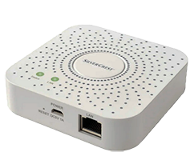
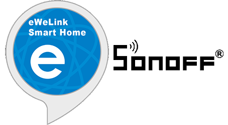
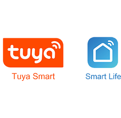

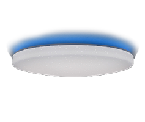
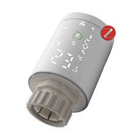
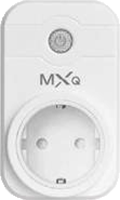
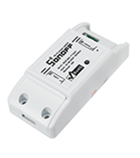
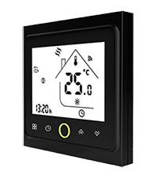
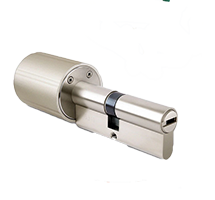
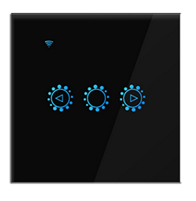
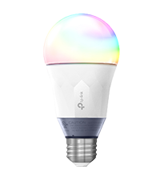
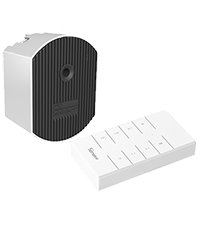
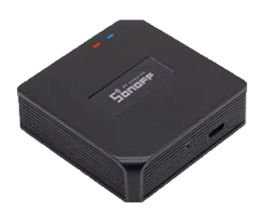
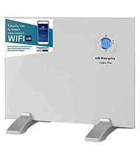
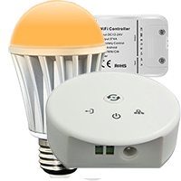
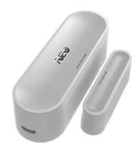
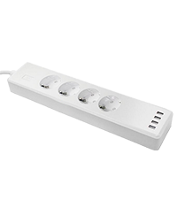
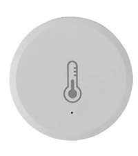
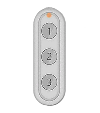
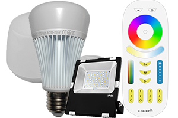

# Compatibilités et limitations

## Produits compatibles 
 
Il existe de nombreux produits compatibles avec le plugin mais de marques très différentes ou sans marque.
 
Les produits compatibles :
-   Ampoules Mi.Light/EasyBulb/LimitlessLED reliées aux contrôleurs ci-dessous : pas de retour d'état !
-   Strip-led Mi.Light/EasyBulb/LimitlessLED reliée aux contrôleurs ci-dessous : pas de retour d'état !
-   Contrôleur led Mi.Light/EasyBulb/LimitlessLED V3.0 à V5.0 (la miboxer n'est pas compatible): pas de retour d'état !
-   Contrôleur led Mi.Light/EasyBulb/LimitlessLED V6.0/iBox1/iBox2 : pas de retour d'état !
-   Contrôleur led DIY MiLight-hub : avec retour d'état !!
-   Ampoules WiFi Xiaomi Yeelight blanches et couleur avec retour d'état !
-   Strip-led WiFi Xiaomi Yeelight couleur avec retour d'état !
-   Plafonnier WiFi Xiaomi Yeelight avec retour d'état !
-   Lampe de chevet V2 WiFi Xiaomi Yeelight avec retour d'état !
-   Lampe de bureau WiFi Xiaomi Mijia avec retour d'état !
- 	Sonoff Basic R3 en mode DIY avec retour d'état !!
-   Nanoleaf Aurora avec retour d'état !

Produits pouvant être compatibles et non garantis :
-   LW12/Lagute : RGB strip-led contrôleur : retour d'état !
-   Wifi 320/370 RGB/RGBW strip-led contrôleur : retour d’état partiel !
-   Magic UFO : RGBW strip-led contrôleur, gère le blanc !
-   MagicHome : RGBW/RGBWW strip-led contrôleur et ampoules/spots RGBW compatibles avec l'appli MagicHome !
-   H801 : RGBW strip-led contrôleur, pas de retour d’état !!
-   Arilux AL-C01/02/03/04/06/10 : RGB/RGBW/RGBWW strip-led contrôleur, retour d’état !
-   TP-Link LB100/110/120/130 : ampoules avec retour d’état !
-   Lampe Extel Meli avec retour d'état !
-   Xiaomi Philips : Lampe bureau, ampoule et plafonnier avec retour d'état !!!
-   Ampoules, prises, interrupteur, interrupteurs volets, humidificateur, thermostat compatibles Tuya Smart live ou Jinvoo smart ou eFamilyCloud apps avec retour d'état !!!
-   Prises électriques TP-link HS100 HS110 avec retour d'état !!
-   Contrôleurs de pixel strip leds compatible Magic home avec retour d'état !
-	Périphériques contrôlés par l'appli Ewelink dont les Sonoff en mode LAN avec retour d'état !!!
-	Passerelles wifi (dont Lidl) utilisant le protocole Tuya pour les périphériques Zigbee !!!
-   Périphériques Meross !!!
-	Produits Wiz!!

Pour ces contrôleurs, ampoules ou prises, le protocole d'échange ne provient pas directement du constructeur qui peut donc le modifier à tout moment. Plusieurs versions existent sur le marché qui ne sont pas toutes compatibles avec le plugin.

Attention :
- ! : intégration facile pour une personne qui lit la documentation avant d'agir
- !! : en plus de !, nécessite de suivre une procédure particulière, adapté à une personne qui comprend qu'une procédure est faite pour être suivie scrupuleusement
- !!! : en plus de !! nécessite des connaissances de base en informatique et être habitué à faire des recherches sur internet dans un but précis

Produits incompatibles et qui ne le seront pas :
-   Le pont Mi.light MiBoxer (sauf ON/OFF de la box)
-	Les contrôleurs de Led Milight(du type YL etc.) sans pont.
-   Les ampoules, prises ou contrôleurs de bandeau led qui contiennent un récepteur bluetoooth au lieu d'un récepteur radiofréquence 2.4 Ghz ou WiFi.
-   Les contrôleurs de bandeau led ou d'ampoules et les ampoules ou prises qui utilisent une connexion WiFi point à point avec l'application mobile.
-   L'ancienne lampe de chevet Xiaomi Yeelight n'est pas compatible.
-	Certains périphériques compatibles Magic Home qui ne fonctionnent plus qu'avec le cloud.
- 	Tous les capteurs WiFi sur pile (détecteur de présence, détecteur d'ouverture) compatibles Tuya qui ne fonctionnent plus qu'avec le cloud.

Il est conseillé de se renseigner sur le forum pour connaitre la compatibilité d'un produit peu diffusé.

Aller sur le forum de Jeedom [ici](https://community.jeedom.com/t/plugin-wifilightv2-discussion-generale/2439)

## Limitations

Mi.Light/EasyBulb/LimitlessLED :
-   Toutes les fonctionnalités sont prises en compte par le plugin (avec les ibox1 et 2 et avec le pont DIY Milight-hub)
-   Le pont MiBoxer n'est pas compatible

LW12/Lagute :
-   La programmation des modes custom n'est pas possible, il faut utiliser l'application fournie avec le contrôleur (Magic Home). Par contre, les modes customs peuvent être déclenchés avec le plugin.
-   Il existe plusieurs versions de LW12 qui peuvent ne pas être compatibles avec le plugin.

Magic UFO, MagicHome et Arilux AL-C01/02/03/04/06/10 :
-   La programmation des modes custom, le mode radio et les timers ne sont pas gérés. Il faut utiliser l'application fournie avec le contrôleur (Magic Home). Par contre, les modes customs peuvent être déclenchés avec le plugin.
-   Il existe différents modèles qui peuvent ne pas être compatibles avec le plugin.

Xiaomi Yeelight :
-   Les commandes HSV ne sont pas gérées. Flow et scène le sont en créant des commandes avec le code JSON correspondant à l'effet recherché (voir la documentation de l'API YeeLight).
-   La lampe de chevet Xiaomi n'est pas compatible.
-   La lampe de bureau Xiaomi Mijia est partiellement compatible (pas de retour d'état complet).

Wifi 320/370 :
-   Le retour d'état des modes scènes n'est pas géré, seul ON/OFF est géré.
-   Il existe différents modèles qui peuvent ne pas être compatibles avec le plugin.

H810 :
-   les jeux de scène ne sont pas gérés.
-   Il existe différents modèles qui peuvent ne pas être compatibles avec le plugin.

TP-Link :
-   Les timers ne sont pas gérés.
-   Les informations de consommation électrique ne sont pas gérées pour les ampoules.

Extel Meli :
-   La partie son de la lampe n'est pas prise en compte

Xiaomi Philips :
-   Toutes les fonctionnalités sont prises en compte

Contrôleurs de pixel strip leds compatibles Magic Home :
-   les scènes custom ne sont pas gérées.

Périphériques compatibles Tuya Smart/Jinvoo/eFamilyCloud :
-   toutes les commandes des périphériques validés (voir le forum) du firmware 1.0 et du firmware 2.0 sont compatibles (en particulier les prises Neo CoolCam).

Sonoff DIY :
-   Basic R3 avec le firmware 3.3.0 périphériques avec un seul contact.

Ewelink et Sonoff LAN :
-   périphériques avec le firmware 3.0.1 (liste donnée ci-après dans le paragraphe eWelink)
-   non compatible zigbee

Nanoleaf Aurora :
-   Rythm non implantés

Passerelle Wifi Tuya et périphériques Zigbee :
-   La configuration est manuelle ou semi-automatique sauf pour un nombre limité de périphériques. La gestion de la couleur des lampes est complexe à configurer.

# Configuration du module wifi

## Installer les périphériques

Télécharger l'application mobile du constructeur et suivre les indications afin de contrôler le périphérique avec le mobile. Pour chaque équipement wifilightV2, une aide détaillée est fournie dans la page de configuration.

Tant que le périphérique n'est pas contrôlé avec l'application mobile, le plugin ne pourra pas fonctionner.

Consultez l'aide et les forums du constructeur des périphériques.

## Configurer le routeur
Il faut configurer le DHCP de votre routeur (généralement fourni par votre fournisseur d'accès) pour modifier l'attribution de l'adresse IP du module wifi ou de l'ampoule ou la prise pour qu'elle soit statique. Noter cette adresse. En général, elle sera de la forme :
192.168.1.xxx 
où xxx correspond à l'adresse du module wifi (2 à 254)

Consultez les forums de votre box pour apprendre à configurer votre DHCP.

Après cette modification, vérifier que l'application mobile contrôle toujours le périphérique.

Vous pouvez alors passer à la configuration du plugin wifilightV2.

## Configuration du plugin

wifilightV2 ne crée aucun périphérique automatiquement (sauf pour les périphériques Tuya/Zigbee en mode inclusion), il faut les créer dans le plugin avant de les paramétrer.

Aide : 
-   Utiliser l'icône sous forme de point d'interrogation pour obtenir une aide sur chaque élément de configuration.

Paramétrage :
-   Pour paramétrer un équipement, choisir le menu Plugins / Objets communicants / wifilightV2
-   Puis cliquer sur le bouton en haut à gauche Ajouter un module Wifi 
-   Saisir le nom du module wifi
-   Saisir l'objet parent
-   Choisir la catégorie Lumière (par défaut)
-   Activer et rendre visible (par défaut)
-   Saisir l'adresse IP du module de la prise ou de l'ampoule WiFi (voir la FAQ pour plus d'explications)
-   Pour la box milight-hub, un identifiant et un port doivent être configurés
-   Vous pouvez charger dans le dossier /data du plugin des images à l'aide du plugin Jeexplorer Ces images peuvent remplacer les images associées aux périphériques dans la page d'affichage de tous les périphériques wifilightV2. Utile pour les périphériques personnalisés qui ne sont pas associés à une image.
-   Pour certains périphériques il est demandé de saisir le canal utilisé, créer un équipement wifilightV2 par canal
-   Pour certains périphériques il est demandé de saisir un jeton ou (et) un identifiant, consulter l'aide sur la page de configuration du périphérique
-   Pour les périphériques Tuya, il est possible de forcer l'interrogation de l'état toutes les minutes, utile pour les prises avec consommation.
-   Pour certains contrôleurs il faut indiquer le nombre de leds des pixel strip leds
-   Pour certains contrôleurs il faut indiquer l'ordre des couleurs si les couleurs par défaut ne correspondent pas
-   Saisir la marque ou le type de périphérique
-   Saisir le sous-type exact du contrôleur, de l'ampoule, de la prise ou du strip-led, ceci est indispensable pour créer les commandes afin de piloter le périphérique
-   Saisir le nombre d'envois de commandes : permet de répéter la commande pour un équipement éloigné en cas de mauvaise transmission. (1 par défaut). Certaines ampoules ou prises ne gèrent pas cette répétition car le plugin s'assure par retour d'état de la transmission. Certaines commandes relatives (incrémentations) ne sont pas répétées.
-   Saisir le délai d'envoi en cas de répétition (0 ms par défaut, 100 ms max)
-   Saisir le % d'incrémentation de l'intensité lors de l'appui sur les boutons d'incrémentation ou de décrémentation de l'intensité lumineuse
-   Configurer le nombre de commandes créées, la création de toutes les commmandes peut alourdir l'interface
-   Saisir le n° de groupe pour la synchronisation, voir plus bas

## Ajout des commandes
Lors de la sauvegarde du module, les commandes sont automatiquement créées.

Configurer le paramètre "Création des commandes" pour créer tout ou partie des commandes.

le nom des commandes peut être modifié. Les commandes automatiquement créées et effacées sont recréées lors d'une sauvegarde.

Lorsque toutes les commandes sont créées, elles peuvent alourdir l'interface, il est possible de ne pas les afficher en configurant la création des commandes.

## Modification du périphérique

-   un changement de type ou de sous type supprime toutes les commandes
-   sauvegarder 2 fois après changement

# Retour d'état

## Compatibilité

Le retour d'état est immédiat pour les périphériques suivants :
- Yeelight
- compatibles avec Ewelink
- compatibles avec l'appli Tuya smart live
- Sonoff en mode LAN
- compatibles Tuya/Zigbee
- Sonoff en mode DIY (nécessite un firmware récent, sinon interrogation toutes les minutes)

Par exemple, si un interrupteur est actionné, Jeedom le saura immédiatement.

Pour les périphériques :
 - LW12/Lagute
 - Magic UFO/Home
 - Arilux
 - Wifi 3x0 (partiellement) 
 - TP-Link
 - Xiaomi Philips
 - Extel Meli
 - Nanoleaf Aurora
 - Meross
 - Mi.Light connectés au pont Milight-hub
 - Wiz

Le plugin interroge régulièrement le périphérique pour connaitre son état. Le délai pour que Jeedom connaisse l'état peut dépasser 1 minute.

Pour les autres périphériques il n'y a pas de retour d'état.

La commande stateGet permet, pour les périphériques qui renvoient leur état, de forcer la mise à jour de l'état en interrogeant le périphérique.

## Mise à jour par scénario

Les commandes xxxxGet et Etat peuvent être utilisées dans un scénario Jeedom.

## Information de connexion

La commande ConnectedGet permet de récupérer l'état de la connexion de chaque périphérique. Elle est mise à jour toutes les minutes.
-  -1 : périphérique avec retour d'état OK
-  -2 : impossible de préparer la connexion au périphérique
-  -3 : périphérique non connecté
-  -4 : pas de réponse du périphérique
-  -5 : mauvaise réponse du périphérique
-  -6 : périphérique sans retour d'état

# Synchronisation

## Principe

Il est possible de synchroniser plusieurs périphériques de marques différentes :

Tous les périphériques qui ont le même numéro de groupe sont synchronisées

Le groupe 0 n'est pas synchronisé (groupe par défaut)

Lors de l'utilisation d'une commande d'un périphérique du groupe, la même commande est appliquée sur tous les périphériques du même groupe

Si la commande n'existe pas pour le périphérique synchronisé, elle est simplement ignorée.

Attention, les périphériques ne vont pas être commandés exactement en même temps à cause des délais de latence lors de l'envoi des commandes qui se fait les uns après les autres.

## Configuration

Il suffit de mettre un nombre différent de zéro dans le champ groupe lors de la configuration de l'équipement. Tous les équipements ayant les mêmes numéros seront synchronisés.

# Kelvin des lampes

Il y a 2 curseurs pour la température en Kelvin. Kelvin exprimé en % de 0 (chaud) à 100 (froid) et KelvinVal exprimé en Kelvin de min à max. 
Les valeurs par défaut correspondent la plupart du temps aux données du constructeur. Pour certaines lampes qui ne donnent pas les valeurs min et max, le plugin utilise par défaut 2700 à 6500.
Pour certaines lampes, les valeurs min et max peuvent être erronées et les valeurs extrêmes non comprises par la lampe. Il faut ajuster ces valeurs pour qu'elles soient dans les limites acceptées par la lampe. 
Vous pouvez prévenir le développeur pour qu'il modifie la configuration par défaut pour éviter ces ajustements.   

# liste des couleurs

Pour les ampoules couleurs, il faut avoir créé le périphérique en mode étendu + couleurs + disco. Une liste à choix est alors associée à chaque couleur. Si les commandes couleurs sont supprimées, la liste à choix créée automatiquement ne sera pas modifiée mais la liste déroulante ne pourra plus avoir accès à cette couleur. Pour ne pas être gèné dans l'interface, il faut supprimer l'affichage des commandes couleurs.   

# liste des modes Disco et Custom

Certaines lampes possèdent des modes disco et custom. Une liste à choix est associée à chaque option de ces modes. Si les commandes disco ou custom sont supprimées, la liste à choix créée automatiquement ne sera pas modifiée. Pour les commandes custom, vous pouvez ajouter de nouvelles commandes mais il faudra modifier manuellement cette nouvelle commande dans la liste. Il faut avoir créé le périphérique en mode étendu + couleurs + disco. Si les modes Disco et Custom individuels sont supprimés, la liste déroulante ne pourra plus avoir accès à ce mode. Pour ne pas être gèné dans l'interface, il faut supprimer l'affichage des commandes disco et custom.

Par exemple, la commande action/liste pour les customs a comme nom interne : CMD_LIST_CUSTOM. Son paramètre correspond à la construction de cette liste :

   Scene01\|Extinction;Scene02\|Allumage

La liste affichera Extinction et Allumage et les commandes qui seront exécutées seront celles de nom interne Scene01 ou Scene02. Si vous ajoutez une nouvelle commande custom, par exemple Scene03 dont le nom est Flash, il faudra modifier le paramètre de cette façon : 

   Scene01\|Extinction;Scene02\|Allumage;Scene03\|Flash

Si par la suite, la commande Scene01 est supprimée, il faudra manuellement modifier le paramètre de CMD_LIST_CUSTOM : 

   Scene02\|Allumage;Scene03\|Flash
   

# Mi.Light

Il faut créer un périphérique par canal dans le plugin.

## Ibox 1 / 2 et Mi.Light Box

### Arrêt de la vente

Mi.Light ne diffuse plus les ibox1 et 2 qui les a remplacées par la Miboxer qui est purement cloud et n'est pas compatible avec le plugin.

### Configuration

Depuis la version 1.0.58 des iBox 1 et 2, il peut être nécessaire de modifier leur configuration pour qu'elles puissent dialoguer avec Jeedom. 

Se connecter en http (avec un navigateur Web) à l'adresse IP de votre iBox. Les identifiants par défaut sont admin/admin. Aller dans l'onglet "Other Setting" et dans "Network Parameters setting/Protocol" choisir UDP et sauvegarder.

Il faut laisser le champ Port vide (ni même un espace).

## MiLight-Hub

### Un hub alternatif

Plusieurs projets ont abouti à des hubs compatibles avec les ampoules et télécommandes Mi.Light afin de contourner les limitations des hubs du constructeur et qui deviennent encore plus intéressants aujourd'hui avec la disparition des iBox1 et 2. Le plugin est compatible avec le projet de [Sidoh](https://github.com/sidoh/esp8266_milight_hub) et propose 2 modes pour piloter les ampoules. Le premier mode est celui historique des iBox1 et 2, ce qui permet d'utiliser vos périphériques comme habituellement, il y aura 2 paramètres de configuration à ajouter. Le 2ème mode est complètement nouveau et a comme avantages une très grande réactivité et un retour d'état partiel toutes les minutes.

### Montage du Milight-hub

Le hub est donc DIY, il faut donc le monter et le programmer avec les informations fournies par [Sidoh](https://github.com/sidoh/esp8266_milight_hub). Un tuto est disponible [sur le forum](https://community.jeedom.com/t/tuto-realiser-un-hub-milight-en-remplacement-des-ibox1-et-ibox2/47836?u=bernardfr.caron).

### Mode historique Mi.Light

Dans ce mode, il suffit de renseigner le paramètre Port avec le port du mode UDP du Milight-hub. Voir [Sidoh](https://github.com/sidoh/esp8266_milight_hub)  ou [sur le forum](https://community.jeedom.com/t/tuto-realiser-un-hub-milight-en-remplacement-des-ibox1-et-ibox2/47836?u=bernardfr.caron) pour plus de détails.

### Mode ESP

Dans ce mode, le choix des périphériques se fait par le type de télécommande et non par le type de lampe comme dans le mode historique. Il faut, après avoir renseigné les paramètres habituels, renseigner l'identifiant du groupe de télécommandes, voir [Sidoh](https://github.com/sidoh/esp8266_milight_hub) ou [sur le forum](https://community.jeedom.com/t/tuto-realiser-un-hub-milight-en-remplacement-des-ibox1-et-ibox2/47836?u=bernardfr.caron) pour plus de détails. Ce mode propose un retour d'état partiel mis à jour toutes les minutes.

Pour appairer une lampe avec le Milight-Hub, mettre la lampe sous tension et cliquer sur Sync ON. Utiliser Sync OFF pour désappairer. Pour apparirer une télécommande, sélectionner le ON du canal à synchroniser dès la mise sous tension et cliquer sur Sync ON.

Pour connaitre les caratéristiques du hub, cliquer sur getKey, le résultat est obtenu dans getKetget en cliquant sur Tester.

# Xiaomi Yeelight

## Configuration
Il est indispensable d'activer le contrôle par réseau local via l'application Xiaomi Yeelight.

## Choix de la version

Le plugin permet le choix entre 2 versions :

- V1 : la connexion entre le plugin et le périphérique n'est pas permanente, le temps de réaction est un peu plus important et le retour d'état n'est pas immédiat.
- V2 : la connexion est permanente donc le plugin est plus réactif et le retour d'état est immédiat. Par contre cela entraine une plus grande sensibilité aux mauvaises connexions wifi, provoquant des déconnexions avec impossibilité pendant quelques minutes d'accéder au périphérique.

## Mode Scène
Il est possible de configurer les modes scène. Plusieurs modes scène sont préprogrammés dans le plugin mais il est possible d'ajouter d'autres modes scène.

Il suffit de respecter certaines conditions :
-   Ajouter une commande wifilightV2 action de type Défaut
-   Lui donner un nom (par exemple Scene Clignote)
-   Dans paramètres, mettre la commande scène Yeelight, par exemple : 
   "id":1, "method":"set_scene","params":["cf",0,0,"500,1,255,100,1000,1,16776960,70"]

Ne pas mettre les accolades de début et de fin ainsi que les caractères de retour à la ligne, le plugin les ajoutera automatiquement
S'inspirer des commandes préconfigurées pour créer ces modes scène supplémentaires.
Pour la syntaxe Yeelight, voir [ici](https://www.yeelight.com/download/Yeelight_Inter-Operation_Spec.pdf)

## Etat
En V2, lors de l'activation du plugin et dès que le démon est lancé ainsi que toutes les minutes, le plugin recherche les ampoules alimentées et connectées à Jeedom.

Dès que l'ampoule est trouvée, l'état de l'ampoule est remonté au plugin immédiatement.

Noter que le plugin peut mettre jusqu'à 1 minute pour trouver une ampoule et 4 minutes pour trouver qu'un périphérique est déconnecté.

En V1, le retour d'état peut prendre jusqu'à une minute.

# TP-Link

Les périphériques compatibles sont :
-   ampoules LB 100/110/120/130
-   prises HS110 V1/V2

## Configuration

Note : certains périphériques en version 2 ne nécessitent pas de récupérer un jeton : laisser le champ vide dans la configuration du périphérique.
Depuis mi 2019, de nouveaux périphériques sortent en protocole version 2. Le protocole V2 nécessite de récupérer un jeton (token) permettant au plugin de dialoguer avec les périphériques TP-Link.

Pour obtenir ce jeton, il faut capturer les trames échangées entre l'appli Kasa sur le téléphone et le périphérique à ajouter dans le plugin. Sous Android il faut utiliser Packet Capture.

Le plugin permet ensuite d'extraire le jeton. Il faut copier la trame récupérée dans le champ Paramètres de la commande getKey puis exécuter cette commande. Si la trame est décodable, le jeton sera affiché dans les logs et dans le centre de messages (attention : effacer à chaque fois le message après lecture).

La trame à mettre dans "Paramètres" doit avoir l'allure suivante (les ... remplacent d'autres valeurs) :

    00 00 00 5f d0 f2 91 fe 90 e4 81 f9 8d af 95 ... 99 bb 81 fa 87 fa 87

Les données sont séparées par des espaces et représentent des nombres hexadécimaux qui sont issus directement de Packet Capture. En général, la trame commence par 3 zéros puis, ici, 5f donne la taille de la trame en hexadécimal soit 95 en décimal.

Aucune aide ne sera donnée pour récupérer la trame à partir de Packet Capure.

Pour l'instant seules les prises sont utilisables en V2, contacter l'auteur si vous avez des ampoules en V2.

# Xiaomi Philips

Il est indispensable de récupérer un jeton (token) permettant au plugin de dialoguer avec les périphériques Xiaomi Philips.

La procédure est complexe et nécessite plusieurs manipulations. Faire une recherche sur le web avec comme mot clé : Xiaomi token ou sur le forum [ici](https://community.jeedom.com/t/xiaomi-philips-et-wifilightv2/48064) .

Aucune aide ne sera donnée pour récupérer le jeton.

# Meross

Les périphériques compatibles sont :
-   prises MSS210HK MSS210 MSS425EHK MSS425FHK
-   switch MSS71
-   commande volets roulants MRS100 (retour d'état et positionnement non fonctionnels)
-   prise avec conso MSS310 : la conso ne remonte que toutes les minutes
-   Hub Meross MSH300
-   MTS100/100H : têtes thermostatiques reliées au hub
-   MSG100 (garage) : proposé en beta non testé et incomplet
-   les capteurs de températures connectés au hub pourraient être compatibles (non testé)

Dans le cas d'un hub Meross, il faut créer un périphérique dans le plugin pour chaque périphérique connecté au hub. Pour les prises multiples, il faut créer un périphérique dans le plugin pour chaque prise commandée et lui affecter un canal de 1 à n correspondant aux n prises. Le canal 0 est utilisé pour actionner toutes les prises en même temps.

## Meross pour firmware <2.2.2
Attention : certaines prises anciennes ont un comportement différent, utiliser la version V1 dans le sous type. Il est indispensable de récupérer un Jeton correspond à sign dans le plugin, un Identifiant qui correspond à messageId dans le plugin et un timestamp. Pour les équipements reliés au hub Meross, il faut en plus un identifiant local. Pour trouver ces 3 ou 4 paramètres, voir sur le web : Meross Credentials ou [sur le forum](https://community.jeedom.com/t/meross-credential-et-plugin-wifilightv2/48063) .

Aucune aide ne sera donnée pour récupérer les 3 ou 4 informations nécessaires.

## Meross V2 pour firmware >=2.2.2
Il n'y a pas besoin de renseigner les credentials. Par contre, il faut renseigner les login et mot de passe du compte Meross et cliquer sur getKey. Une clé (key) est récupérée des serveurs Meross et sauvegardée dans le champ key. Pour voir sa valeur il faut recharger la page. vous pouvez recopier cette clé dans tous vos périphériques Meross et effacer les login et mot de passe, mais il ne faut plus cliquer sur getKey. Pour les équipements reliés au hub Meross, il faut néanmoins récupérer un identifiant local (voir Meross firmware <2.2.2).

## Hub Meross

## Récupération plus précise de la consommation.

Créer un scénario : mettre une pause de 10s et un appel à stateGet du périphérique. Récupérer alors la puissance, la diviser par 360 et l'ajouter à une variable qui s'appellera consommation. A la fin, lancer un autre scénario qui relancera ce même scénario (les 2 scénarios sont indispensables pour que le scénario ne s'appelle pas lui même, ne se termine pas et finisse par saturer la mémoire). Si vous trouvez plus simple -> forum.

# Sonoff en mode DIY

## Compatibilité

Les périphériques compatibles sont : 
-  Sonoff D1 smart Dimmer
-  Sonoff BASICR3 et RFR3
-  Sonoff MINI

## Configuration

Pour les firmware à partir de 3.3.0 et en dessous de 3.5.0 c.-à-d. le mode DIY 1.0, Sonoff donne tous les éléments [ici]( https://github.com/itead/Sonoff_Devices_DIY_Tools/tree/master/tool) pour configurer les modules en mode DIY.

Un téléphone portable et un PC sous windows avec carte Wifi sont nécessaires.
Le logiciel à faire tourner pour trouver le Sonoff donne dans la colonne de gauche l'identifiant nécessaire à la configuration du périphérique.

Le périphérique Sonoff doit être en firmware 3.3.0 ou plus, l'appli Windows ci-dessus permet de mettre à jour le firmware.

Pour les firmwares à partir de 3.5.0, la procédure est plus simple et est détaillée [ici sur le forum](https://community.jeedom.com/t/sonoff-diy-et-wifilightv2-en-firmware-3-5-0/48060) .

# Sonoff/Ewelink LAN

## APiKey DeviceID

Suivre les indications [ici]( https://blog.ipsumdomus.com/sonoff-switch-complete-hack-without-firmware-upgrade-1b2d6632c01 ) ou [sur le forum Jeedom](https://community.jeedom.com/t/plugin-wifilightv2-sonoff-ewelink-lan/2632 ) pour récupérer ces 2 informations ou faire une recherche sur le web et le forum jeedom avec comme mots clé : Ewelink ou Sonoff Apikey. Le deviceid est à mettre dans l'identifiant du plugin. L'Apikey est à mettre dans le jeton. Il ne faut mettre ni espace ni guillemets.

Le périphérique doit être en firmware 3.0.1 ou plus, l'appli Ewelink permet de mettre à jour le firmware.

## Connexion

Quand un périphérique se connecte au wifi, le plugin sera immédiatement prévenu. Par contre, lorsqu'un périphérique est déconnecté, le plugin ne pourra le savoir que si une commande lui est envoyée par le plugin.

## Compatibilité

De nombreuses marques sont compatibles dont les Sonoff. Les produits testés sont les suivants :
-  Interrupteurs, prises murales, switch : simples de toutes marques
-  Interrupteurs, prises murales, switch : multiples de toutes marques
-  Interrupteurs, prises murales, switch : simples avec variateur de toutes marques
-  Sonoff D1 smart Dimmer
-  Sonoff TH10/1H16 capteur de température. Nouvelle config pour firmware >=3.4 avec ON/OFF OK
-  Sonoff basic, RF, POW, Mini
-  Sonoff Dual
-  Sonoff 4CH/4CH PRO
-  Sonoff Touch
-  Sonoff S20/S26
-  Sonoff T1/TX
-  Sonoff SLAMPHER
-  Sonoff T4EUC1
-  Sonoff RF bridge 433 pour les capteurs uniquement (porte, détecteur de présence, télécommande)

Le sonoff DW2 n'est pas compatible car purement cloud et ne se met pas en Acces Point permettant de trouver apiKey et DeviceID. Il est probable qu'il en soit de même pour tous les capteurs de porte compatibles ewelink.

Le Hub Zigbee n'est pas compatible (et purement cloud).

Aucune ampoule ou strip led n'est compatible.

Néanmoins, la compatibilité de ces périphériques n'est pas garantie car le protocole peut être modifié par les constructeurs. Ne pas modifier le firmware du périphérique sans avoir vérifié qu'il est compatible avec le plugin.

Pour les périphériques multicanaux (comme le Sonoff 4CH) il faut créer autant d'équipements wifilightV2 que de canal, une copie du premier créé facile la tâche, ensuite il faut changer le n° de canal.

Pour les périphériques non présents dans cette liste (Sonoff Ifan par exemple) ou si la configuration ne fonctionne pas et après avoir intégré le périphérique dans Jeedom (avec la configuration Sonoff Basic par exemple) repérer dans les logs :

	Receive after decode :{...............}
	
et donner dans le [forum](https://community.jeedom.com/t/plugin-wifilightv2-sonoff-ewelink-lan/2632) le contenu des accolades afin de permettre l'intégration du module dans le plugin.

# Zigbee/Tuya

 [Voir la documentation spécifique](./tuya#tocAnchor-1-1)

# Tuya 

[Voir la documentation spécifique](./tuya#tocAnchor-1-10)

# Lidl 
Les produits Lidl Tuya/Zigbee ne doivent jamais avoir été appairés avec l'application Lidl. Il faut les appairer uniquement avec l'application Tuya SmartLife.
[Voir la documentation spécifique](./tuya#tocAnchor-1-1)

# Nanoleaf

## Clé

Appuyer pendant 5-7 s sur le bouton power du Nanoleaf et appuyer sur la commande getKey du plugin. Vérifier que l'Apikey a été placée dans le champ "jeton" de la configuration du plugin.

## Effets custom

Créer un effet avec l'appli du NanoLeaf et lui donner un nom. Créer une commande action/défaut dans la liste des commandes du périphérique dans le plugin. Mettre le nom dans paramètres. Donner ensuite un identifiant unique et un nom, ils peuvent être identiques au nom de la commande.

# A l'aide ?

Aller sur le forum de Jeedom [ici](https://community.jeedom.com/t/plugin-wifilightv2-discussion-generale/2439)